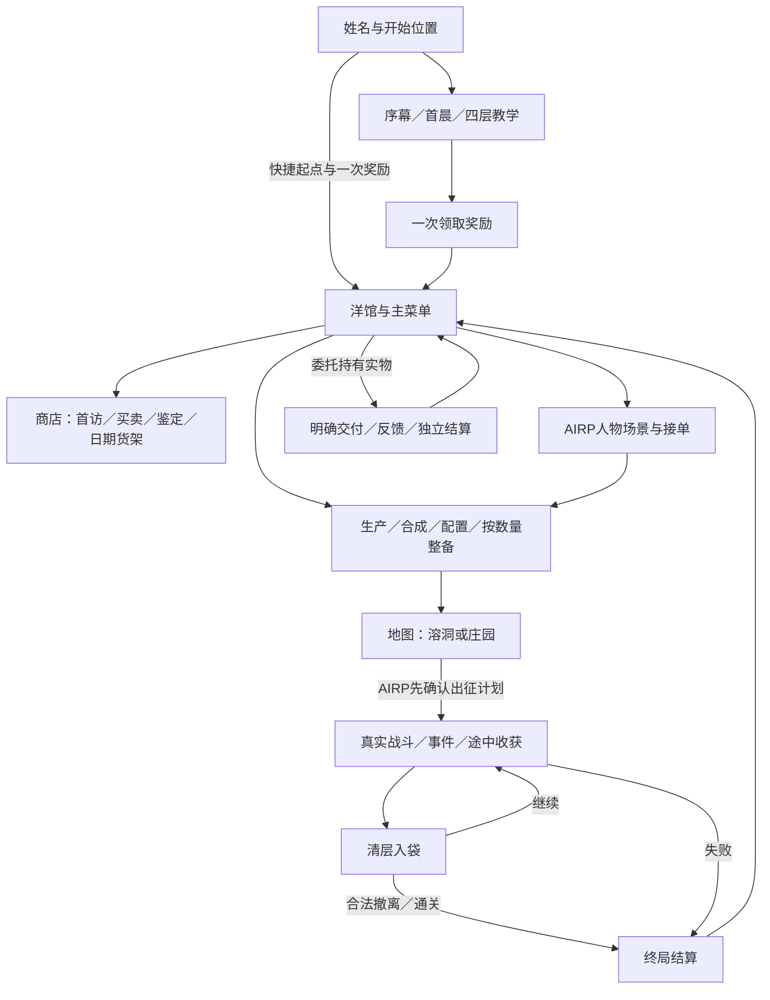

# ABYSSA 当前机制与游戏闭环总览

更新：2026-09-25。范围是当前工作树，默认普通新档内容27、正式AIRP新档内容28，规则和应用记录均为4。此文维护已实现机制；完成度与待办只在[状态页](DESIGN_DECISIONS_AND_CURRENT_STATUS.md)维护。数值可用不代表最终平衡通过。

## 1. 当前产品状态

洋馆生活、角色阅读、骰子远征、掉落结算、商店和基础生产共用本地档案。生活洋馆在守望者之崖，克雷格旧庄园是冒险地点；不能混成同一栋建筑。小队早已共同生活，教学教的是玩家操作，不把角色写成刚认识的新手。

| 范围 | 当前实现 |
| --- | --- |
| 完整开场 | 四幕15张CG → 首晨120节点／五组选项 → 四层四战＋E1 → S4-1 → 一次领奖 |
| 普通副本 | 潮声溶洞三层五战；庄园五层初战／维护；另有固定回忆战 |
| 经济 | G＝铜里拉；途中资金／物品入袋、结算入库、出售／鉴定／购买 |
| 配装 | 六名有战斗规则的角色，最多五人出征；成长上限Lv.3，九种通用商店装备 |
| 设施 | 厨房、温室、工坊、储藏室、女仆工作间；真实库存、加工、每周公款与修缮升级 |
| AIRP | 内容28接六人日度／副本GM、多轮场景、实物委托、实例奇物和读后结算；普通27不依赖模型 |

## 2. 现在实际能走的完整流程

活动远征有独立身份，刷新继续已保存战斗；导航不是撤退，也不发结算奖励。普通终局结算推进一个游戏相位，四相位为一天。回忆／教学遵守各自契约，不能一概套普通远征规则。

## 3. 新档、队伍与角色

### 3.1 新档初始状态与起点

- 初始可操作玩家位、尤斯缇丝、艾洛拉、柯萝萝、诺玛；玛丽埃塔在完成回忆与当下收束后开放亲征。最多玩家＋四名伙伴。
- AIRP剧情调度另有六人：尤／艾／柯／诺／玛丽埃塔／魔王艾比希斯。玛的洋馆出场不要求战斗解锁，艾比希斯不加入战斗编队；剧情能力不发放角色或装备。
- 角色初始Lv.1、基础最大3HP；新普通远征满血开始。装备改变战面，不自动改变生命上限或命数。
- 建档顺序为姓名→开始位置→确认，最终确认前不建档。姓名是显示字段，内部角色ID仍是`kael`；旧档缺省显示“你”。
- 序章／首晨／教学起点递进跳过前段。自由行动起点为教程豁免，明确发一次4,400 G、食物3、药水2及旧十字币、结界钉、木牌、黑面包四批物品，不伪造通关。
- 「调试入口 → 商店初见调试」可跳过教程并保留SHOP演出。新完整首访按实际四件物品和来源判断；旧介绍的豁免字段不再是全部首访流程的判断依据。
- 正式「AIRP 游玩」起点创建28；「调试入口 → 旧版 AIRP 调试」仍创建18。调试入口默认收起，正常开始位置保留序章、首晨、教学、自由行动和AIRP五项；旧档继续与失败建档重试不改版本。第1天晨开局，不以快捷起点伪造本次委托物品或交付事实。

教学为四层五房：T1、T2＋E1、T3、T4。进场剧情后打开共用规则总览，确认开始才进入首战；正文仅中文、诺玛处理E1、S4-1收束。标准带做路线资金3,600＋800＝4,400 G，自由操作按实际合法结算；领取与重试保持幂等。详情见[第一章](design/CHAPTER_ONE_AND_TUTORIAL.md)和[教学恢复契约](architecture/TUTORIAL_RULES_AND_RECOVERY.md)。

手册唯一编辑源为[handbook.json](../src/content/presentation/tutorial/handbook.json)，剧情为[scenes](../src/content/presentation/scenes)。教学新获得通知、LOG、物品详情与领奖共用远征收获组件；教学固定物件不套普通随机掉落和失败减半。

### 3.2 六面与战术职责

下表是 **Lv.1**。`金／锈`是品质，未标为素；`眠`是命数沉眠，未标为清醒。沉眠不禁止行动，只排除成牌。玩家位面6是唯一命点万能；诺玛面1只在攻／挡／治之间选择，点数仍是1。

| 角色 | 面1 | 面2 | 面3 | 面4 | 面5 | 面6 |
| --- | --- | --- | --- | --- | --- | --- |
| 玩家位 | 攻1·锈可除 | 攻1 | 挡1 | 护卫2，护别人3 | 治1 | 攻／挡／治1·金，命点万能 |
| 尤斯缇丝 | 攻1 | 攻2 | 攻2 | 攻3·金 | 挡2 | 空·眠 |
| 艾洛拉 | 治1 | 挡1 | 治1 | 空·眠 | 攻2 | 治2·金，越限治疗 |
| 柯萝萝 | 空·眠 | 空·眠 | 空·眠 | 攻4 | 攻4 | 攻5·金 |
| 诺玛 | 攻／挡／治1 | 攻2 | 空·眠 | 挡1 | 挡2·金 | 攻3 |
| 玛丽埃塔 | 主攻2＋右邻1·永久锈 | 主攻2＋左邻1 | 提线 | 挡3·金 | 全体攻击意图各挡2·眠 | 攻4，有线则6并耗线·眠 |

| 角色 | 初始醒／眠 | 面1→6的花色 | 定位 |
| --- | --- | --- | --- |
| 玩家位 | 6／0 | 尘／尘／圣／圣／圣／圣 | 补位、保护、唯一命点万能 |
| 尤斯缇丝 | 5／1 | 圣／圣／尘／圣／尘／圣 | 稳定攻击与同花威胁斩首 |
| 艾洛拉 | 5／1 | 尘／尘／尘／圣／尘／圣 | 治疗、资源取舍、三条支援 |
| 柯萝萝 | 3／3 | 渊／渊／外／渊／渊／外 | 高爆发，代价是较多沉眠空面 |
| 诺玛 | 5／1 | 尘／尘／尘／尘／渊／渊 | 灵活补位、两对与空面联动 |
| 玛丽埃塔 | 4／2 | 尘／尘／尘／尘／外／外 | 顺劈、提线控制、敌方阵位重排 |

尘＝尘世，圣＝圣辉，渊＝深渊，外＝界外。花色随面存在；编队效果另按角色主副花色计票。全量面名与定义见[角色数据](../src/content/gameplay/demo-v1/characters.ts)。

### 3.3 专属动作的实际边界

- 格挡作用于**一条攻击意图**，不是挂在角色身上的通用护盾；同一队友遭多段攻击时，要分别处理。玛的全体格挡给每条当前攻击意图加值。
- 顺劈固定本次主目标及左右邻居，主目标死亡不让副目标改成新补位者。
- 越限治疗实际治2；从本层散金扣至多1,000 G，不足则扣现有散金，不拒绝治疗、不动已入袋资金。
- 提线对当前血量不高于门槛的敌人生效：通常上限 `ceil(玛最大HP×1.5)`；敌人严格低于半血时上限改为 `玛最大HP×2`，总上限6。当前3HP玛对应5／6。
- 一个敌人每场首次提线会跳过当前回合行动，并保留其蓄力状态；再次提线能挂线，但不能无限重复眩晕。挂线供绞杀红线消耗。
- 诺玛的“淬毒飞刀”在当前规则中是攻2，名字不代表已实现中毒。

依据：[动作、伤害与目标选项](../src/game-core/battle/rules/v2/combat.ts)。

## 4. 一轮战斗、牌型与铭约

### 4.1 回合顺序

1. 回合开始生成公开敌方意图，刷新两次重掷与两次道具使用额度。
2. 玩家 ROLL；点击未固定骰会固定并自动选中其队员，直接点目标即可行动。再次点击未用固定骰解除固定，若该队员正被选中也取消选中；固定另一名队员的骰子只切换行动者，不解除其他骰子的固定。仍可重掷可动骰。
3. 已固定骰可执行一次合法动作；攻击、防御、治疗和控制由当前面决定。
4. 结束回合先冻结本轮牌型与命点万能取值，再触发符合条件的铭约。
5. 按已保存队列逐个结算仍有效的敌方意图；清场／团灭则结束遭遇，否则进入下一轮。

清掉最后一个敌人后也会通过正式收尾结算，不靠动画回调写胜利。铭约在敌方执行前触发，可能提前清场。战斗没有现行的通用回合超时惩罚或逐轮狂暴压力。

### 4.2 骰子资格必须分开理解

| 状态 | 重掷 | 行动 | 成牌 |
| --- | --- | --- | --- |
| 已掷、未固定、未用 | 可以，须有次数 | 先固定 | 清醒且主人存活即可 |
| 已固定、未用 | 解除固定后可以 | 可以 | 可以，仍看醒／眠 |
| 已使用 | 不可以 | 本轮不能再行动 | **继续参与**，不因使用而移除 |
| 沉眠面 | 按固定／使用状态判断 | 面有合法动作即可 | **不参与** |
| 封锁骰 | 不可以 | 不可以 | 不参与 |
| 力竭队友 | 不可以 | 不可以 | 不参与 |
| 尚未掷出 | 等待 ROLL | 不可以 | 不参与 |

判定来自所有符合资格的当前朝上面，与“是否已经用过”无关。结束回合时产生该轮结算快照。金／素／锈不改变动作强度，品质修正只影响成牌收益；界面应明确标出沉眠。

### 4.3 牌型与品质收益

| 牌型 | 条件 | 基础加成 |
| --- | --- | ---: |
| 散牌 | 无更高牌型 | +0 |
| 一对 | 同点2枚 | +0.10 |
| 两对 | 两组对子 | +0.20 |
| 三条 | 同点3枚 | +0.30 |
| 小顺 | 连续4点 | +0.50 |
| 同花 | 至少4枚同花色，取4枚 | +0.60 |
| 葫芦 | 三条＋一对 | +0.80 |
| 四条 | 同点4枚 | +1.20 |
| 大顺 | 连续5点 | +1.60 |
| 快艇 | 同点5枚 | +2.00 |

只结算最佳牌型，不把多种牌型加成叠加。用于该牌型的每枚金面 +0.10、锈面 −0.10，素面不变；散牌不凭品质单独产生收益，加成最低为0。比较顺序先基础牌型，再品质，再点数组合；玩家位的万能面在1–6中按同一顺序选择，并供该轮铭约共用。

每轮有效加成计入本层累计；清层时最多按 +2.00，即牌型倍率×3.00计算，之后清零。这个倍率增加资金收益，不乘攻击伤害。具体层收益见§7。

### 4.4 铭约触发与两阶效果

铭约是宽判模式，可与最终显示的最佳牌型不同；满足的多个铭约可以同轮触发。拥有者须存活且未封锁，自己沉眠不阻止由其他队友成牌触发铭约。

| 角色 | 触发 | Lv.1／2：初铭 | Lv.3：现行 |
| --- | --- | --- | --- |
| 尤斯缇丝 | 至少4同花 | 对最大攻击威胁敌人造成2；无攻击意图时优先最低血 | 伤害2–4 |
| 艾洛拉 | 至少三同点 | 最低血的受伤存活队友回1 | 治疗1–2名受伤者各1；另尝试净化最低血存活者的封锁 |
| 柯萝萝 | 至少连续4点 | 对1名目标造成3，优先可斩杀目标 | 1–2个不同目标各3 |
| 诺玛 | 宽判两对且有实际空白动作面 | 随机1–2次飞刀，每次伤害1 | 随机2–3次，可重复命中同敌 |
| 玛丽埃塔 | 五枚有效骰组成3＋2、4＋1或5同点 | 自动重排敌方阵位，最多1次相邻交换 | 最多2次相邻交换 |

诺玛的宽判两对含四条；装备把空白动作改掉后，该面不再满足“有空白”。空白条件可由存活且未封锁者的沉眠空面满足，但该面仍不参加点数成牌。

玛的重排优先增加2＋1顺劈可同时击倒的邻接组合，再比较其中威胁；没有改善就不移动。它是自动有限重排，不是任意拖动敌人，也不会重写已经冻结的敌方行动队列。现行执行顺序：尤→柯→诺→艾→玛。

依据：[战斗入口与顺序](../src/game-core/battle/demo-engine.ts)、[正式牌型](../src/game-core/battle/rules/v2/hand.ts)、[铭约](../src/game-core/battle/rules/v2/covenants.ts)、[阵位规划](../src/game-core/battle/rules/v4/formation.ts)。

## 5. 生命、力竭、状态与编队效果

- 每名队员3HP；受伤跨房间保留。生命归零本场力竭，治疗和道具不能原地复活。
- 力竭会使一面产生本趟临时锈：优先素面，再金面，按面位选取；不会把所有成长永久抹掉。
- 普通力竭者下一场战斗以1HP归队；本趟临时锈继续保留。下一次新出征恢复满血并清除本趟状态。
- 封锁在下一回合作用于目标骰；每轮格挡、定身等按自己的回合／遭遇边界清除。没有实现长达数日的强制伤病系统。

| 编队效果 | 当前条件 | 当前效果 |
| --- | --- | --- |
| 大地 | 至少4名成员的主副花色含尘世 | 清层资金×1.1；一名角色不重复投票 |
| 雨夜之盟 | 四名勇者伙伴同时在队 | 有人力竭后，其余存活者本场格挡动作+1；倒地者下层归队至少2HP，与普通下一场1HP边界区分 |
| 王权／天王威慑 | 有天王成员，当前可用者为玛 | 每场首回合敌方攻击意图−1，最低0 |

其他花色并不都已有可触发的编队效果。队伍的主副花色计票与当前掷出的同花是两套判断。

## 6. 普通路线、回忆与事件

### 6.1 路线、敌群与出口

目前是作者配置的固定房间路线，未实现随机地图生成。

| 目的地／模式 | 层数与战斗 | 撤离点 | 内容 |
| --- | --- | --- | --- |
| 潮声溶洞／退潮黑礁 | 三层五战、六房 | 第二层 | 雾滩、洞内、走私栈道；软泥、礁蟹、海蛭与三类亡命徒 |
| 庄园初战 | 五层五战、三件事件及撤离房 | 第三层 | 候席客、侍者、女佣、管家；末战千金与宾客 |
| 庄园维护 | 五层五战及撤离房 | 第三层 | 复用小怪；末战维护刻仪兽，不重演救离 |
| 玛丽埃塔回忆 | 独立短篇战斗 | 回忆内恢复 | 固定勇者五人、伙伴Lv.2、无装备；刻仪兽14HP、局部药水／护符各2次 |

庄园未首通前一直是初战，撤离或失败不切到维护。首通并完成收束后开放维护／回忆，回忆及当下结果兑现后才开放玛亲征。回忆不扣当下资产、不发普通掉落、不推进普通时间。

溶洞具体房间、数值与美术复用见[路线合同](design/TIDE_REEF_DUNGEON.md)。普通物品表见[正式掉落表](design/ORDINARY_DUNGEON_DROPS.md)；两个目的地、三条普通路线，不能把维护算成第三个地牢。

### 6.2 现行敌人工作值

| 敌人 | HP | 行为 | 基础赏金 G |
| --- | ---: | --- | ---: |
| 候席客 | 3 | 每轮攻击1 | 300 |
| 执盘侍者 | 5 | 蓄力→攻击3循环 | 500 |
| 缝补女佣 | 3 | 修复其他友军1，优先缺血最多者；无目标则待机 | 300 |
| 落幕管家 | 16 | 封锁→攻击3循环 | 1,200 |
| 末席的提线千金 | 18 | 举杯攻击与补席交替 | 1,800 |
| 维护刻仪兽 | 16 | 当前仍采用蓄力→攻击3循环 | 800 |
| 回忆刻仪兽 | 14 | 蓄力→攻击3循环 | 0 |

千金举杯的原始伤害为 `2＋当前活跃宾客数`，杀客后意图即时变化；最多3名活跃宾客，总补席预算6，新召唤者当轮不行动、不产赏金。千金核心归零后解线、退场剩余宾客，不要求把余客逐一杀光。首通另发一次2,000 G。

分餐侍从是废稿；衣橱守门人、纯家具长桌 Boss 也已作废。白布／黑木／红线及三重锁叙事继续以[庄园美术与叙事定稿](design/OLD_MANOR_DESIGN.md)为准。

### 6.3 现有事件是什么

| 事件 | 选择与真实结果 |
| --- | --- |
| 迎宾簿 | 阅读／略过；无随机费用和收益 |
| 遗物整理 | 选择1名存活队友，消耗本层散金200 G，独立抽其一面并判定；成功得400 G散金，失败不返费用；可免费绕行 |
| 空席核对 | 阅读／略过；无随机费用和收益 |

遗物判定先看动作：治疗、越限治疗、护卫、全体格挡、三向万能为强保全，不额外要求清醒；否则清醒且点数≥4或命点万能为弱保全；其余失败。强／弱当前奖励相同。

事件有实际骰面、动画与结果呈现，但规则仍是**提交单人尝试时一次抽面并结算**；它不使用上一战剩余骰，也没有“先全队开骰再挑多人配合”的持久玩法。多人解谜详见[待实施提案](plans/MULTI_ACTOR_DICE_EVENT_RULES_AND_SAVE_CONTRACT.md)，不能计入已完成。

依据：[当前装配](../src/content/gameplay/demo-v3/content.ts)、[五层定义](../src/content/gameplay/demo-v1/manor-full.ts)、[事件与道具](../src/game-core/session/demo-items-events.ts)、[事件判面](../src/game-core/battle/rules/v2/event-face.ts)。

## 7. 道具、资金、商店与结算

### 7.1 战备与馆内库存

内容27／28按选择数量扣减真实库存，出征剩余返还；打开页面、刷新或再次出发不会自动补满。储藏室Lv.1／2／3对应4／5／6类携带位，当前玩家从4类开始，可通过公款升级储藏室至5／6类。UI七槽是展示容量；旧内容12～24继续按原六类上限，不能据此缩减旧档。

| 补给 | 每趟上限 | 效果 | 当前来源 |
| --- | ---: | --- | --- |
| 食物 | 4 | 单人回1HP；每人每趟最多吃2次 | 厨房、一次性起始奖励 |
| 药水 | 2 | 单人回2HP | SHOP 260 G／份，或工坊制药 |
| 护符 | 2 | 给一条攻击意图增加2格挡 | SHOP 400 G／份 |
| 圣水 | 2 | 解除封锁，必要时为解封骰补掷 | SHOP 300 G／份 |
| 保养工具 | 1 | 清除指定面本趟临时锈 | SHOP 600 G／份 |
| 幸运符 | 1 | 本回合重掷次数＋1，须有可重掷骰 | SHOP 800 G／份 |
| 卦签 | 2 | 揭示下一层／当前事件信息，不预知未来随机骰 | SHOP 300 G／份 |

道具不占角色行动骰，每回合最多使用两次，仍须处于合法输入窗口。不能治疗力竭者、清除永久锈或任意复活。战备库存、单次携带量、携带种类数是不同限制。

### 7.2 资金与入袋

系统唯一单位是**铜里拉G**，100 G＝一银，10,000 G＝一金。人物口头按银／金计价，废料可说铜板；UI显示G与“小队资金”。内容27／28自由行动首款500,000 G；之后每周一清晨从450,000／475,000／500,000／525,000／550,000 G选择固定于存档周次的金额。D1为周一，下一次D8；余额结转，公款仅用于设施修缮与升级，DEMO无考核、断供或账户转账。晶石常规获取消费未开放。完整数值见[经济B定稿](design/ECONOMY_BASELINE_B.md)。

清层资金为 `四舍五入〔本层资金 ×（1＋牌型累计加成，封顶2）×层深倍率×大地倍率〕`。五层倍率1／1.25／1.5／1.75／2；大地满足条件取1.1。清层后本层资金和牌型累计清零，钱进本趟已入袋账，终局领取才进长期钱包。

普通掉落在房间胜利事务中确定，清完整层后入袋；通知随取得发生，LOG分为已入袋／未入袋。结算页展示原实例的保留和遗失，不另抽奖励、不提前把售价变成现金。

| 普通终局 | 本层未入袋 | 已入袋资金／普通掉落 | 从馆内带入的剩余战备 |
| --- | --- | --- | --- |
| 合法撤离 | 丢失 | 全部带回 | 返还 |
| 失败 | 丢失 | 资金向下取半；普通掉落实例数向下取半 | 返还 |
| 通关 | 末层完成入袋 | 全部带回；庄园初战另领一次2,000 G | 返还 |

普通物品失败保留按总实例数取半：各定义先取半，奇数余量按取得顺序分配；不是按估值取半。教学固定批次不拆分。**委托物另有专用背包：完成所在层并安全归来才持有，团灭全部遗失**；没有正确持有实例不能交付。

### 7.3 出售、鉴定与首访

普通表含12种可售战利品、4种鉴定品；途中20%取得鉴定品，末战必出，同趟排重。来源槽位与专用掉落随机不随召唤／重复击杀增加。常规物可合并按件出售；未鉴定物保留实例，鉴定300 G、废料2 G，鉴定只揭示取得时固定的身份。

新完整首访共用正式SHOP与AVG：开箱→免费鉴定→报价与去留→出售清单→可选购买→离店。要求同一奖励凭据的四件教程物齐全，不为缺件旧档重发。旧十字币原为12枚一批，尝币动作一次变为11枚可见，整批仍售1,800 G；木牌2 G；黑面包拒收。新首访钉绑定400 G报价，历史未进入此首访的500 G记录不追改。A／B出售分支收入2,202／1,802 G。具体兼容与流程见[首访记录](audits/2026-09-25-shop-first-visit-alignment.md)。

正式AIRP的新出征准备启用 `appraisalPlanVersion: 1`：程序按同一掉落算法预演奇物位，固定实例、品质和600／800／1,000／1,200 G经济模板；副本GM在同一次规划响应中创作外观、身份、介绍与缇比台词。它不增加掉落数量、不改变报价、不生成装备效果或委托奖励。未启用的旧计划、普通模式和教学仍使用原作者物品。

未鉴定只显示外观及未知品质；鉴定成功才揭示真名。选中、逐句鉴定、已知成交和回看复用SHOP小对话框、打字机与差分，不进入AVG，也不额外调用模型。不同生成实例不混售；未知物直接售出仅得2 G且不泄露身份。文案随原远征与实例保存，下一趟不会覆盖历史，见[奇物接入](audits/2026-09-25-gm-special-appraisal.md)。

交易只在合法自由边界执行，数量、扣物和入账原子提交；失败／重试不部分扣除、不重复发钱。回看免费，文案不授予物品或资金。

### 7.4 日期货架与装备

九件通用装备售价1,200～1,680 G；五件按D2／D4／D6固定上新，四件分D3／D5进入随机袋，D7由一个随机货位增至两个。货单由游戏日期事实刷新，同日开关商店、购买、读档不重抽。

每种每档商店限购一件；短刃和药囊原剧情赠物另计并追加，不覆盖已有装备。每人一个通用装备位，六人可配置、最多五人上阵；战中冻结，不开放装备转售。具体效果见[九件设计](design/SHOP_FIRST_WAVE_ITEMS.md)，算法见[货架合同](design/SHOP_SCHEDULE.md)。

## 8. 成长、装备与角色记事

### 8.1 成长是事件领取，不是战斗经验条

| 进度 | 当前条件与结果 |
| --- | --- |
| 勇者伙伴 Lv.2 | 参加一次合法第三层撤离／第五层通关，回馆完成自己的手写成长片段 |
| Lv.3 | 已领本人Lv.2、庄园已接管；在Lv.2领取之后重新出发并合法归来，再完成对应片段 |
| 玛 Lv.2／3 | 先完成回忆及当下收束开放亲征；参与开放后的维护远征，仍满足相应成长条件 |
| 玩家团队里程碑 | 五位成长角色中任意两人已达Lv.3，护卫面品质一次性变金；基础护卫数值不变 |

现有十个成长事件（尤／艾／柯／诺／玛各两段），可稍后继续，结果须明确完成才领取。初始版没有Lv.4／5、连续刷好感经验、全员统一升级或玩家位晶石除锈获取线。

| 角色 | Lv.2唤醒 | Lv.2变金 | Lv.3 |
| --- | --- | --- | --- |
| 尤斯缇丝 | 面6 | 面5 | 铭约升现行 |
| 艾洛拉 | 面4 | 面3 | 铭约升现行 |
| 柯萝萝 | 面3 | 面5 | 铭约升现行 |
| 诺玛 | 面3 | 面4 | 铭约升现行 |
| 玛丽埃塔 | 面5 | 面2 | 铭约升现行 |

### 8.2 两件剧情赠物

首次符合条件的普通归来提供一次“整备赠物”，完成后获得备用短刃和应急药囊各一件。它们是有唯一身份的长期资产，不是每趟自动发放。

- 备用短刃：把装备者全部原生空面动作改为攻1。
- 应急药囊：把全部原生空面动作改为治1。
- 面位、点数、醒眠、花色和品质保留；不会把沉眠空面直接变成可成牌的清醒面。
- 每人只有一个实际可装卸的通用槽；适用者是尤／艾／柯／诺。玩家位与玛没有原生空面，不能装备这两件。
- 支持库存、装上、卸下、原子转交；目标槽被占或角色未开放会拒绝。活动run期间不能改装，出征冻结配置并预留装备，归来解锁。
- 角色页保留三格装备／私约相关展示结构，但不能据此理解为三类装备均可获得或自由编辑。

### 8.3 角色页面与好感展示

概要、六面、长期／本趟配置、装备来源、成长与记事读取同一档案。五枚羁绊晶石的外观保留，正式进度展示为离散Lv.1–3；该成长展示与AIRP独立结算的好感字段分开，不以晶石数量推断好感。其他人物能查看作者资料，不等于有可出征规则。

玛回忆入口在她的“记事”顶部；成长、回忆、归来等记事来自已发生记录。静态人物档案与动态经历分开，预览样稿中的等级、伤情和余额不会灌入新档。

依据：[成长与装备来源](../src/game-core/session/d5-progress.ts)、[面配置](../src/game-core/battle/rules/v2/configuration.ts)、[角色展示投影](../src/game-client/character-presentation.ts)。

## 9. 洋馆、阅读与独立预览

| 设施 | 当前基础能力 | 三档参数 |
| --- | --- | --- |
| 厨房 | 自由行动开始Lv.1，4相位一批食物 | 每批2／3／4份 |
| 温室 | D2可首次修缮，8相位一批原料；药草或净光草 | 每批3／4／6束 |
| 工坊 | D3可首次修缮，1相位一单 | 每单最多1／2／3份；药草×2＋100 G→药水×1 |
| 储藏室 | 初始Lv.1，存储与出征种类容量 | 携带4／5／6类；原料每种12／24／36束；成品上限为每趟容量的3／4／6倍 |
| 女仆工作间 | D4可首次修缮，工程减费 | 5%／10%／15%；不减自身费用，开工锁定折扣 |

生产按游戏时间，到期手动收取，只保留当前一批，未收完不开始下一批。工坊开工扣材扣费并预留成品空间；满仓保留待领。现实等待、切页、读档不推进生产。内容27／28可在房间面板申请首次修缮与升级，全馆同时一项；2／4／8时段完工后生效，原有生产批次数量不变，工坊施工期间不接单。

首次修缮、等级升级、受损维修是三件事。公款只付首次修缮和升级，事件损坏未开放；五房间基价、预算与未来房间分工见[设施合同](design/MANSION_FACILITIES_AND_UPKEEP.md)，旧物品名称对应见[来源说明](design/MANSION_SUPPLY_PRODUCTION.md)。

正式生成使用居中面板、堆叠侧栏和背景展开阅读；AVG／NVL／LOG共用阅读器，正式任务阅读锁定并可刷新恢复。Menu内SAVE／LOAD／SETTINGS原位切换，手动档案30槽，标题完整档案列表另按需分页。详见[阅读恢复](architecture/AIRP_FLOW_AND_RECOVERY.md)。

`new-shop`、`battle-loot`、`airp`、`novel`、`rp`是独立调试／演出入口；其测试余额和按钮不构成正式玩法。码头骰局也没有接入完整的小队经济。制作工具只编辑表现资料，不推进玩家进度。

## 10. 存档、恢复、撤回与版本

### 10.1 权威状态和操作边界

- IndexedDB保存正式记录，以saveId／epoch／head和请求身份控制事务。相同请求幂等，双标签冲突不擅自换head重做选择。
- 战斗保存随机状态、敌方队列和推进位置；刷新恢复已提交结果，不重掷或重领奖励。撤回仅限当前窗口，成功掷骰／重掷清掉此前操作历史。
- 故事与AIRP游标持久保存，实际阅读、选择、交付和完成各有来源。动画回调不授予奖励；旧通知不能改变任务状态或把活动战斗带回MAP。
- 存档采用版本化文本／结构池去重，展开后原文、失败帧和字段保持；物理保存及导入上限仍8 MiB。原身份恢复和跨身份复制分别校验。
- 普通27可在安全边界另存同版本；正式AIRP28的活动链跨身份复制未开放。旧复制升级默认目标仍9，不是当前新游戏27。
- 默认本机游戏库曾实施一次版本清理，API连接库、偏好和缓存另存；不能把“仍有旧格式reader”解释成“被清掉的旧本机存档仍在”。详见[池化与清理记录](audits/2026-09-25-airp-save-pooling.md)。

### 10.2 已登记内容与兼容方式

| 内容族／版本 | 用途 |
| --- | --- |
| legacy 1／旧三层庄园1 | 规则1／2兼容档 |
| demo 1～3 | 早期五层、D5和刻仪兽闭环，按原规则／摘要读取 |
| demo 4～7 | 序幕、首晨、早期教学 |
| demo 8／9／10 | 手写药箱、离线事件池、旧rp在线样本；9仍为旧复制升级默认目标 |
| demo 11～16 | 带做教程、中文定稿、基础鉴定、四层、跳过奖励和旧商店介绍 |
| demo 17 | 铜G经济与四批教学物件 |
| demo 18／19 | 早期浏览器直连试读／总调度验证 |
| demo 20／21 | 普通溶洞与两地正式掉落表 |
| demo 22 | 正式AIRP副本／节点／结算接线 |
| demo 23／24 | 普通／AIRP的日期商店与九件装备 |
| demo 25／26 | 真实设施供应的冻结前版；免费启用，不自动迁移 |
| demo 27／28 | **当前普通／正式AIRP新档**：每周公款、修缮／升级、后勤折扣、完工生效 |

内容引用包含ID、版本与摘要，新增包不直接覆盖旧包；读取按完整引用验证。旧金额可能只做显示换算，不改写旧事实。完整注册表见[player-runtime](../src/game-runtime/player-runtime.ts)。

## 11. 工程底座、LLM与验证边界

`game-core`提供纯规则，`game-application`负责命令与事务，`game-infrastructure`适配存储／HTTP，`game-runtime`装配内容与驱动，`game-client`和页面只提交合法输入并演出结果。

正式AIRP28使用浏览器直连、日度／副本GM和正文→封装→场景GM，多轮选择后继续或结束；结算独立执行。完整资料与r8用于创作，游戏保持玩法权威，详见[LLM与AIRP](architecture/LLM_AND_AIRP.md)。原llm作者工具已退役；旧rp和两场试读不是正式链的上限。

六人剧情名单在新日程前以 `residentCast` 配置事实接入，内容28目录摘要不变；旧日程和冻结帧保持原样。生活指导含6条固定世界／人设锚点与14个随机情境，不新增fixed任务ID、不设出场配额或必演顺序；原有三张硬目标fixed卡保留。新奇物由出征计划显式启用，两者都不原地重写旧存档的已生成内容。

当前登记22个入口，正式构建／实验／工具分别输出。配置和验证命令见[工程说明](../config/README.md)。测试、真实模型样本、人工文学评价、视觉验收及公网发布分开记录；当前缺口与下一步只见[状态页](DESIGN_DECISIONS_AND_CURRENT_STATUS.md#4-下一步顺序)。
