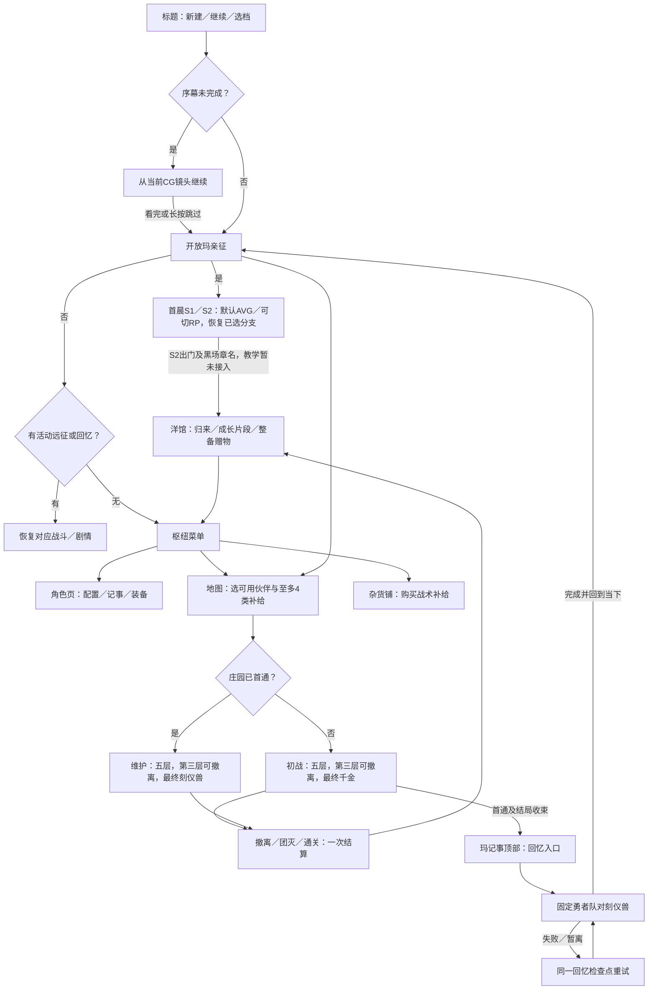

# ABYSSA 当前机制与游戏闭环总览

> 更新：2026-09-09；版本：1.2。范围：当前工作树的正式默认游戏，以及与它相邻的原型／未实现功能。
>
> 本文替代原来的混合总规格，作为**当前机制与实际可玩范围的唯一总览**。数值表示已发布代码的现行值，不代表平衡或文案已经验收。用户定稿、当前实现和待实施提案分别标识。
>
> [文档索引](README.md) · [定稿与完成度](DESIGN_DECISIONS_AND_CURRENT_STATUS.md) · [初章计划](plans/DEMO_PROLOGUE_AND_ONBOARDING_PLAN.md) · [质量审计](audits/2026-09-07-demo-experience-quality.md) · [历史文档](archive/README.md)

## 1. 当前产品状态

**工程上的游玩闭环已接入，CG序幕的视觉、阅读与存档链路已阶段收口；洋馆首场已接入，完整引导及教学尚未完成，战斗压力与现有剧作尚未达到Demo交付标准。**

| 范围 | 当前实际情况 |
| --- | --- |
| 正式默认包 | `abyssa.demo`，`contentVersion: 5`，`rulesVersion: 4`；应用记录／协议为4 |
| 已可循环游玩 | 建档、角色检视、地图编队、配给、庄园初战／维护、事件、结算、回馆、成长／装备、商店补充、再次出征 |
| 已可完成角色开放 | 庄园首通→玛丽埃塔记事顶部回忆→刻仪兽战→当下收束→玛亲征 |
| 当前新档入口 | 标题“新的开始”创建真实档案→四幕15张CG序幕→原Logo浮现→洋馆S1／S2（默认AVG／可切RP，四组三选一＋一组二选一）→黑场章节交接→暂回现有洋馆；序幕34段文字按点击阅读，幕间独立「三年后」字卡；按镜头恢复 |
| 尚无 | 序幕音频／独立动作帧、S2-6行军外景及地图切面、基础操作教程、强盗／经典小怪教学副本 |
| 已接通但未通过内容验收 | 庄园难度、刻仪兽终战设计、回忆的人物因果、成长剧本与战斗短句 |
| 不在正式共享闭环 | 洋馆建设生产、完整商业系统、码头骰局资金、独立 RP／AVG 演示、完整 LLM 上下文管线 |

世界与人物的依据仍是 [设定资料](../st/setting)和用户后续定稿：勇者小队与魔王一方已经在守望者之崖共同生活。生活洋馆与克雷格旧庄园是不同地点。角色本来就具备实力，玩法成长表达关系与力量恢复；初章教学针对玩家，不重写成新手冒险者结识队友。

当前内容由[内容6](../src/content/gameplay/demo-v6/content.ts)在冻结的内容5上追加S2，共120个节点、五处选择，最后一处仅A／B。内容5原档可按来源证明续接、保留原档和已选分支；运行时计算并验证摘要，不能仅用版本号接受导入。装配证据：[player-runtime](../src/game-runtime/player-runtime.ts)、[首晨实施记录](design/FIRST_MORNING_IMPLEMENTATION.md)。

## 2. 现在实际能走的完整流程

- 新档先播放四幕序幕；暂接现有洋馆。教学尚未开放，不能把序幕视为已完成全部初章。
- 角色页可在出征前和战中检视；有活动 run 时配置冻结。导航离开战斗不等于撤退或结算。
- 第三层出口是正式撤离点；战斗中随时逃跑、扎营尚无正式规则。
- 初战最终未通关前始终是初战；三层撤离或团灭不会把世界切到维护。
- 首通后开放维护与回忆两条内容。回忆需先完成／跳过首通落幕的阅读收尾；完成回忆战也还需当下结果兑现，才开放玛亲征。
- 回馆有真实记录、成长和装备操作，但没有已经运转的洋馆生产经济。

**后续目标：** 已有序幕之后接洋馆介绍→小钩子与基础教程→简单初始副本→回馆，再承接自由枢纽与庄园。已确认方向与具体建议见[初章计划](plans/DEMO_PROLOGUE_AND_ONBOARDING_PLAN.md)。

## 3. 新档、队伍与角色

### 3.1 新档初始状态

| 项目 | 当前值／规则 |
| --- | --- |
| 角色范围 | 玩家位、尤斯缇丝、艾洛拉、柯萝萝、诺玛、玛丽埃塔六人有正式战斗规则 |
| 初始可操作 | 玩家位＋尤／艾／柯／诺；玛在洋馆履职，但亲征未开放 |
| 队伍 | 核心允许玩家位＋至多四名已开放伙伴；最大五人，不是六人同时上场 |
| 生命 | 现行六人均为最大3HP；每次普通出征以满血开始 |
| 成长 | 初始 Lv.1、无已领成长；上限 Lv.3；玩家位走团队里程碑 |
| 装备 | 初始无装备；后续仅备用短刃、应急药囊各一件 |
| 资金 | 公款、小队金币、晶石均为0；正式收入主要进入小队金币 |
| 时间 | 第1天晨；每次普通远征结算推进一相位，四相位为一天 |
| 补给 | 新档库存空；首次出发默认选食物和药水，按基础配给补满 |
| 世界进度 | 未接管庄园，未完成回忆，无活动剧情／run |
| 序幕 | `A1-01 / playing`；逐镜提交，不改变世界时间／资金；标题完成或显式跳过后解除开场准入 |

依据：[初始进度与成长判定](../src/game-core/session/d5-progress.ts)、[角色配置解析](../src/game-core/battle/rules/v2/configuration.ts)。

### 3.2 六面与战术职责

下表是 **Lv.1**。`金／锈`是品质，未标为素；`眠`是命数沉眠，未标为清醒。沉眠不禁止行动，只排除成牌。玩家位面6是唯一命点万能；诺玛面1只在攻／挡／治之间选择，点数仍是1。

| 角色 | 面1 | 面2 | 面3 | 面4 | 面5 | 面6 |
| --- | --- | --- | --- | --- | --- | --- |
| 玩家位 | 攻1·锈可除 | 攻1 | 挡1 | 护卫2，护别人3 | 治1 | 攻／挡／治1·金，命点万能 |
| 尤斯缇丝 | 攻1 | 攻2 | 攻2 | 攻3·金 | 挡2 | 空·眠 |
| 艾洛拉 | 治1 | 挡1 | 治1 | 空·眠 | 攻2 | 治2·金，越限治疗 |
| 柯萝萝 | 空·眠 | 空·眠 | 空·眠 | 攻4 | 攻4 | 攻5·金 |
| 诺玛 | 攻／挡／治1 | 攻2 | 空·眠 | 挡1 | 挡2·金 | 攻3 |
| 玛丽埃塔 | 主攻2＋右邻1·永久锈 | 主攻2＋左邻1 | 提线 | 挡3·金 | 全体攻击意图各挡2·眠 | 攻4，有线则6并耗线·眠 |

| 角色 | 初始醒／眠 | 面1→6的花色 | 定位 |
| --- | --- | --- | --- |
| 玩家位 | 6／0 | 尘／尘／圣／圣／圣／圣 | 补位、保护、唯一命点万能 |
| 尤斯缇丝 | 5／1 | 圣／圣／尘／圣／尘／圣 | 稳定攻击与同花威胁斩首 |
| 艾洛拉 | 5／1 | 尘／尘／尘／圣／尘／圣 | 治疗、资源取舍、三条支援 |
| 柯萝萝 | 3／3 | 渊／渊／外／渊／渊／外 | 高爆发，代价是较多沉眠空面 |
| 诺玛 | 5／1 | 尘／尘／尘／尘／渊／渊 | 灵活补位、两对与空面联动 |
| 玛丽埃塔 | 4／2 | 尘／尘／尘／尘／外／外 | 顺劈、提线控制、敌方阵位重排 |

尘＝尘世，圣＝圣辉，渊＝深渊，外＝界外。花色随面存在；编队共鸣另按角色主副花色计票。全量面名与定义见[角色数据](../src/content/gameplay/demo-v1/characters.ts)。

### 3.3 专属动作的实际边界

- 格挡作用于**一条攻击意图**，不是挂在角色身上的通用护盾；同一队友遭多段攻击时，要分别处理。玛的全体格挡给每条当前攻击意图加值。
- 顺劈固定本次主目标及左右邻居，主目标死亡不让副目标改成新补位者。
- 越限治疗实际治2；从本层散金扣至多10，不足则扣现有散金，不拒绝治疗、不动已入袋金币。
- 提线对当前血量不高于门槛的敌人生效：通常上限 `ceil(玛最大HP×1.5)`；敌人严格低于半血时上限改为 `玛最大HP×2`，总上限6。当前3HP玛对应5／6。
- 一个敌人每场首次提线会跳过当前回合行动，并保留其蓄力状态；再次提线能挂线，但不能无限重复眩晕。挂线供绞杀红线消耗。
- 诺玛的“淬毒飞刀”在当前规则中是攻2，名字不代表已实现中毒。

依据：[动作、伤害与目标选项](../src/game-core/battle/rules/v2/combat.ts)。

## 4. 一轮战斗、牌型与铭约

### 4.1 回合顺序

1. 回合开始生成公开敌方意图，刷新两次重掷与两次道具使用额度。
2. 玩家 ROLL；可固定／解除固定未使用骰，重掷可动骰。
3. 已固定骰可执行一次合法动作；攻击、防御、治疗和控制由当前面决定。
4. 结束回合先冻结本轮牌型与命点万能取值，再触发符合条件的铭约。
5. 按已保存队列逐个结算仍有效的敌方意图；清场／团灭则结束遭遇，否则进入下一轮。

清掉最后一个敌人后也会通过正式收尾结算，不靠动画回调写胜利。铭约在敌方执行前触发，可能提前清场。战斗没有现行的通用回合超时惩罚或逐轮狂暴压力。

### 4.2 骰子资格必须分开理解

| 状态 | 重掷 | 行动 | 成牌 |
| --- | --- | --- | --- |
| 已掷、未固定、未用 | 可以，须有次数 | 先固定 | 清醒且主人存活即可 |
| 已固定、未用 | 解除固定后可以 | 可以 | 可以，仍看醒／眠 |
| 已使用 | 不可以 | 本轮不能再行动 | **继续参与**，不因使用而移除 |
| 沉眠面 | 按固定／使用状态判断 | 面有合法动作即可 | **不参与** |
| 封锁骰 | 不可以 | 不可以 | 不参与 |
| 力竭队友 | 不可以 | 不可以 | 不参与 |
| 尚未掷出 | 等待 ROLL | 不可以 | 不参与 |

判定来自所有符合资格的当前朝上面，与“是否已经用过”无关。结束回合时产生该轮结算快照。金／素／锈不改变动作强度，品质修正只影响成牌收益；界面应明确标出沉眠。

### 4.3 牌型与品质收益

| 牌型 | 条件 | 基础加成 |
| --- | --- | ---: |
| 散牌 | 无更高牌型 | +0 |
| 一对 | 同点2枚 | +0.10 |
| 两对 | 两组对子 | +0.20 |
| 三条 | 同点3枚 | +0.30 |
| 小顺 | 连续4点 | +0.50 |
| 同花 | 至少4枚同花色，取4枚 | +0.60 |
| 葫芦 | 三条＋一对 | +0.80 |
| 四条 | 同点4枚 | +1.20 |
| 大顺 | 连续5点 | +1.60 |
| 快艇 | 同点5枚 | +2.00 |

只结算最佳牌型，不把多种牌型加成叠加。用于该牌型的每枚金面 +0.10、锈面 −0.10，素面不变；散牌不凭品质单独产生收益，加成最低为0。比较顺序先基础牌型，再品质，再点数组合；玩家位的万能面在1–6中按同一顺序选择，并供该轮铭约共用。

每轮有效加成计入本层累计；清层时最多按 +2.00，即牌型倍率×3.00计算，之后清零。这个倍率增加金币收益，不乘攻击伤害。具体层收益见§7。

### 4.4 铭约触发与两阶效果

铭约是宽判模式，可与最终显示的最佳牌型不同；满足的多个铭约可以同轮触发。拥有者须存活且未封锁，自己沉眠不阻止由其他队友成牌触发铭约。

| 角色 | 触发 | Lv.1／2：初铭 | Lv.3：现行 |
| --- | --- | --- | --- |
| 尤斯缇丝 | 至少4同花 | 对最大攻击威胁敌人造成2；无攻击意图时优先最低血 | 伤害2–4 |
| 艾洛拉 | 至少三同点 | 最低血的受伤存活队友回1 | 治疗1–2名受伤者各1；另尝试净化最低血存活者的封锁 |
| 柯萝萝 | 至少连续4点 | 对1名目标造成3，优先可斩杀目标 | 1–2个不同目标各3 |
| 诺玛 | 宽判两对且有实际空白动作面 | 随机1–2次飞刀，每次伤害1 | 随机2–3次，可重复命中同敌 |
| 玛丽埃塔 | 五枚有效骰组成3＋2、4＋1或5同点 | 自动重排敌方阵位，最多1次相邻交换 | 最多2次相邻交换 |

诺玛的宽判两对含四条；装备把空白动作改掉后，该面不再满足“有空白”。空白条件可由存活且未封锁者的沉眠空面满足，但该面仍不参加点数成牌。

玛的重排优先增加2＋1顺劈可同时击倒的邻接组合，再比较其中威胁；没有改善就不移动。它是自动有限重排，不是任意拖动敌人，也不会重写已经冻结的敌方行动队列。现行执行顺序：尤→柯→诺→艾→玛。

依据：[战斗入口与顺序](../src/game-core/battle/demo-engine.ts)、[正式牌型](../src/game-core/battle/rules/v2/hand.ts)、[铭约](../src/game-core/battle/rules/v2/covenants.ts)、[阵位规划](../src/game-core/battle/rules/v4/formation.ts)。

## 5. 生命、力竭、状态与编队共鸣

- 每名队员3HP；受伤跨房间保留。生命归零本场力竭，治疗和道具不能原地复活。
- 力竭会使一面产生本趟临时锈：优先素面，再金面，按面位选取；不会把所有成长永久抹掉。
- 普通力竭者下一场战斗以1HP归队；本趟临时锈继续保留。下一次新出征恢复满血并清除本趟状态。
- 封锁在下一回合作用于目标骰；每轮格挡、定身等按自己的回合／遭遇边界清除。没有实现长达数日的强制伤病系统。

| 共鸣 | 当前条件 | 当前效果 |
| --- | --- | --- |
| 大地 | 至少4名成员的主副花色含尘世 | 清层金币×1.1；一名角色不重复投票 |
| 雨夜之盟 | 四名勇者伙伴同时在队 | 有人力竭后，其余存活者本场格挡动作+1；倒地者下层归队至少2HP，与普通下一场1HP边界区分 |
| 王权／天王威慑 | 有天王成员，当前可用者为玛 | 每场首回合敌方攻击意图−1，最低0 |

其他花色并不都已有可触发的编队共鸣。队伍的主副花色计票与当前掷出的同花是两套判断。

## 6. 庄园三种战斗与事件

### 6.1 路线、敌群与出口

当前是手写固定路线，不是已经完成随机房间生成的地牢系统。地图有地标展示，正式当下出征准入目前只开放庄园初战／维护。

| 层 | 初战 | 维护 | 场景 |
| --- | --- | --- | --- |
| 1 | 候席客×3→迎宾簿 | 候席客×3 | 迎客门厅 |
| 2 | 执盘侍者＋缝补女佣＋候席客→遗物整理 | 同敌群，无该事件 | 服务走廊 |
| 3 | 落幕管家→撤离／继续 | 执盘侍者×2＋缝补女佣→撤离／继续 | 服务走廊 |
| 4 | 候席客×3＋缝补女佣→空席核对 | 同敌群，无该事件 | 宴会厅 |
| 5 | 千金＋初始候席客×2 | 刻仪兽 | 宴会厅 |

回忆是固定勇者五人的短篇战斗，最终敌人为14HP刻仪兽，四位伙伴使用固定Lv.2，无装备；局部药水2次、护符2次。不复制当下五层，也没有千金或玛本尊终战。

### 6.2 现行敌人工作值

| 敌人 | HP | 行为 | 基础赏金 |
| --- | ---: | --- | ---: |
| 候席客 | 3 | 每轮攻击1 | 3 |
| 执盘侍者 | 5 | 蓄力→攻击3循环 | 5 |
| 缝补女佣 | 3 | 修复其他友军1，优先缺血最多者；无目标则待机 | 3 |
| 落幕管家 | 16 | 封锁→攻击3循环 | 12 |
| 末席的提线千金 | 18 | 举杯攻击与补席交替 | 18 |
| 维护刻仪兽 | 16 | 当前仍采用蓄力→攻击3循环 | 8 |
| 回忆刻仪兽 | 14 | 蓄力→攻击3循环 | 0 |

千金举杯的原始伤害为 `2＋当前活跃宾客数`，杀客后意图即时变化；最多3名活跃宾客，总补席预算6，新召唤者当轮不行动、不产赏金。千金核心归零后解线、退场剩余宾客，不要求把余客逐一杀光。首通另发一次20金币。

分餐侍从是废稿；衣橱守门人、纯家具长桌 Boss 也已作废。白布／黑木／红线及三重锁叙事继续以[庄园美术与叙事定稿](design/OLD_MANOR_DESIGN.md)为准。

### 6.3 现有事件是什么

| 事件 | 选择与真实结果 |
| --- | --- |
| 迎宾簿 | 阅读／略过；无随机费用和收益 |
| 遗物整理 | 选择1名存活队友，消耗本层散金2，独立抽其一面并判定；成功得4散金，失败不返费用；可免费绕行 |
| 空席核对 | 阅读／略过；无随机费用和收益 |

遗物判定先看动作：治疗、越限治疗、护卫、全体格挡、三向万能为强保全，不额外要求清醒；否则清醒且点数≥4或命点万能为弱保全；其余失败。强／弱当前奖励相同。

事件有实际骰面、动画与结果呈现，但规则仍是**提交单人尝试时一次抽面并结算**；它不使用上一战剩余骰，也没有“先全队开骰再挑多人配合”的持久玩法。多人解谜详见[待实施提案](plans/MULTI_ACTOR_DICE_EVENT_RULES_AND_SAVE_CONTRACT.md)，不能计入已完成。

依据：[当前装配](../src/content/gameplay/demo-v3/content.ts)、[五层定义](../src/content/gameplay/demo-v1/manor-full.ts)、[事件与道具](../src/game-core/session/demo-items-events.ts)、[事件判面](../src/game-core/battle/rules/v2/event-face.ts)。

## 7. 道具、金币、商店与结算

### 7.1 七种道具，实际最多携带四类

七槽道具坞是展示容量；正式出征最多选四种道具。当前没有通过洋馆升级解锁第五／第六携带位。

| 道具 | 容量／充能上限 | 当前效果 | 正式来源／单次充能价格 |
| --- | ---: | --- | --- |
| 食物 | 4 | 单人回1；每名队员每趟最多吃2次 | 基础配给，选中出发时补满 |
| 药水 | 2 | 单人回2 | 基础配给，选中出发时补满 |
| 护符 | 2 | 一条攻击意图加2格挡 | 杂货铺，4金币 |
| 圣水 | 2 | 解除当前封锁；行动阶段必要时为解封骰补掷 | 杂货铺，3金币 |
| 保养工具 | 1 | 清除指定一面的本趟临时锈 | 杂货铺，6金币 |
| 幸运符 | 1 | 本回合重掷次数+1，须有可重掷骰 | 杂货铺，8金币 |
| 卦签 | 2 | 揭示下一层或当前事件信息，不透露未来随机骰 | 杂货铺，3金币 |

道具不占角色骰行动；战斗每回合最多两次，仅在合法玩家输入窗口使用。走廊／事件按充能及胃口限制；护符、圣水、幸运符各有战斗目标约束。没有对力竭者复活、清除永久锈或任意负面全净化的通用能力。

购买按**一次充能**计价，不是买一整包容量。战术道具只能携带已有库存，剩余充能在结算后原样返回；未携带的库存留馆。基础食物／药水下次出发可再配给，因此失败不会因零钱直接失去全部恢复来源。

### 7.2 钱从哪里来，在哪里花

| 资金／资源 | 实际用途与状态 |
| --- | --- |
| 本层散金 | 敌人赏金、遗物事件；越限治疗和事件尝试可消耗 |
| 本趟已入袋金币 | 清层转入，普通治疗不能支取；尚未直接进入长期钱包 |
| 小队金币 | 整趟结算后取得，可在正式杂货铺购买五类战术补给 |
| 公款／晶石 | 有字段和展示，但当前没有完整的常规获取与消费链；不能把原型余额／商品当成已实现 |
| 素材／建设资源 | 没有正式生产、加工、设施消耗闭环；本版核心产出仍是金币与有限装备 |

内部清层计算为：`四舍五入〔散金 ×（1＋本层累计牌型加成，最多2）×层深倍率×大地共鸣〕`。五层倍率依次1、1.25、1.5、1.75、2；大地为1.1，否则1。清层后散金与牌型累计归零。

按用户展示要求，规则账目仍完整保存，但界面不重新堆回逐层入袋公式和清单。

### 7.3 撤离、团灭、通关

| 结果 | 资产与进度 |
| --- | --- |
| 第三层主动撤离 | 带回全部已入袋金币与剩余道具；不首通、不开放回忆 |
| 团灭 | 丢失当前未入袋散金；已入袋金币保留一半向下取整；剩余道具返回；不持久化伤病 |
| 初战第五层通关 | 带回全部已入袋金币，另领一次20金币；接管与千金结局成立，维护／回忆可开放 |
| 维护第五层通关 | 正常结算，不重领千金首通奖励、不重演救离 |
| 回忆失败／成功 | 不扣当下资产，不推进普通远征时间，不发当下掉落；成功提供篇章完成证据 |

每次普通远征结算只入账一次，并推进一相位；刷新、双击和旧链接不能再领。返回导航仅暂停当前 run，不是额外的免费撤离通道。

商店目前只开放上述战术补给购买，需无活动远征／回忆或活动故事；出售、鉴定、砍价、晶石兑换及原型商品未进入正式规则。旧内容版本仍可显示交易未开放，需要按可用路径复制升级。

依据：[经济与配给](../src/game-core/session/d5-economy.ts)、[层与终局结算](../src/game-core/session/demo-expedition.ts)、[商店接线](../src/apps/shop/ShopPage.tsx)。

## 8. 成长、装备与角色记事

### 8.1 成长是事件领取，不是战斗经验条

| 进度 | 当前条件与结果 |
| --- | --- |
| 勇者伙伴 Lv.2 | 参加一次合法第三层撤离／第五层通关，回馆完成自己的手写成长片段 |
| Lv.3 | 已领本人Lv.2、庄园已接管；在Lv.2领取之后重新出发并合法归来，再完成对应片段 |
| 玛 Lv.2／3 | 先完成回忆及当下收束开放亲征；参与开放后的维护远征，仍满足相应成长条件 |
| 玩家团队里程碑 | 五位成长角色中任意两人已达Lv.3，护卫面品质一次性变金；基础护卫数值不变 |

现有十个成长事件（尤／艾／柯／诺／玛各两段），可稍后继续，结果须明确完成才领取。初始版没有Lv.4／5、连续刷好感经验、全员统一升级或玩家位晶石除锈获取线。

| 角色 | Lv.2唤醒 | Lv.2变金 | Lv.3 |
| --- | --- | --- | --- |
| 尤斯缇丝 | 面6 | 面5 | 铭约升现行 |
| 艾洛拉 | 面4 | 面3 | 铭约升现行 |
| 柯萝萝 | 面3 | 面5 | 铭约升现行 |
| 诺玛 | 面3 | 面4 | 铭约升现行 |
| 玛丽埃塔 | 面5 | 面2 | 铭约升现行 |

### 8.2 两件装备

首次符合条件的普通归来提供一次“整备赠物”，完成后获得备用短刃和应急药囊各一件。它们是有唯一身份的长期资产，不是每趟自动发放。

- 备用短刃：把装备者全部原生空面动作改为攻1。
- 应急药囊：把全部原生空面动作改为治1。
- 面位、点数、醒眠、花色和品质保留；不会把沉眠空面直接变成可成牌的清醒面。
- 每人只有一个实际可装卸的通用槽；适用者是尤／艾／柯／诺。玩家位与玛没有原生空面，不能装备这两件。
- 支持库存、装上、卸下、原子转交；目标槽被占或角色未开放会拒绝。活动run期间不能改装，出征冻结配置并预留装备，归来解锁。
- 角色页保留三格装备／私约相关展示结构，但不能据此理解为三类装备均可获得或自由编辑。

### 8.3 角色页面与好感展示

概要、六面、长期／本趟配置、装备来源、成长与记事读取同一档案。五枚羁绊晶石的外观保留，正式进度展示为离散Lv.1–3；它不是另有0–100好感系统。其他人物能查看作者资料，不等于有可出征规则。

玛回忆入口在她的“记事”顶部；成长、回忆、归来等记事来自已发生记录。静态人物档案与动态经历分开，预览样稿中的等级、伤情和余额不会灌入新档。

依据：[成长与装备来源](../src/game-core/session/d5-progress.ts)、[面配置](../src/game-core/battle/rules/v2/configuration.ts)、[角色展示投影](../src/game-client/character-presentation.ts)。

## 9. 剧情、AVG、洋馆与周边页面

### 9.1 已接入的叙事与表现

- 首通落幕、庄园事件对白、回忆、当下收束和成长片段均有手写脚本；“脚本存在”不代表人物与戏剧质量过关。
- 重要剧情使用完整AVG、角色差分和阅读栏。战斗向上淡出进入AVG，退出后战斗向下入场；复用原场景衔接与对话框动效。
- 事件选项、骰子结果、间歇和第三层出口使用现有战斗区域；不新增剧情弹窗替代全AVG。
- 推进有背景行进，遇敌有敌区推近／回旋、快速双闪及揭示；固定或已用骰保持稳定，回合归位与正常ROLL分开。
- 战斗有本地角色反应、机械倍率仪表、日志、七槽道具坞和通用菜单。仅庄园皮肤使用红线，其余皮肤使用自己的框边。
- 千金解线、沉睡／抱起的专用姿态及部分演出拆层仍缺，不能把现有静态立绘当作已完成这些新画面。

当前故事文本在 [presentation](../src/content/presentation)，写作依据为[人物声音指南](design/DEMO_DIALOGUE_VOICE_GUIDE.md)及原始档案；衔接见[AVG契约](design/BATTLE_AVG_SCENE_HANDOFF.md)。

### 9.2 哪些是正式功能，哪些只是已有界面

| 页面／模块 | 正式可用 | 当前边界 |
| --- | --- | --- |
| 标题／序幕 | 多档、新建、继续、导入导出、复制升级／二周目；四幕CG、阅读与逐镜恢复 | 教学未实现；序幕音频与动作分层待补；标题设置命令未接通完整设置页 |
| 枢纽 | 共享资金／进度、前往地图／洋馆／商店／角色等 | 不是已经实现完整任务／成就／图鉴系统 |
| 地图 | 真实可用名册、配给选择、冻结配置并发起远征 | 正式当下只接庄园；托管、其他主题地牢没有生产玩法 |
| 洋馆 | 场景与角色检视、共享余额／补给、归来反馈、成长／赠物及导航 | 建造、修缮、升级、生产、收取、手动相位推进未开放，设施等级仍为展示数据 |
| 商店 | 实际购买五类战术补给 | 完整商业商品、出售、鉴定、砍价等仅原型 |
| 角色 | 真实六面／等级／记事、两件装备管理、玛回忆入口 | 专武、小件、自由私约编辑与其余角色亲征未开放 |
| 码头骰局 | 独立五骰博弈、下注、重掷、庄家轮换与对手逻辑 | 页面内状态与资金未接Campaign；可选外部实时／战报管线是独立实验 |
| novel／rp | AVG／NVL和演出、阅读控制样例 | 不等于正式开场或统一日常剧情系统 |
| settings | 文字速度、表现与立绘等参数预览 | 未形成正式全游戏持久设置链 |
| 制作工具 | 洋馆热区、立绘／队伍标定、Logo、骰面工作台 | 作者工具，不属于玩家成长／存档 |

洋馆未接经济的证据：[useMansionEstate](../src/apps/mansion/useMansionEstate.ts)的生产／升级／时间操作仍为空实现。码头骰局状态见[useDiceRound](../src/apps/dice/useDiceRound.ts)。

## 10. 存档、恢复、撤回与版本

### 10.1 权威状态和操作边界

- 游戏存于浏览器 IndexedDB，页面使用 `save/epoch` 定位同一档案；有活动run时附带远征或回忆身份。最近档提示与阅读缓存不是存档本体。
- 应用命令校验当前head、请求身份和合法动作，存档、事实与回执原子提交；重发相同请求返回同一结果。双标签冲突不会擅自换新head再做一次玩家选择。
- 战斗保存RNG、敌方队列和推进位置；刷新续行已提交结果，不重新掷骰或重领收入。随机、行动、事件选择和奖励不由UI自行计算。
- 撤回限当前可撤回窗口；v4一旦掷骰／重掷就清除此前撤回栈，避免看随机结果后反悔。结束回合、事件揭示与阶段推进也有明确边界，不是任意时光倒流。
- 持久故事游标与页签内阅读游标分层；首通、解锁、成长和装备依据合法完成证据，不靠动画播完授予。

### 10.2 已登记内容与兼容方式

| 内容 | 规则／应用版 | 当前用途 |
| --- | ---: | --- |
| `abyssa.legacy` 内容1 | 1 | 老裂隙档与兼容验证 |
| `abyssa.demo.manor-segment` 内容1 | 2 | 老三层庄园档 |
| `abyssa.demo` 内容1 | 3 | 老五层庄园档 |
| `abyssa.demo` 内容2 | 4 | 旧D5本尊回忆版本的档案 |
| `abyssa.demo` 内容3 | 4 | 保留既有刻仪兽回忆／维护与基础商店档案 |
| `abyssa.demo` 内容4 | 4 | 保留四幕序幕旧档 |
| `abyssa.demo` 内容5 | 4 | 保留S1首晨旧档，可按来源证明续接 |
| `abyssa.demo` 内容6 | 4 | **当前默认**，完整S1／S2及五组选项；章节交接后暂回洋馆 |

旧独立Battle的schema4是另一套历史格式，不能与应用规则4混为一谈。读取始终跟随档案完整内容引用与摘要；新增内容不能直接覆盖旧包。

- 导入／复制保留原档，使用新档身份；不凭导入重复授予已领内容。
- 标题档案支持可恢复归档：只收起已被合法升级后代完整续接且head未变的旧源档，保护当前使用档；原档与回执保留。归档是同源显示元数据，不改变正式存档版本。
- 复制升级已支持完整庄园v3、D5内容2／3到当前包；须无活动远征、回忆和未完成收尾，不对进行中的战斗热迁移。旧档升级标记序幕已跳过，保留原档。legacy／三层档没有同样的升级通道。
- 二周目要求已完成回忆及当下收束；创建新档，只继承篇章证明，重置资产、成长与庄园接管。新周目仍要实际首通，然后可凭证明跳回忆并完成当下开放步骤。
- 序幕完成／跳过由正式进度事实证明，旧档不强制重播；新周目重新开场且可显式跳过。教学阶段的版本承接待后续定义。

依据：[档案入口](../src/apps/title/useTitleArchive.ts)、[客户端会话](../src/game-client/README.md)、[版本登记](../src/game-runtime/player-runtime.ts)、[继承与升级](../src/game-application/versions/d5-lineage.ts)。

## 11. 工程底座、LLM与验证边界

| 层 | 当前职责 |
| --- | --- |
| `game-core` | 纯规则、内容验证、战斗／远征／进度投影；不依赖React、浏览器或模型服务 |
| `game-application` | 命令、事务、回执、事实、档案版本与存储Port |
| `game-infrastructure` | IndexedDB等适配 |
| `game-runtime` | 绑定已验证内容包、版本reader、查询与可选本地反应 |
| `game-client`／apps | 会话、导航、合法输入、提交后演出与已有UI |
| `content`／assets | 玩法定义、作者文本、立绘／背景／图标；不用显示姓名充当规则ID |

洋馆S1／S2已改用JSON作为文本、分页、分支、舞台预设和演出信息的唯一源；共享校验／编译层保留原120节点。LLM受限生成接口可注入Provider，返回角色＋台词＋单情绪词，具有超时、取消及身份／过期校验；实际后端尚未配置，生成结果的正式持久化未接入。见[JSON与生成契约](design/AVG_JSON_AND_GENERATION_CONTRACT.md)。

Abyssa独立拥有游戏闭环，后续复杂上下文与模型管线再调用rp-style-lab。普通出征、回忆、初章和成长不能依赖LLM在线；当前正式反馈主要为手写／本地内容。码头独立管线实验不等于正式游戏已完成S4。

仓库登记19个Vite入口（10个game分类、4个lab、5个tool）；构建分类不代表每个入口都已接正式Campaign。Node要求见`.nvmrc`（22.23.2），运行与构建见[工程入口](../config/README.md)。

本次重新读取源码，并导出已校验默认Catalog核对角色范围、路线、敌人、道具与版本；本次文档整理不宣称重新完成整套玩家E2E或内容验收。历史验证记录已归档，按日期与对应版本使用。

## 12. 已知缺口与接下来的顺序

| 优先级／范围 | 现状与下一结果 |
| --- | --- |
| 当前先做：初章 | 序幕CG子项已收口；下一步定稿洋馆介绍、小钩子与教学副本，再落实教学奖励与持久阶段。序幕音频／分层另补 |
| 庄园与刻仪兽压力 | 基础应对过于稳定；撤离、补给与机制取舍缺乏重量，需要重新设计敌群／意图与资源曲线 |
| 剧作 | 成长过多重复留座、吃饭、休息；事件提前解释答案；回忆未充分建立玛的变化与亲征因果，需要分场返工 |
| 教学接入契约 | 出征准入仍锁在初战／维护；层数、成长资格和终局验证含庄园约束，新增简单路线不能只换敌人表 |
| 多人事件 | 规则与存档提案存在，正式玩法未实现；不计入本轮初章已完成功能 |
| 美术与性能 | 已有主场景、立绘、皮肤与动效；缺姿态和事件配图仍需补，完整人工与最大负载表现验收待齐 |
| 后续系统 | 完整经营、额外装备／高等级、其他三地牢、托管、随时逃跑、长期LLM日常管线均单独排期 |

已记录的当前Catalog对照模拟共96条：基础应对初战15/16、维护16/16、回忆16/16；仅主动攻击初战4/16、维护15/16、回忆16/16。基础应对进入管家16/16满血、进入千金14/16满血。这些是指定策略／种子的证据，不是玩家通关率，不能概括为所有模式随机乱点都能赢。详见[质量审计](audits/2026-09-07-demo-experience-quality.md)。

后续维护本文时，先核对当前发布包，再改相应章节；不再在文件开头连续叠加互相矛盾的“最新进展”。历史阶段进入归档，待实施方案留在plans，定稿与实际偏差留在状态清单。
