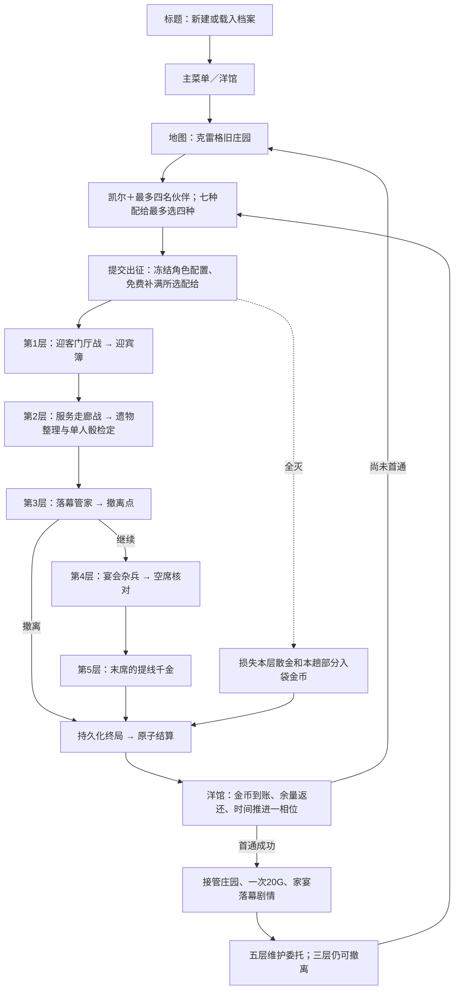

> 历史档案：2026-09-07文档整理时归档。原路径：`docs/audits/2026-09-07-game-loop-and-shop.md`。保留当时的设计、状态和验证证据，不作为当前排期或默认机制；当前入口见[文档索引](../../README.md)。

# 当前游戏闭环与商店接入审计

> 日期：2026-09-07。依据当前工作树的正式入口、规则、存档读取器和页面接线；旧设计稿与原型只作为历史参考。
> 本文保留实施前的调查快照。后续用户授权实施，当前结果见[三类战斗、旧档续接与商店实施记录](2026-09-07-loop-and-shop-implementation.md)：默认新档已接新内容、记事回忆入口、刻仪兽与真实购买。下文“关闭／待实施”描述调查当时，不代表现在。

**用户后续定稿（同日，以最后确认覆盖前述版本）**：最终未通关前一直是初战，千金仅为初战最终Boss；首通后同时开放回忆与维护，两者最终Boss均为刻仪兽。回忆入口设在角色「记事」顶部；用户确认由刻仪兽战替代原玛丽埃塔本尊战。维护仍从地图进入，完成回忆及当下收束后开放玛亲征。见[总规格§9](../design/DEMO_CHARACTERS_AND_OLD_MANOR_SPEC_V0_1.md#9-首通回忆与重复挑战)。以下保留调查时的代码事实：v4回忆仍是洋馆报告内的本尊战，维护末层仍为普通敌群，刻仪兽仅有素材。新入口、遭遇和版本承接均待实施，不能把本次规格更新或v4内部能力当成正常新档已经可达。

## 1. 结论

当前已具备**可重复游玩的庄园冒险闭环**，尚未形成**收入—消费—整备—再次冒险的经济闭环**。

还必须分清两条发行状态：

- **标题页正常新建的是 v3**：五层庄园、首通接管、维护委托、七种绑定配给，角色成长／装备领取／回忆不开放。
- **显式 v4 档有 D5 内容**：首通后回忆、当下收束、玛亲征、十个成长事件、两件装备的领取和装卸。但旧档复制升级、v4 备份导入与默认入口切换尚未实施；本轮还复现了玛亲征战斗页报错。
- **商店入口已连接，交易有意关闭**：正式页只读真实钱包，购买／出售／鉴定全部禁用。可交互的旧商店是独立原型，不具备正式资产交易能力。

因此，商店缺的是规则与存档中的完整交易路径，不能通过解除按钮禁用或恢复原型本地状态来交付。

## 2. 当前玩家实际走的流程

### 2.1 默认 v3



图中“全灭”适用于任一战斗。实际路线固定；当前不是随机生成的房间树。

| 环节 | 现在的实际行为 |
| --- | --- |
| 新档与旧档 | 新档默认 v3；legacy／三层 v2／v3／显式 v4 按自己的内容版本读取，不自动升级 |
| 地图 | 三个可视地标中只有 `tower` 对应的庄园可出征；正式接线仅亲征，委托派遣未开放 |
| 编队 | 凯尔为领队，总队伍上限五人；初始伙伴为尤斯缇丝、艾洛拉、柯萝萝、诺玛 |
| 战斗 | 投骰、固定／重掷、行动、铭约、敌方意图执行、撤回、恢复续步已有权威命令 |
| 场间与事件 | 推进、间歇、道具使用、现有三类事件已内嵌；遗物整理是单人投骰检定，多人解谜仍只是规格 |
| 入袋 | 当前层全部必经内容完成后入袋一次；事件和战斗结束不等于整趟到账 |
| 结束 | 第三层撤离、末层完成或全灭产生终局；最终结算成功后回馆 |
| 失败 | 清本层散金，本趟入袋金币保留向下取整的一半；以前的营地余额不扣 |
| 下一趟 | 重新生成 run；满血、无本趟临时锈，所选配给补满；没有住院费或跨趟永久伤病 |
| 首通后 | 转为维护路线，第三层和末层使用杂兵组合，不复活管家／千金，不重复首通20G |

源码：[默认创建](../../../src/game-runtime/player-runtime.ts:24)、[地图发令](../../../src/apps/map/MapPage.tsx:46)、[五层编排](../../../src/content/gameplay/demo-v1/manor-full.ts)、[推进和终局](../../../src/game-core/session/demo-expedition.ts)、[出征与结算](../../../src/game-core/session/demo.ts)、[新趟人物初始化](../../../src/game-core/battle/demo-engine.ts:107)。

### 2.2 显式 v4 增加的成长闭环

普通远征正常返回（三层撤离或五层完成）→ 洋馆成长事件／整备赠物 → 角色页装卸通用装备 → 新一趟使用已冻结的新配置。

庄园首通并读完或跳过家宴落幕 → 回忆《王座前的提线魔女》→ 固定历史勇者小队交锋 → 回到当下完成收束 → 玛丽埃塔加入可出征名单 → 维护委托中的成长。

- 十个成长事件是尤／艾／柯／诺／玛各 Lv.2、Lv.3；好感晶石显示对应已授予的等级，不是自由对话积累的连续好感值。
- Lv.2 需要该角色参加过合法正常返回；Lv.3 需要首通，并在领取 Lv.2 后重新出征且正常返回。玛还需先开放亲征，再参与维护。
- 任意两名成长角色达到Lv.3，派生一次凯尔护卫面的团队品质提升。
- 首次符合条件的正常返回可领取备用短刃、应急药囊各一件；不是花钱买，也不是随机掉落。两件都改写原生空面，每名适用角色最多装备一件。
- 回忆使用固定历史配置和局部物资，不消耗当下库存、不发普通金币、不推进当下时间。
- 战斗中的临时状态与长期配置分开；活动远征／回忆期间禁止馆内改装和成长领取。

这是代码已经支持的规则路径，**不能等同默认新玩家已经能完整走通**。本轮页面断点及发行缺口见第5节。

依据：[D5进度与资格](../../../src/game-core/session/d5-progress.ts)、[内容装配](../../../src/content/gameplay/demo-v2/foundation.ts)、[成长读取](../../../src/game-runtime/d5-views.ts)、[D5计划](../plans/DEMO_D5_MEMORY_AND_GROWTH_PLAN.md)。

## 3. 经济与库存现在究竟是什么状态

### 3.1 钱包有了，营地消费尚无

| 资产 | 实际来源与用途 | 缺口 |
| --- | --- | --- |
| 本层散金 | 击杀赏金；遗物整理花2G，成功回4G；昂贵治疗最多扣当前散金10G | 这些是远征内资源变化，不能算商店消费 |
| 本趟入袋金币 | 每层按牌型、深度和队伍条件结算 | 最终返回前不属于营地钱包 |
| `funds.party` | 普通远征最终到账；首通额外20G | v3／v4 当前没有营地支出命令 |
| `funds.public` | 默认0 | 洋馆经营未开放，当前无正式收支 |
| `funds.crystals` | 默认0 | v3／v4庄园当前没有晶石产出与使用链；不要套用 legacy 晶石奖励或原型的8晶石 |
| 可出售材料、未鉴定物 | 当前庄园没有这样的正式掉落实例 | 不能直接启用原型出售／鉴定列表 |

金币积累是真实存档；只有获得、没有营地消费，使重复维护在成长做完后缺少持续动机。当前并无完整长期循环承接它。

### 3.2 七种“配给”不是普通商店货物

| 配给 | 每趟上限 |
| --- | ---: |
| 食物 | 4 |
| 药水 | 2 |
| 护符 | 2 |
| 圣水 | 2 |
| 保养工具 | 1 |
| 幸运符 | 1 |
| 卦签 | 2 |

最多选四种，默认食物／药水／护符／圣水。出征命令内免费补到上限；用完即减次数，结算返还原实例的实际余量。营地可以留有七种，单趟最多四种；战斗道具坞七个显示位置不意味着可以带七种出征。

这遵循[D0绑定配给契约](../design/DEMO_D0_SCOPE_AND_CONTRACTS.md#62-demo-配给)和[D3配给规格](../plans/DEMO_D3_OLD_MANOR_PLAN.md#7-常备包净化和配给p07)，是为了经营未上线时仍能多趟测试的明确设计，**不是漏扣钱的Bug**。配给不得出售、分解或变成普通购买物品。

因此，直接上架这七种同效、同容量道具，同时保留每趟全量免费补给，会让购买没有实际价值；放开出售则会把免费配给变成可重复换钱的来源。

### 3.3 当前“仓库”分为两套有限资产

- `campaign.supplies`：七种绑定配给。
- v4 `campaign.inventory`：D5两件装备，含在库／已装备／已预留的实例位置。
- 洋馆库存弹层当前只映射配给；两件装备由角色页的装备管理查看和操作。
- 主菜单“仓库”入口仍提示尚未接入。洋馆设施等级、日常对白和位置可以展示，但建设／生产／升级／手动推进时间没有正式写命令。

依据：[洋馆状态桥接](../../../src/apps/mansion/useMansionEstate.ts)、[菜单仓库入口](../../../src/apps/menu/MenuPage.tsx:229)、[D5库存结构](../../../src/game-core/session/d5-types.ts)。

后续商店应消费统一的资产查询投影，不再建立“商店背包”。底层按资产类型分开可保留，不必先重做整个仓库页面。

### 3.4 其他入口不等于已接入长期循环

- 洋馆可进入码头骰局，但[骰局状态](../../../src/apps/dice/useDiceRound.ts:54)仍由独立`useState(createInitialGame())`管理，未走Campaign钱包与结算命令。其下注输赢不能计作本审计中的营地收支。
- 骰局已有[可选Runtime接入](../../../src/apps/dice/runtime/dice-runtime.ts)，用于对手决策／战报；这与庄园纯本地权威规则是两条链，不能据此说主线LLM已接通。
- 洋馆按相位变化的人物对白属于手写展示；它与v4有持久资格、阅读游标和奖励凭证的成长事件不同，不能把点日常对白视作已经获得成长。

## 4. 商店关闭的具体原因

### 4.1 正式页与原型是两回事

| 项目 | 正式 `ShopPage` | 独立 `ShopPreview` |
| --- | --- | --- |
| 钱包 | 读取真实Campaign | `useState(1247)`／`useState(8)` |
| 商品 | 无正式在售目录 | 页面内写死的餐具、药水、家具、材料等样稿 |
| 买入 | 禁用 | 本地扣余额、减货架数量；不创建Campaign物品 |
| 卖出 | 禁用 | 卖的是样稿列表，不校验玩家真实拥有 |
| 鉴定 | 禁用 | 本地扣费并切换预置文案；不转换真实物品 |
| 砍价 | 未开放 | 本地固定减2里拉；不是骰子或正式经济规则 |
| 刷新恢复／并发 | 真实只读档案 | 本地交易不持久化 |

可复用原型中的缇比、对话、分类、货架、物品详情、数量操作和原RPG框体。资产数据与交易处理需要替换为正式应用接线；不需要重新发明一套Web商城样式。

代码：[正式商店](../../../src/apps/shop/ShopPage.tsx)、[原型状态与交易](../../../src/apps/shop/ShopPreview.tsx:165)。`ShopPage.test.tsx` 实际测试的是 `ShopPreview`，其“购买成功”不能作为正式交易完成的依据；真正正式页的[ShopScene测试](../../../src/apps/shop/ShopScene.test.tsx)明确断言三个交易按钮禁用。

### 4.2 存档契约不允许随手扣钱包

- v3 的[快照校验](../../../src/game-core/session/demo.ts:71)要求：小队余额等于全部结算收入加首通奖励，公款／晶石为0。
- v4 的[快照校验](../../../src/game-core/session/d5-snapshot.ts:7)要求：Campaign等于已提交进度证据的重建结果；现有证据没有商店收支。
- [普通命令](../../../src/game-application/versions/demo-command.ts)及[D5命令](../../../src/game-application/versions/d5-contracts.ts)没有购买／出售／鉴定。
- v4赠物当前按“仅有两件装备”的范围赋值库存；扩展装备商店前还要处理领取赠物与其他资产共存，不能只增一个商品。

商店首版必须补充交易事件、资产来源、余额重建和库存位置校验，使用新内容／规则契约，并保留旧档读取。不能关闭校验，也不能改写已有Catalog摘要来让扣钱通过。

## 5. 当前需要排在商店发布之前的断点

| 优先级 | 发现 | 影响与处理 |
| --- | --- | --- |
| 高 | 玛丽埃塔维护战白屏：已用合法v4游玩检查点复现 `Cannot read properties of undefined (reading 'tone')` | [Surface](../../../src/apps/battle/presentation/ExpeditionBattleSurface.tsx:262)按角色ID读取[旧五人映射](../../../src/apps/battle/presentation/expedition-visuals.ts:24)，缺少玛。应补全共用展示映射并验证全部合法阵容；保持原样式 |
| 高 | 默认新档仍v3，D5内容无法由正常新开档到达 | [创建策略](../../../src/game-runtime/player-runtime.ts:24)与标题持久请求只覆盖到v3；按F/G/H完成迁移、集成验收与入口切换，不能只改默认数字 |
| 高 | v4可以导出，但正式导入明确拒绝 | [版本运行时](../../../src/game-runtime/versioned-runtime.ts:194)将其留给D5-F；需补同版本复制、ID重定位、来源与重复奖励校验 |
| 中 | 标题“继续游戏”把回忆编码为`expedition`，没有携带memory的attempt；已复现错误引导页 | [标题恢复](../../../src/apps/title/useTitleArchive.ts:50)与[定位契约](../../../src/game-client/navigation.ts)不一致；页面“继续回忆”链接参数正确，可作为恢复入口。需修正标题接线并覆盖实际点击路径 |
| 中 | 洋馆库存、装备管理、主菜单仓库入口职责不统一 | 商店先共享权威资产查询，再按已接受样式接入；不用新造第三份库存 |
| 中 | 本轮D5成长／赠物／转交的故障与幂等综合用例超过180秒时限 | 其余22项定向测试通过，此项超时；不能据此宣称事务错误，也不能宣称当前集成回归全通过。G应进一步区分运行负载与重复校验开销 |
| 中 | P2多人事件、美术补图、整体性能与配平尚未收齐 | 不把已有单人ROLL、缺图占位和专项测试宣布成完整DEMO验收 |

截至本轮，D5-F/G/H与D6仍有工作；UI计划的P1已实施，P2为提案。旧总计划部分段落仍写“P1尚未实施”，应以[较新的UI计划](../snapshots/BATTLE_UI_AND_EVENT_FLOW_OPTIMIZATION_PLAN_BEFORE_CONSOLIDATION.md)和源码为准。

## 6. 商店首版建议怎样做

以下是**调查后的建议，尚未作为新经济规则定稿**。现有D0免费配给和D5两件赠物规则保持有效。

### 6.1 先确定商店为何值得用

| 方案 | 收益 | 代价 |
| --- | --- | --- |
| 保留当前全量免费配给，再卖同效物品 | 改动小 | 缺乏购买理由，不推荐作为经济闭环 |
| 新经济版本采用“免费基础配给＋付费战术补给” | 复用七种现有物品，金币能转成下一趟的准备选择 | 需重新定稿免费范围、购买量与配平；不能直接改旧档 |
| 全部补给收费 | 消费明确 | 零资金开局与连续失败会卡住再次出征，不适合直接启用 |

**推荐第二项**：保留能继续出征的免费基础保障，部分战术物资通过购买补齐；仍遵守七种定义、单趟最多四种和本趟充能上限。免费与购入来源分开，购入数量有限，下一次出征不得自动把购买来源也补满。

免费具体给什么、补多少、价格多少，应拿现有三层撤离／五层完成收益做配平后确定。当前原型药水250里拉、武器860等价格没有与庄园收入衔接，不能直接使用。首版统一使用小队金币，公款和晶石继续保持各自边界。

### 6.2 第一包只交付真实购买

首版闭环：**赚取金币 → 回馆 → 商店购买有用补给 → 地图选择携带 → 战内消耗 → 返回实际余量 → 再购买**。

| 首版接入 | 后续再做 |
| --- | --- |
| 已实现物品的正式商品目录与固定价格 | 新装备、家具、生产素材与新增效果 |
| 真实小队余额、购买数量、充能／库存上限 | 晶石黑市、讨价还价、商人好感 |
| 非活动run期间购买；到账后持久保存 | 战内商人、异步交易、远征途中换装 |
| 原商店视觉和缇比手写反馈 | 模型生成交易结果或自由生成道具 |

**出售后置**：先有真实、可卖的掉落和定价规则，再放开。当前绑定配给及两件一次赠物不能拿来充当商品循环。

**鉴定后置**：必须先有“未知实例来源 → 鉴定成本 → 已确定结果持久保存 → 鉴定后用途”。刷新不能重新抽结果。只有鉴定文案而无实例转换，不算功能。

**砍价后置**：需要独立的折扣范围、次数、刷新周期和价格重验。LLM可以说话，不决定折扣。

### 6.3 接入边界

```text
原商店组件
  → game-client会话发令
  → game-application：身份、幂等、旧head冲突、同事务提交
  → game-core：价格、资格、库存／充能、资产来源、收支计算
  → 本地存储：状态＋交易证据＋回执
  → runtime只读查询供商店／地图／角色／洋馆一致展示
```

建议购买请求只包含商店／商品ID、数量、报价版本及现有请求身份，不接收客户端传入的“最终扣款”或库存patch。商品定义与数值放在版本化内容包，台词和资源留在展示层。

同一次提交完成：余额扣除、物资到账、必要货架记录、交易事实、请求回执。缺钱、容量不足、活动run、报价过期均保持资产不变；重复点击或提交后失去响应只能成交一次。

首版可采用固定常驻货架，库存上限由玩家资产／充能约束，不必立刻引入每日刷新系统。未来若采用限量或周期补货，再把货架周期和已购量纳入存档，不能借页面刷新补货。

`rp-style-lab`不参与报价、扣钱、发物品或判定；后续如有需要，只消费已提交的公开交易事实，生成缇比的反应。当前全链路继续由Abyssa独立完成。

## 7. 建议实施顺序与验收

1. **补现有D5闭环缺陷**：玛的展示映射、回忆从标题恢复；补实际页面覆盖，不以无界面模拟代替。
2. **补F的存档续接能力**：v4导入、v3复制升级与来源验证。二周目沿F原计划管理，不把它与购买混成一个功能包。
3. **单独定稿最小经济规格**：免费底线、付费范围、来源区分、库存／充能、价格、失败后的再次出征保障；与F及P2统筹新版本安排，不擅自在本审计锁定版本号。
4. **实现购买事务和查询，再接原商店UI**：先跑资产生命周期，后在原有框体／角色／对话布局中接线。顺手改造其他页面样式不在范围内。
5. **合并进入G的完整验收，再执行H的默认入口发布**：如果先发布纯D5则仍按计划切v4；若合并经济版本，需明确修订发行与迁移目标，不能静默扩大H。

必须验证的经济场景：

- 零资金新档、连续失败仍能重新出征；三层撤离和五层完成均能承接下一趟整备。
- 购买后刷新／跨页余额与数量一致；地图携带、战斗消耗、结算返还的是同一资产来源。
- 双击、两页同时买、扣款提交前失败、提交成功后丢响应都不重复扣款／发物。
- 免费配给不能套现；重复首通、重复赠物、回忆反复挑战不能额外造资产。
- 活动run期间购入与预留策略明确，首版直接禁止；旧档仍按旧规则运行。
- 新经济档导出导入后账本重建一致；原图标、框体、数量操作在1600×900及1280×720中核对。

## 8. 本轮验证记录

证据目录：`dist/reports/loop-shop-audit/`。记录只代表本轮定向审计，不替代D5-G完整发布／配平验收。

- 已通过真实标题“新的开始”创建独立档案，核实schema v3、三种资金全0、默认首通路线、七种物品与默认四选项、无D5成长查询。
- 已打开正式商店，核实Campaign余额与购买／出售／鉴定禁用。
- 已注入先前通过真实命令游玩的v4维护检查点，复现玛在队时的展示报错及空页面；没有修改检查点的角色或规则状态。
- 已复现回忆标题恢复误带`expedition`参数，页面显示“已有另一趟远征”；点击导航中的“继续回忆”后，正确携带`memory＋attempt`，已验证回到实际回忆战斗界面。
- 已实测v4导出成功，同版本导入返回`content-unavailable`，明确提示D5-F尚未安装。
- 6个文件、23项定向测试：**22通过，1项超时**，整条命令退出1。通过范围包括庄园五层及维护、v2配给／返还／失败／事件、正式商店关闭状态、回忆身份恢复、装备会话，以及D5十项成长与原装备实例生命周期。
- 未通过项是`d5-growth.test.ts`的成长／赠物／转交故障、回执重放与多连接综合测试：超过原有180秒限制，本轮约186秒退出；未报告资产断言不一致。没有延长超时、修改测试或将历史通过记录当作本轮通过。
- 本轮并行进行了浏览器读取，未进行独立性能基准；超时原因需后续定向排查。浏览器原先使用5秒默认等待时未等到重验完成，放宽审计探针等待后完成核验；这些等待不作为玩家加载耗时结论。

定向命令：

```sh
npm test -- src/apps/shop/ShopScene.test.tsx src/game-client/full-manor-session.test.ts src/game-core/session/demo-expedition.test.ts src/game-application/testing/d5-growth.test.ts src/game-client/d5-recovery.test.ts src/game-client/equipment-session.test.ts
```

文档路径检查通过，链接目标存在，`git diff --check`通过。生产代码未改，本轮没有重跑构建和完整发布回归。

本次新增的是审计文档与忽略目录下的验证证据，未变更生产代码。
