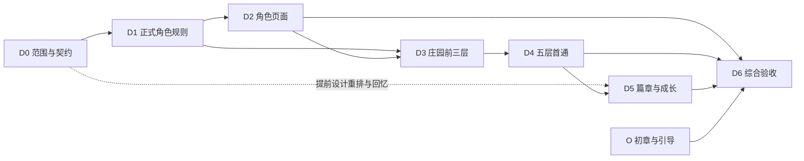

> 历史档案：2026-09-07文档整理时归档。原路径：`docs/plans/DEMO_CHARACTERS_AND_OLD_MANOR_IMPLEMENTATION_PLAN.md`。保留当时的设计、状态和验证证据，不作为当前排期或默认机制；当前入口见[文档索引](../../README.md)。

# DEMO 正式角色与克雷格旧庄园实施计划

> 版本：v0.3；更新日期：2026-09-07。
>
> 状态：D0 文档与契约收口完成；三项主要选择已定稿。D1 规则与 D2 正式角色页已完成本地验收；D3 三层内容已接回原界面，整体验收尾项待齐；D4 五层／首通／维护工程闭环与本轮自动验证完成，美术与人工验收待补；D5-A–F及刻仪兽／记事入口／商店已接线，默认切至v4内容3；G完整配平与综合验收待齐；D6待开始。
>
> 规则依据：[实施规格 v0.1](../design/DEMO_CHARACTERS_AND_OLD_MANOR_SPEC_V0_1.md)。
>
> 前置底座：[S3 实施验收](../audits/2026-09-05-s3-implementation.md)。

当前优先级：按用户最新要求先做[初章与引导 O0–O4](../../plans/DEMO_PROLOGUE_AND_ONBOARDING_PLAN.md)。O0现状与范围文档已交付；接下来制作 CG 分镜、洋馆介绍、基础教学关卡与初始钩子，再进行游戏接线。D0–D5历史编号保留，D6新增初章路径；庄园压力和剧本质量问题继续跟踪，不因新优先级而视为通过。

用户后续定稿：[三项正式决策](../design/DEMO_CHARACTER_RULES_REVIEW.md#0-本轮定稿记录)——先通庄园，再完成回忆开放玛；Lv.3 封顶且只提供两件空面装备；重排敌方阵位。实施范围已同步，D1 已完成；真实解锁链按 D4/D5 推进。

2026-09-07追加定稿：初战千金；首通并列开放回忆与维护，最终Boss均为刻仪兽；回忆入口位于角色「记事」顶部，原本尊战由刻仪兽战替代。既有D5完成项描述旧v4，不能作为替换已经实现的依据。本轮新内容、入口和旧档承接已接线，见[闭环与商店实施记录](../audits/2026-09-07-loop-and-shop-implementation.md)；完整配平与综合验收继续按[D5计划§0](DEMO_D5_MEMORY_AND_GROWTH_PLAN.md#0-本轮替换范围与实施顺序)补齐。

2026-09-06 D0 交付：[范围与契约](../design/DEMO_D0_SCOPE_AND_CONTRACTS.md)、[核验记录](../audits/2026-09-06-demo-d0-closure.md)。后续按用户要求完成 [D1 详细勘探与计划](DEMO_D1_CHARACTER_RULES_PLAN.md)及[源码审计](../audits/2026-09-06-demo-d1-exploration.md)，随后授权实施 D1，见[实施报告](../audits/2026-09-06-demo-d1-implementation.md)。角色机制细则已回写[规则讨论单](../design/DEMO_CHARACTER_RULES_REVIEW.md)。

## 1. 执行原则与交付节奏

原 D 线已建立正式角色、庄园五层、回忆与重复出征的工程闭环。现在先补新玩家的初章，再处理原内容质量问题；每阶段交付可检查的内容与游玩结果，不按页面数量或仅按接线通过宣布完成。

本计划是 S0–S3 之后的内容实施线，使用 D 编号；S4 仍指可选 AI 接入。rp-style-lab 不作为以下任一阶段的前置依赖。

| 阶段 | 玩家／工程结果 | 依赖 | 状态 |
| --- | --- | --- | --- |
| D0 范围与契约收口 | 首发可达内容清单、版本及状态归属、设计决策记录 | 本规格 | 文档交付完成；产品基线不等于角色规则定稿 |
| D1 正式角色规则 | 新 Catalog、六人六面、牌型、四约、专属动作、成长解析与共鸣 | D0 契约＋对应角色细则收口 | 规则与版本化存档验收完成；生产内容后续注册 |
| D2 正式角色页面 | 同档案概要、骰装、记事；地图与战斗使用相同投影 | D1 的内容与 selector；可提前做展示标定 | 已实施与验收；生产沿用 legacy，新规则隔离验证 |
| D3 庄园前三层 | 三类小怪、管家、事件、常备包、第三层撤离和失败再出征 | D1 核心；D2 关键玩家导航 | 已实施并走通三层回馆／再出征；配平、人工、故障和性能尾项待齐 |
| D4 五层与首通 | 宴会厅、千金、联动意图、解线、接管及维护路线 | D3 基线；发布前补齐验收 | 工程闭环与本轮自动验证完成；缺图、人工及完整表现验收待补 |
| D5 角色篇章与成长 | 角色重排、刻仪兽回忆、玛亲征解锁、真实成长／装备获取 | D1；D4 首通进度 | A–F及刻仪兽／记事入口／商店接线已实施，默认v4；G完整配平与综合验收待齐 |
| O 初章与引导 | CG 世界介绍、洋馆介绍、基础教程／简单副本、初始钩子与回馆 | 复用现有存档／AVG／战斗；具体方案见独立计划 | O0文档已交付，O1内容稿待开始；当前优先 |
| D6 DEMO 综合验收 | 包含初章的完整玩家路径、新旧档兼容、配平、表现性能及交付记录 | D2–D5＋O | 待开始 |

D3 是内部可玩段落，不能替代完整 DEMO。D5 的回忆战、解锁与角色铭约不是可省略的包装工作；若变更首发范围，需要同时更新规格、可达表与完成口径。

## 2. 开工准备与变更保护

当前工作树已有大量 S0–S3 迁移、UI 和素材改动。每阶段开工先记录 `git status`、相关路径基线与已有失败；只改本阶段涉及路径，不 reset／clean，也不将既存删除算作本阶段清理。

保留以下基线：

- `src/content/gameplay/legacy-v1/` 的历史内容、`abyssa.legacy` 版本语义和兼容入口。
- 956 步旧黄金轨迹及 124 项兼容运行时导出。新玩法另建用例，不重录旧期望掩盖回归。
- S3 的事务先于演出、CAS、幂等回执、自动恢复、一次终局结算。
- 当前 Battle 配色、顶栏与内沿红线、骰子自然滚动／归位、敌后雾效。
- 用户开发服务；验证使用独立端口或测试临时服务，不终止既有服务。

每阶段记录实际修改、规则差异、验收命令、结果、未覆盖范围。报告放 `docs/audits/`；大体积截图、trace、性能记录可放忽略目录 `dist/reports/demo/`，报告保留复现方法，不依赖这些临时文件存在才能读懂结论。

## 3. D0：首发范围、决策与版本契约

**目标：给后续实现一个明确的输入，不把 UI 样稿、旧版默认值和临时夹具混成正式策划。**

### 工作包

- [x] D0.1 已形成初始五人、玛开放、补给与重访可达表；后续用户将首发定为 Lv.3 封顶、两件空面装备，当前范围已同步。
- [x] D0.2 P01/P14 的首发基线、P04 工程决策落文档；其余 P 项逐项转入角色讨论或 D3/D4/D5 落点。
- [x] D0.3 已列角色／36 面、动作、敌人、遭遇、房间、路线、物品、装备、成长与篇章的身份和引用；未创建生产 Catalog。
- [x] D0.4 已列 schema 2 目标、各层状态所有权、memory 互斥运行、终局与展示游标边界。
- [x] D0.5 已列命令、业务去重、冲突／存储失败／恢复语义；新旧版本不会静默混用。
- [x] D0.6 已列 memory 事实来源、导入保留、时间和双重奖励契约；后续用户选择敌方阵位重排，R08 继续补自动策略及两阶参数。
- [x] D0.7 已核对36面与成长表；确认凯尔有立绘和队伍标定，缺档案登记／头像映射；补列千金拆层、回忆场地缺项。

**涉及路径**：`docs/design/`、本计划及 `docs/audits/`。本阶段先产契约，后续按契约实施；不借“工程整理”批量重排根目录。

**交付**：版本矩阵、内容可达表、决策记录、状态／命令矩阵、资产缺项单。可写为实施规格附录，避免再造多份冲突的规则书。

**退出条件（按本轮用户停止线调整）**：能明确回答新档有什么、哪些要解锁、哪笔钱属于谁、哪里能撤离、如何读取旧档；D1 所需但尚未定稿的规则有独立讨论单，没有被默认值替代。Boss 数值等在 D3/D4 收口。D0 以文档和契约交付完成，不等同 D1 就绪，更不代表正式角色规则已确认。

## 4. D1：正式 Catalog 与角色战斗规则

**目标：脱离浏览器也能运行正式角色的确定性战斗；角色页和地图有稳定读模型可用。**

详细执行以 [D1 勘探与实施计划](DEMO_D1_CHARACTER_RULES_PLAN.md)为入口。该稿沿用下列 D1.1–D1.8 编号，拆为 A–G 执行包，补上版本分流、阵位／意图区分、独立遭遇结果、临时锈来源与查询接线；具体源码依据见[勘探审计](../audits/2026-09-06-demo-d1-exploration.md)。本节勾选项表示 D1 代码交付；完成依据见[实施报告](../audits/2026-09-06-demo-d1-implementation.md)。

### 建议顺序

1. 新包与版本路由：类型→验证→内容→运行时装配→新档创建→导入导出，保留旧版入口。
2. FaceDef、解析配置与命数／品质／花色，接六人 36 面和成长奖励表。
3. 三向万能、护卫、昂贵治疗、顺劈、提线／线消费及全体意图格挡。
4. 成牌快照、同花、万能点数选择与宽判铭约检测；接尤／艾／柯／诺四约的初铭与现行，含艾现行净化。
5. 归队／临时退化与编队共鸣；收口新版阵容可达表。
6. 导出供角色页、编队和 Battle 使用的查询结果；开发夹具与生产开放条件分离。

### 工作包

- [x] D1.1 修改严格限定 `rulesVersion: 1` 的契约与验证；实现显式新旧装配，不使用模块级可变“当前 Catalog”。
- [x] D1.2 新建 `src/content/gameplay/demo-v1/`；内容校验覆盖六面数量、唯一 ID、引用、合法花色／命数／品质和非负参数。
- [x] D1.3 完成 P02/P03/P06 决策：成牌／万能点数、顺劈快照、束缚上限、挣脱边界、力竭恢复；写规则例子再实现。
- [x] D1.4 正式面映射与 Lv.1–3 成长解析；凯尔可除锈、永久锈和临时锈身份分开。纳入任意两人 Lv.3 后护卫面变金的既定团队里程碑；不交付凯尔晶石获取线。
- [x] D1.5 扩展最小必要 effects/status/modifier；不把角色姓名或怪物名称写进通用 resolver 分支。
- [x] D1.6 四约初铭／现行的目标策略、随机数量、净化与真值表，固定 RNG 和稳定平局规则；玛重排两阶参数未完成时仅内部夹具可用，不标成完整五约；不实施 Lv.5 终铭。
- [x] D1.7 共鸣按正式成员及主副花色计算；特别验证玛替尤、玛替艾仍有尘世共鸣，圣辉不可达。
- [x] D1.8 新玩法回放、存档恢复与 legacy 回归，生成首批规则报告。

**涉及路径**：`src/game-core/contracts/`、`battle/domain/`、`battle/rules/`、`battle/selectors/`、`battle/persistence/`、`session/`、`src/content/gameplay/`、`src/game-application/` 的版本验证、`src/game-runtime/`。

**有意义的测试**：睡眠强力面可行动但不成牌；醒空面仍成牌；固定／已用骰不改成牌资格；两种万能不同；顺劈主目标死亡不换波及对象；定身保蓄力且不重复定身；多个目标留线、绞杀只消费当前目标；多铭约一次触发及派生不递归；重试 RNG 不漂移。

**退出条件**：正式规则可 headless 执行和恢复；六人当前配置被同一 selector 描述；旧档按旧规则继续。D1 通过不等于玛铭约／回忆或正式装备获取已完成。

## 5. D2：真实角色页面与编队投影

**目标：角色页展示玩家这份档案里真实拥有的角色，而不是独立样稿。**

执行入口：[D2 详细勘探与实施计划](DEMO_D2_CHARACTER_PAGE_PLAN.md)，源码及浏览器依据见[D2 勘探审计](../audits/2026-09-06-demo-d2-exploration.md)。下列 D2.1–D2.7 对应 A–G 工作包已实施，见[D2 实施验收](../audits/2026-09-06-demo-d2-implementation.md)。只读会话、语义查询、三页和跨页检视已经接通；真实 legacy 档与规则 2 隔离验证分别验收。原有五晶石、三格私约卡片和装饰布局保留，缺数据时显示未记录。正式 Catalog 开放随 D3/D5 推进，不用 D1 fixture 替代生产内容。

### 工作包

- [x] D2.1 `character-status` 接统一会话体系的只读能力、save/epoch 和导航；无档案沿用选择档案流程，读取不重放命令或续行战斗。
- [x] D2.2 建立 gameplay＋Campaign＋展示资料的投影适配；移除生产页面对样例羁绊／伤情／记事的依赖。
- [x] D2.3 凯尔进入角色选择与资料映射；六人六面完整可查；非首发人物按范围显示为资料或未开放。
- [x] D2.4 概要显示真实进度，篇章缺状态时如实说明；骰装显示当前／下一成长、三种锈来源、三槽适用性及真实实例；记事读取跨远征、可归属角色、可见且未撤回的事实。
- [x] D2.5 地图名单、已开放成员、战斗装载与角色页用同一解析结果；不能出现页面是金面、出征仍是旧面。
- [x] D2.6 初期保持装备／成长只读；D5 完成命令后开放写操作，不先放能点击但无真实效果的按钮。
- [x] D2.7 处理换档、读档失败、跨标签更新、旧版本角色、局内查看和缺图；保留明确的样稿预览用途。

**涉及路径**：`src/apps/character-status/`、`src/apps/map/sortie/`、`src/game-client/`、runtime 中的展示适配、`src/content/characters/`、必要的 `src/shared/domain/`／`shared/ui/patterns/` 展示契约。

**验收**：同档案跨页一致；换档不串数据；沉眠与空面可区分；永久锈不会被描述为可清理；未开放玛没有亲征按钮；静态历史与实际记事不同源。重点做查询与交互测试，低风险文案／样式不重复堆实现镜像测试。

**退出条件**：玩家可从主流程进入真实角色页并返回地图；缺少后期成长不妨碍读当前配置；UI 组件没有反向依赖 application/core。

## 6. D3：庄园前三层与完整撤离循环

**目标：用真实内容检验底座能否承接一个地牢段落，而非只替换背景。**

执行入口：[D3 详细勘探与实施计划](DEMO_D3_OLD_MANOR_PLAN.md)；规划时依据：[D3 源码审计](../audits/2026-09-06-demo-d3-exploration.md)；当前事实：[D3 原界面接入与验收边界](../audits/2026-09-06-d3-ui-correction.md)。阶段包、非战斗节点、七种配给、回馆和第二次出征已经接通；三层档保留，新档已随D4切入五层庄园。40 项浏览器回归通过，原样式保留。D4已补默认五人两策略各100种子的三层矩阵与满席性能初验；五趟人工、完整历史故障注入等整体验收尾项仍未收齐。下列清单保留作整体验收核对，不表示代码仍未实施。D0 的绑定配给、失败仅损本趟和结算推进一相位继续有效。

### 工作包

- [ ] D3.1 将 Route 扩为层与房间进度；区分 encounter-complete、room-complete、layer-complete、exit-choice、finished 的职责，实际类型名称按契约统一。
- [ ] D3.1a 扩展 GameSession 自动续步分类：只恢复必须完成的确定性后续，遇事件／出口等待输入；核对现有六步恢复上限，不以盲目提高上限代替正确状态机。
- [ ] D3.2 接三小怪、敌方修复、蓄力游标、正式 artId 与阵位；第 1 层教学必须通过正常命令，不用固定好骰伪造成功。
- [ ] D3.3 完成管家机制卡与 P08 的首段决策，明确封锁目标／持续、预告、3 伤落幕及 HP。
- [ ] D3.4 接七件道具、四槽选择、出征预留、实际消耗、返还和再次补给；完成 P07，不能等完整经营系统才允许测试第二趟。
- [ ] D3.5 完成 P09，接至少一张有完整选择／判定／结果的事件卡及卦签揭示；事件选择可刷新恢复。
- [ ] D3.6 完成 P10 的首段经济表：赏金、一次深度倍率、层入袋、道具成本与失败范围；区分场间与清层效果。
- [ ] D3.7 接庄园地图节点、迎客门厅／服务走廊、第三层真实出口；非出口不允许借页面跳转逃离结算。
- [ ] D3.8 覆盖低血、力竭、临时锈、全灭、第三层撤离、回馆与第二次出征；修正发现的规则／经济问题。

**涉及路径**：core 的 session、expedition、lifecycle、settlement、enemy intents 和 targets；application 的命令／事实／结算；client 的恢复与导航；`demo-v1` 路线／物品／事件；`apps/map`、`apps/battle`、必要的回馆结果面板。

**关键测试**：

- 一层两个战斗的专用夹具：场间不误入袋、不重置本趟装备成长；首回合共鸣每场生效；归队按已选规则触发。
- 第 1、2 层无法主动撤离；第三层必须先赢管家；刷新出口画面不会自动继续深入。
- 同一道具请求重复两次只消耗一次，第三件战斗道具被拒；场外使用按独立边界，不能复活力竭者。
- 战斗、事件、清层和返还每一处存储失败／重试都不多发钱、不丢物、不跳过待选项。

**退出条件**：从生产新档走默认勇者队完成前三层、撤离、回馆、补给、第二趟；另走失败回馆路径。内部玛夹具可以测专属能力，但测试结果必须注明非生产解锁。

## 7. D4：宴会厅、千金与首通／重访

**目标：第一个副本有自己的机制和结局，并且第二次进入仍讲得通。**

执行入口：[D4 详细计划](DEMO_D4_OLD_MANOR_PLAN.md)；实施结果：[D4 实施与验证](../audits/2026-09-06-demo-d4-implementation.md)。完整 v3 包、关联意图／有限补席、末层自动结算、一次接管／奖励、可恢复剧情及维护路线已接通；新档使用 v3，旧三层继续 v2。当前采用千金 HP18、两客起始／三客上限作为试玩工作值，配平证据与限制见实施报告。继续沿用原战斗与角色页样式，D5 未实施。下列勾选表示工程交付；用户已允许缺图待补，D4.4 不勾作完整演出。

### 工作包

- [x] D4.1 依据前三层数据确认第 4 层考题和敌群；默认不启用刻仪兽，变更必须补卡片与范围记录。
- [x] D4.2 定千金卡：HP、席位上限、补席循环、召唤行动时机、举杯目标和胜利条件；验证默认勇者队可解。
- [x] D4.3 关联意图共享核心计算；候席客死亡即时减伤，补席即时更新预览，格挡独立且不被重算覆盖。
- [ ] D4.4 脚本、必经进度与原弹层接线完成，千金已禁用通用斩杀；刀排／断线拆层、沉睡及抱起画面按用户决定待补，完整演出未验收。
- [x] D4.5 首通进度、奖励和结算引用原子提交；剧情播放／跳过／恢复不影响权威结果。
- [x] D4.6 完成 P11，接首通后维护路线及常规奖励；不会重绑千金、重复接管或重复首通领奖。
- [x] D4.7 接庄园可见事实与本地回馆短反馈，解释撤离、保全、失败或家宴结束的实际结果。
- [x] D4.8 最大四敌完成两尺寸取景和性能初验；满席重掷p95为17.6ms，30秒内无长任务。六次补席储备、零召唤赏金与层收益上限已验证；完整碎刀演出及长场／多设备验收仍待补。

**涉及路径**：`demo-v1` 敌人／路线／事件／剧情映射、core 关联意图／召唤／胜利条件、application 首通与事实、client 演出恢复、Battle presentation、地图／洋馆投影和庄园本地素材。

**验收例**：举杯从 `2+3=5` 随两名宾客死亡变为 3；结算读取最新值，格挡仍有效。这个例子验证公式，不指定正式初始宾客数。Boss 与最后宾客同批死亡、敌人治疗改 HP、全体定身、满席补席、终杀演出中刷新均需覆盖。

**退出条件**：默认新档能首通五层、看到救离与接管、领奖一次、回馆并进入维护委托；第三层撤离不误触首通。若关键终杀资产未完成，只能标工程可玩，不能标表现完整验收。

## 8. D5：本尊回忆、玛丽埃塔开放与成长配装

**目标：让正式六人从“数据存在”成为玩家有合法路径获得和使用的内容。**

执行入口：[D5详细计划](DEMO_D5_MEMORY_AND_GROWTH_PLAN.md)；实现前证据：[D5勘探审计](../audits/2026-09-06-demo-d5-exploration.md)。D5-A已交[机制与内容规格](../design/DEMO_D5_A_RULES_AND_STORY_SPEC.md)和[完整脚本](../design/DEMO_D5_A_STORY_SCRIPT.md)。D5-B已交[独立v4与合法进度底座](../audits/2026-09-06-demo-d5-b-implementation.md)，覆盖证据、游标、run互斥和唯一归属。C已交[重排与本尊核心](../audits/2026-09-06-demo-d5-c-implementation.md)，下列D5.1／2完成。核心可执行不等于玩家回忆、领取与页面接通，数值和美术仍待验证。

### 工作包

- [x] D5.1 自动排列、时机、持续、预算、平局及初铭／现行／本尊机制卡已在D5-A收口；共同例子与收拢边界经独立算术核验。工作数值待D5-G配平，Lv.5后置。
- [x] D5.2 C已实施共用阵位原语、两阶铭约、本尊护域／循环及固定历史战；四约顺序、冻结手牌、敌方队列、有效伤害、终局、撤回与恢复已验证。D已接入原界面的局部重排表现，完整美术／性能仍待G验收。
- [x] D5.3 六段回忆由D接入可恢复播放、真实本尊战与当下兑现；A已写齐的成长／赠物脚本由E接入，不另造完整地牢。
- [x] D5.4 D已实现memory运行状态、时间边界和事实隔离；失败／重试／读档不影响当下资产、HP、临时锈和普通远征结算。
- [ ] D5.5 D已实现篇章完成一次开放玛亲征，E已同步成长与配置查询；**仅F的二周目继承／跳过部分待实现**，必须依据可验证的完成记录，不提供绕过首次完成的默认捷径。
- [x] D5.6 E已接通十项成长、整备赠物及团队里程碑；真实旅程验证五人成长至Lv.3、两件装备装卸／出征及凯尔结果一次生效，见[E记录](../audits/2026-09-07-demo-d5-e-implementation.md)。
- [x] D5.7 已实施备用短刃、应急药囊的唯一实例库存与装卸／转交；不追加专武／小件或原Lv.3专武赠礼。凯尔团队品质成长不混入道具净化，晶石除锈线后置。
- [x] D5.8 原角色页通用槽已启用有限装备写操作；重复领奖、转移、无所有权／占槽／不适用目标及普通远征／回忆中改装均有校验，查询本身不推进活动run。
- [ ] 2026-09-07修订：维护末层／回忆Boss改为刻仪兽，替换原本尊脚本，在角色记事顶部接入入口；同步新旧内容版本承接与真实页面验收。上方旧完成项不覆盖这项新增差异。

**涉及路径**：core 共用 effect、growth/loadout 解析和隔离会话；application 进度／奖励／命令／事实；runtime 装配；novel 或现有叙事入口与主流程导航；角色页、地图和回馆内容。

**退出条件**：先通庄园，再完成回忆开放玛；失败无当下惩罚，成功一次领奖。五名成长角色的初铭／现行及 Lv.2／3 均有真实可达路径，玛可使用两阶阵位重排；凯尔团队变金与角色页／战斗一致。不能用调试脚本代替解锁，Lv.4／5 和额外装备不得误开放。

## 9. D6：综合验证、配平与交付

### 必走玩家路径

| 路径 | 检查重点 |
| --- | --- |
| 新档→CG世界介绍→洋馆介绍→教程／简单副本→回馆→自由枢纽 | 开场不直进菜单；玩家理解操作与目的；CG／对白／战斗恢复；教学不串庄园奖励 |
| 初章完成档→角色页→编队→备包→庄园前三层→撤离→回馆→再出征 | 正式数据一致，退出点与补给闭合 |
| 初章完成的勇者队→庄园第五层首通→救离／接管→回馆 | 未开放玛也能完成；结局、首通资产与进度一致 |
| 回忆失败→重试→完成→玛开放→成长／配装→维护委托 | 历史隔离、真实获得、重复挑战叙事成立 |
| 任意战斗／事件／出口／终杀中刷新；双标签发相同请求 | 结果不重算、选择不被代选、资产不重复 |
| 无 AI、模型超时或响应过期 | 游戏与本地反馈完整，旧响应不写进新场景 |
| legacy／既有 DEMO 老档→继续／导出；含初章的新档→继续／导出 | 版本匹配、未知版本失败可解释、旧规则未被新内容污染；旧档不强制补初章 |

### 配平与性能

- [ ] 固定种子矩阵：默认勇者队和玛四种替换、Lv.1／2／3、凯尔团队变金、两件空面装备及不同补给，记录胜负／撤离、回合、耗材、收益及专属机制价值；不以 Lv.5 终铭作为本次验证前置。
- [ ] 人工试玩验证读取意图、理解睡眠、明白第三层退出、识别席位减伤；不能只以自动策略通过代替可玩性。
- [ ] 以实际首发最大敌群同时触发雾、骰子、意图变化／召唤，记录相同设备和场景的前后帧时间、长任务、布局与内存变化；不把低负载旧截图当证据。
- [ ] 1600×900 及较小窗口检查字体、长名、血条、吊线、地面与全部目标可点击；低动效／后台暂停／WebGL 不可用均能继续。
- [ ] 重复进出战斗和角色页检查监听器、计时器、画布与缓存回收；内容换场不反复解码全包资源。

### 分层检查命令

使用仓库 `.nvmrc` 指定的 Node 与现有脚本，不为新内容另建一套测试入口。各阶段先跑改动域的验证，通过后推进；全量集合在 D6 或跨层变更确有需要时执行。

| 变更范围 | 检查 |
| --- | --- |
| core／内容契约 | `npm run check:core`，定向角色／意图／结算场景 |
| application／存档／命令 | `npm run check:application`、`npm run test:storage` |
| 页面与表现 | `npm run typecheck:app`、相关 app 测试、必要浏览器检查 |
| 完整集成 | `npm run check:baseline`、`npm run release:check:game`、`npm run release:check:ui`、`npm run build:entries`、`npm run check:auxiliary` |

新浏览器路径加入既有 game/storage 项目，服务构建产物；保持根路径／子路径部署检查。远程 CI 只有真正运行成功才记通过，本地通过不能代称远程通过。

**交付文件**：实际实现报告、最终首发可达内容表、未首发清单、已裁决 P 项、配平与性能证据、存档兼容说明、可复现启动／验收步骤。更新 README、当前设计状态和 Battle 基线的“已实现”范围。

**退出条件**：规格第 13 节 A–H 全部通过；无已知会丢档、复制资产、阻断必经路径或破坏剧情状态的问题；没有靠隐藏调试开关完成的必走路径。其余风险明确记录影响和后续范围。

## 10. 当前下一步

**先进入 O1 初章内容稿。** 按[初章计划](../../plans/DEMO_PROLOGUE_AND_ONBOARDING_PLAN.md)补 CG 分镜／简短旁白、洋馆分场、简单委托的起承转合与第一版教学卡；具体剧本、敌群、奖励和跳过策略未定稿，先完成内容与契约再接线。

当前默认已经是规则4／contentVersion 3，D5成长、装备、旧档续接、二周目及三类战斗／商店接线见[实施记录](../audits/2026-09-07-loop-and-shop-implementation.md)。[战斗UI与事件流计划](../snapshots/BATTLE_UI_AND_EVENT_FLOW_OPTIMIZATION_PLAN_BEFORE_CONSOLIDATION.md)的已完成项继续保留，初章复用现有样式和动效。[内容质量审计](../../audits/2026-09-07-demo-experience-quality.md)中的庄园配平与剧作返工、D4缺图与人工验收仍未完成。
