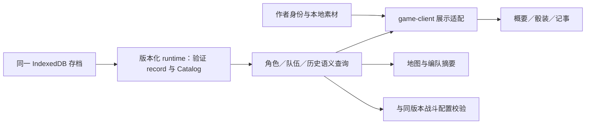

> 历史档案：2026-09-07文档整理时归档。原路径：`docs/plans/DEMO_D2_CHARACTER_PAGE_PLAN.md`。保留当时的设计、状态和验证证据，不作为当前排期或默认机制；当前入口见[文档索引](../../README.md)。

# D2 正式角色页面：勘探与实施计划

> 日期：2026-09-06；版本：v0.2（实施收口）。
>
> 状态：D2 已实施；交付与验收以 [D2 实施报告](../audits/2026-09-06-demo-d2-implementation.md)为准。本稿承接 D1 的实际交付，不重新讨论已定稿角色规则。
>
> 总入口：[D0–D6 实施计划](DEMO_CHARACTERS_AND_OLD_MANOR_IMPLEMENTATION_PLAN.md)；依据：[实施规格 §6](../design/DEMO_CHARACTERS_AND_OLD_MANOR_SPEC_V0_1.md#6-角色页面实施规格)、[D1 实施报告](../audits/2026-09-06-demo-d1-implementation.md)。
>
> 现状与证据：[D2 源码勘探及浏览器审计](../audits/2026-09-06-demo-d2-exploration.md)。

## 1. D2 要交付什么

让玩家从菜单、地图或战斗进入角色页，看到**这份档案、这个版本、当前这趟远征**里的真实配置，并能返回原流程。保留现有概要／骰装／记事布局和美术；本阶段的主要工作是接线、语义修正和状态可靠性。

已定稿约束继续有效：先通庄园，再完成回忆开放玛亲征；Lv.3 封顶；仅备用短刃、应急药囊两件空面装备；玛重排敌方阵位。装备改写全部原生空面，不唤醒沉眠面。

| 本阶段交付 | 本阶段边界 |
| --- | --- |
| 同档案只读角色页、真实 legacy 展示、规则 2 完整展示适配 | 不发布不完整的 `abyssa.demo`，不把 D1 fixture 注册进生产 |
| 六人资料、六面、等级／成长预览、锈来源、装备状态 | 不发成长奖励，不装卸装备，不推进篇章，不开放玛亲征 |
| 跨远征、按角色归属的可见记事投影 | 不编造过去事件，不新增 AI 总结，不把测试经历写入玩家历史 |
| 地图名单和角色摘要使用同一查询；战斗返回导航与一致性校验 | rules 2 的战斗动作交互、路线和恢复接线继续归 D3 |
| 样稿隔离、换档／缺图／读档失败／跨标签更新验收 | 不重新设计 Battle 骰子、红线、雾气或角色页全部装饰 |

### 1.1 分清页面完成与生产内容开放

D1 的六人规则模块已经完成，但完整可执行包仍是 `abyssa.fixture.demo-d1`；其中玛的铭约引用被显式取消，不能冒充完整正式包。默认浏览器入口仍是 legacy。

D2 按以下方式落地，不等待 D3 全部完成，也不提前制造正式新档：

1. **真实玩家路径**：已有 legacy 存档进入新角色页，按旧 Catalog、已提交 Campaign 和当前远征显示真实内容；缺少的新系统显示“不适用／当前档案未提供”。
2. **规则 2 验证路径**：同一角色页和同一读取链接受测试注入的已验证 Catalog，在隔离 IndexedDB 中验证六人、Lv.1–3、装备与临时锈。测试档必须标识来源，与普通存档分开。
3. **后续生产启用**：D3 在内容及交互引用闭合后注册正式包；D4/D5 提供真实首通、篇章、解锁及获得记录。角色页继续消费同一契约，补上这些状态来源。

“D2 完成”表示上述真实 legacy 页面和规则 2 展示接线通过验收；不表示玩家已经能正常获取全部成长或挑战完整庄园。生产注册不得用临时空 handler、假解锁字段或 fixture ID 达成。

## 2. 现状决定的优先级

| 优先级 | 已确认缺口 | 实施决策 |
| --- | --- | --- |
| 先处理 | 角色页未接 GameProvider，默认蕾诺尔，真实入口直接展示 62/100、休养两天 | 入口先接同档案读取；样稿迁入明确预览 |
| 先处理 | 当前 GameSession 只支持 v1，refresh 会重放待发送请求 | 先提供同一会话体系的只读能力；角色页读取不派发命令 |
| 先处理 | D1 character 查询在 v1 只返回定义；v2 三槽只是布尔标记 | 补有效配置、状态及装备来源的语义查询，再接 UI |
| 先处理 | 展示契约把命数与品质混在一起，特殊动作和万能点描述不足 | 以独立轴展示动作、命数、点数、品质、花色；穷尽映射 |
| 随页面完成 | 骰面检视保存旧对象；浏览器已复现切人后仍显示上一人的沉眠 | 检视只存身份，按最新读模型取值；换人／换档清理 |
| 随页面完成 | 记事只查活动／指定远征，缺角色生涯归属 | 新增跨远征历史查询与明确事件白名单 |
| 随页面完成 | 凯尔已有立绘／队伍素材，却无档案映射 | 复用素材，补纯展示登记和头像裁切 |

## 3. 数据链与依赖边界

- `core` 负责成长、装备改写、临时锈和共鸣规则；D2 只在缺少公开读取能力时补 selector，不改 D1 规则结果。
- `application` 负责事实可见性、来源、撤回和历史归属的纯投影。角色页不扫描私有内部事实拼故事。
- `runtime` 按 record 路由，装配查询；返回纯规则数据，不导入 React、`shared` 或图片。
- `game-client` 放可供多个页面复用的展示适配，将规则枚举映射到展示 DTO，并拼接作者身份资料。不能从一个 app 导入另一个 app。
- `shared/domain`／`shared/ui` 只接收展示契约。不能反向导入 runtime、core 或 content；样稿兼容留在显式适配处。
- `content/characters` 只提供作者身份、简介和素材标定。生产适配使用字段白名单，不把 `profile.status` 整体展开进真实状态。

查询输出随 `head + contentRef` 绑定；切换等级预览、角色和页签不写存档、不产生 RNG、不触发模型调用。缓存以存档身份、revision 和内容摘要为依据，不能只以角色 ID 缓存。

### 3.1 拟补的只读模型

以下是实施契约，不是声称已有的 API；最终命名可贴合现有代码。

| 模型部分 | 必须携带的含义 | 来源与缺省语义 |
| --- | --- | --- |
| 来源 | head、contentRef、角色 ID、campaign／active-run、runRef（如有） | runtime 校验后的 record；显示用版本名与内部 ID 分开 |
| 可查与可出征 | dossier 存在、可出征能力、是否本趟成员、原因 | 不用一个 `disabled` 同时代表“不可出征”和“不可查资料” |
| 当前配置 | 六面、maxHP、可用铭约及阶段、成长来源 | 局内成员用冻结配置；其他人用 Campaign 解析配置 |
| 临时状态 | 当前 HP、倒地／归队状态、临时锈面及来源 | 只有当前运行真实存在才显示；馆内不伪造满血／休养倒计时 |
| 成长 | 当前等级、封顶状态、下一奖励定义、配置差异 | 用 core resolver 在进度数据的拷贝上计算；不把预览视为已领取 |
| 装备 | 各槽适用状态、真实实例／定义／owner、影响的原生面 | 来源为该档长期进度或本趟冻结进度，非 Catalog 中“有这件物品” |
| 篇章 | 已知状态，或尚无可读取的状态 | 不用缺字段推断“未完成”；实际完成账本留 D4/D5 |
| 记事 | 条目、事实来源 ID、run/encounter、世界时间、归属 | 可见、未撤回、非 simulation；作者背景另有来源 |

### 3.2 v1 与 v2 不互相补造规则

| 维度 | legacy 档 | 规则 2 档 |
| --- | --- | --- |
| 六面 | 按旧定义和旧有效面 selector；局内退化照旧计算 | D1 已解析六面＋临时覆盖 |
| 花色／命数／成长 | 旧记录没有独立语义时明确不适用，不从新包或样稿补入 | 独立显示四花色、醒眠、自然点／万能点、Lv.1–3 |
| 开放成员 | Campaign 的 `availableCharacterIds` | 当前从有效 profile 读取；D5 接实际解锁账本 |
| 装备 | 旧背包／当前 loadout 的真实实例与生效规则 | `progress.equipment` 的已绑定实例；当前没有“未分配仓库”的推导依据 |
| 玛铭约 | 只展示该版本实际拥有的能力 | 夹具未配置时显示未配置能力；不能套用作者样稿或声称完整五约 |

保留旧记录的业务含义；新展示模型用判别联合表达缺项，不能把 v2 强转为旧 `GameRecord`，也不能通过默认值让旧档看起来已拥有新规则。

## 4. 会话、导航与只读策略

### 4.1 复用会话基础，隔离执行权限

在 `game-client` 的现有会话体系中抽出版本无关的读取／订阅部分，或使其接受最小 reader 接口；角色页使用显式 `read-only` 模式。旧页面执行协调器继续保留自己的 v1 行为，D3 再接 v2 战斗恢复。

只读会话必须：

- 通过版本化 browser runtime 打开同一 `abyssa-game-v1` 数据库，核对 save、epoch、内容版本及 digest；不另建角色存档。
- 仅暴露读、订阅、重试、诊断能力。刷新不重放 pending，不调用 continuation/resume，不清理他页待发送请求，不增加 revision。
- 复用跨标签通知、pageshow／visibility 刷新和过期异步响应丢弃；同一通知协议覆盖已支持版本，先按档案身份过滤再重新验证记录。
- 旧执行会话保留提交后回执、CAS、幂等及恢复能力；不复制一套战斗 coordinator 到角色页。
- browser runtime 负责 store 连接与 close 生命周期；测试通过工厂注入 Catalog 与独立数据库，生产工厂只注册真实受支持的包。

同档刷新失败可保留“上次已读取”的界面并明确提示过期；更换 save／epoch 或身份校验失败须清除旧角色数据。返回当前远征等依赖最新状态的入口不能依据失败前旧 head 直接跳转。

### 4.2 定位与返回

继续使用 `gameHref`，扩展显式角色页参数：角色 ID、三种页签之一、来源页面枚举、可选运行身份。保持旧 `save/epoch/expedition` 链接兼容；运行身份表示查看范围，不表示授权恢复战斗。

| 进入方式 | 默认角色／返回 |
| --- | --- |
| 菜单“角色” | 有效的指定角色，否则凯尔／当前队伍首名；返回菜单 |
| 地图名单检视 | 当前点选成员；返回同档地图；未提交编队继续遵守现有临时选择语义 |
| 战斗成员检视 | 当前成员，明确本趟配置；返回同一活动运行 |
| 直接打开／刷新 | 有效 locator 恢复角色与页签；缺档去已有选档流程 |
| 旧运行链接／未知角色 | 显示运行已变化或角色不可用，提供当前档菜单；不悄悄切另一趟 |

返回目标只接受 `menu/map/battle` 等白名单，不能接任意 return URL。URL 参数编码和 ID 校验须与受支持存档 ID 对齐，包括 core 可接受而当前导航不接受的 `/`；不把 ID 当路径拼接。

维护 `config/entries.mjs` 的导航依赖。双击入口、页面后退与 bfcache 恢复都必须重新核对身份；选档后无需保留跨档的旧角色／面位／记事筛选。

## 5. 三页展示与交互

### 5.1 概要

沿用当前身份、立绘、羁绊带、能力和人物简介的结构，调整内容来源：

- 用户实施期确认：保留原有五枚晶石、连线和进度槽，以及三格私约卡片布局；关系数据缺失时保留区域并标“未记录”。第四／第五晶石、第三私约格的视觉保留不等于开放对应成长。
- 勇者四人和玛显示真实等级。三级封顶采用离散阶段，不画没有业务来源的 62/100、0/100 或升级百分比；Lv.3 显示本 DEMO 已达上限。
- 凯尔显示玩家位、真实可读的运行状态和团队里程碑，不套用个人羁绊条或铭约。当前状态组件须脱离 BondBand，避免无 bond 就无 HP／在队信息。
- D1 四约只显示初铭／现行两阶，触发、目标策略和数值来自该版本能力描述。玛完整铭约未提供时如实显示；不从样稿补“延迟敌意图”等旧机制。
- 角色可查资料与可出征分开。玛可查看身份及六面规则；亲征入口受真实开放状态控制，文案沿用“先通庄园，再完成回忆”。本稿建议不隐藏六面规则，不展示未完成剧情和回忆内容。
- 非首发人物保留“人物资料”能力，战斗栏显示此版本未开放／无规则；不会因名字在美术名单就出现在可出征名单。
- 种族、职能、简介从作者资料白名单读取；所谓“固有能力”若包含战斗断言，必须核对规则或移出战斗能力区域。缺失年龄、身高等不编造。
- 不恢复已删除的六维评级和大段语录，不为了容纳真实数据新增无关数值面板。

### 5.2 骰装

保留命骰十字展开、可手动拖动的立方体和下方检视栏；仅改真实映射与必要标签。

| 检查点 | 必须呈现 |
| --- | --- |
| 身份 | 稳定 faceId 与 1–6 面位；面位不等于命数 |
| 点数 | 凯尔第六面是万能命点、无原生 6；诺玛万能动作面仍是自然点 1 |
| 动作 | 名称、强度、合法分支及特殊说明；攻击／格挡／治疗三向万能与命点万能分开 |
| 命数 | 沉眠仅影响成牌；沉眠的玛攻击 4 等动作仍显示，不提前返回一段风味文字 |
| 品质 | 素、金、锈独立于醒眠；醒面不能统一画成素，沉眠不能丢失品质来源 |
| 锈 | 基础可除锈、永久锈、本趟临时锈分别显示；临时锈同时标明覆盖前品质 |
| 花色 | core 的 `light` 映射到展示层圣辉，其余逐项映射；不假定每人都是四主二副 |
| 装备改写 | 标出真实实例来源、原动作与现动作；所有原生空面同步改写，命数照旧 |
| 下一成长 | 显示下一合法奖励带来的醒面／金面／铭约差异；不写存档，不包含局内临时锈的“永久升级” |

`ExpeditionFlatDieFrame` 已有 rust/plain/gild、scoring、wildPip 能力，优先复用。需要补动作图标时使用现有 SVG 系统；不能将提线、顺劈、护卫等统统写成“术式”。复杂说明放检视栏，格面保留短标签。

共享契约新增显式 live 分支／类型，旧样稿通过 legacy-preview 适配继续可用。live 输入必须给出品质和自然点／万能点语义，不接受 `quality ?? plain` 一类无声回退。若立方体绘制要求数值 pip，适配中的占位数不能进入文字、无障碍标签或规则查询。

检视状态只保存 `faceId/slotId`，渲染时从当前读模型找对象。换人、换 save／epoch 重置；同角色 revision 更新时重新取值，找不到对应对象就回到总览。合骰旋转状态与检视状态分开，不因每次数据刷新重播滚骰或大幅归位。

### 5.3 三槽与成长

三槽命名沿用规格的**专武／小件／通用**，沿用现有三格排布。槽状态与取得来源分别表达：

| 状态 | 何时使用 |
| --- | --- |
| 本 DEMO 未开放 | 专武、小件在首发范围之外；不是“玩家还差一次升级” |
| 不适用 | 通用槽对应角色无原生空面，如凯尔、玛 |
| 空槽 | 规则支持该槽，当前所查看配置没有装备实例；不能推断背包中没有物品 |
| 已装备 | 有合法实例、定义及 owner，并能追溯改写的面 |
| 此版本无该系统 | legacy 或资料人物缺正式三槽语义，不能虚构两个空孔 |

只有记录确有取得事实时才显示“取得于某次事件”。D1 的 profile 初始装备可以说明当前配置，但不能编成“已在商店购买”。卡片可检视，装卸、领取、升级按钮本阶段不出现。

下一成长由 Catalog 奖励和同一个 resolver 计算；Lv.3 无下一档。凯尔单列“任意两人 Lv.3 后护卫面变金”的团队进度，按已应用成长计算达成者，不伪装成凯尔个人 Lv.2。预览涉及的任何团队连带变化须标明归属。

### 5.4 记事

保留现有时间线、分类和空态。新增供角色页消费的跨远征查询，沿用 battle 现有单趟 history 接口，避免改变其语义。

投影顺序：验证 record → 过滤来源／可见性／撤回 → 确认角色归属 → 选取支持的事件 → 合并同次高光 → 转成时间线。

- 只读取当前档案身份内、head 以内的可见事实；simulation、internal、撤回内容不显示。导入来源保留，不按来源旧 saveId 重新猜归属。
- v1 出征成员可由 `expedition-started.partyIds` 建立；`visibility.actorIds` 是目击范围，不是动作执行者。伤害事实缺攻击者时不能写“某人击杀”。
- v2 使用真实 actorId、明确 targetId 与可验证参与关系。现有全局事件没有历史队伍快照时，不把它复制成所有角色的亲历；无法归属则不进个人记事，可保留为队伍事件。
- 首批聚合出征／层突破／远征结果与有确切归属的战斗高光。finish／settled 表达同一结果时去重；不逐条展示掉血、金币和内部恢复事件。
- 成长、装备取得、篇章完成和首通的历史只在 D4/D5 提供对应事实后出现。`appliedGrowthIds` 说明现状，不含取得时间，不能倒推成一条“今天升级”。
- 条目 ID 由来源事实 ID 稳定产生，排序依据保存的事件顺序与世界时间；不读取本机日期填游戏时间。撤回后重新投影，不追加一条新伪历史替代旧内容。
- 作者背景与实际冒险分开标注；当前静态 chronicles 里的样例好感变化、日期、赠礼不得直接当作者正史迁入。

无真实条目显示“暂无可记录的冒险经历”。D1 fixture 的 simulation 历史应保持为空；需要验证正向历史时使用独立测试构造的 adventure 记录，通过同一 reader 校验，不能放宽生产过滤。

## 6. 角色资料和素材

凯尔已有[立绘](../../../src/assets/characters/portraits/kael.png)、[队伍素材](../../../src/assets/map/party-figures/kael.png)及标定。D2 复用立绘裁切头像，补 object-position／头像映射，不将新绘图或抠图作为前置任务。

身份和简介依据[凯尔设定](../../../st/setting/user/0-kael.txt)：当代勇者“静谧之楔”、底层退伍老兵、务实的守护者；不把叙事能力文字当已实现战斗被动。无资料的年龄等字段省略。

建议新增纯展示身份登记，逐步从现有 profiles 提取稳定字段；角色页明确使用首发六人顺序，其他人物为资料。不要直接把凯尔塞进所有 `characterProfiles` 消费者，导致菜单主持人轮播等无关内容也变化。

图片缺路径和加载失败均回退到已有占位与姓名，不能残留上一个角色立绘。头像、立绘、衣装的异步加载与当前角色身份绑定；本地资源继续留在仓库。

## 7. 工作包与执行顺序

本表映射总计划 D2.1–D2.7；A–G 已实施，实际验证、边界及源码入口见实施报告。

| 顺序 | 工作包 | 对应 | 主要交付／完成标准 |
| --- | --- | --- | --- |
| A | 版本化只读接线 | D2.1、D2.7 | browser reader、共享订阅与 Gate、导航定位；legacy 真档可读，注入 v2 可读；打开角色页零提交 |
| B | 角色／队伍语义查询 | D2.2、D2.4、D2.5 | 有效面、冻结范围、状态、成长差异、装备来源；按版本判别，无样稿默认值 |
| C | 身份素材与概要 | D2.2、D2.3、D2.4 | 凯尔登记、六人选择、可查与可出征分离、三级与两阶能力、缺图及未知数据状态 |
| D | 正式骰装 | D2.3、D2.4、D2.6 | 六人 36 面、三槽、当前／下一成长、复杂动作说明、检视不串人，全部只读 |
| E | 真实记事 | D2.2、D2.4、D2.7 | 跨远征、归属、导入／撤回、稳定条目；真实空态与作者背景分开 |
| F | 地图摘要与往返 | D2.1、D2.5 | 地图名单按 record 查询；成员检视及原路返回；与同版本 Battle 配置逐项对照 |
| G | 集成与交接 | D2.7 | 浏览器矩阵、性能观察、生产／预览隔离、验收报告及 D3/D5 接口清单 |

A → B 是前置依赖；C/D/E 在读契约固定后完成，F 汇合，G 验收。实施时先交一条“真实旧档→角色概要→返回”的可运行路径，再铺开六人和三页，不先搭一整套静态新页面。

### 7.1 拟涉及路径

| 现有位置／拟新增位置 | 具体工作 |
| --- | --- |
| `src/game-runtime/browser.ts`、`versioned-runtime.ts` | 版本化浏览器读取装配与连接生命周期，生产注册边界 |
| `src/game-client/session.ts`、`react.tsx`、`navigation.ts` | 共用只读会话能力、Gate、错误与导航；保留现有执行会话行为 |
| `src/game-runtime/versioned-views.ts`，必要时拆 `character-views.ts` | 新旧语义查询、有效配置、成长预览和装备状态 |
| `src/game-core/battle/` 的公开 selector | 仅补共享的有效面读取出口，避免 UI 复写规则 |
| `src/game-application/history.ts` 及版本化历史投影 | 个人跨运行历史，保留原有单运行／AI 投影接口 |
| 拟 `src/game-client/character-presentation.ts` | 规则 DTO → shared 展示契约，供角色页／地图使用 |
| `src/content/characters/` | 稳定身份与美术映射、凯尔裁切；明确样稿数据用途 |
| `src/apps/character-status/` | 正式 App、页面状态、预览隔离及入口测试 |
| `src/shared/domain/dice/face.ts` 或并列 live 展示契约 | 品质、命点、锈来源、稳定身份及槽状态的明确类型 |
| `StatusPanel`、`DiceLoadoutPanel`、`CharacterChroniclePanel`、`CharacterStatusScreen` | 最小展示扩展、检视修复、状态清理、返回插槽与缺图处理 |
| `src/apps/map/sortie/live-roster.ts`、`MapPage.tsx`；Battle 导航接点 | 共享读取结果和检视入口，不替换战斗规则或视觉 |
| `config/entries.mjs`、相关测试与 Storybook | 导航闭包、预览隔离和兼容验证 |

预览建议保留为 Storybook／lab 用例，沿用现有样稿数据；正式 game 入口无档时必须选档，不自动回退 preview。若确需独立开发预览入口，登记到 lab，不能通过生产 URL 参数加载满级 fixture。

## 8. 验收矩阵

| 场景 | 可观察的通过标准 |
| --- | --- |
| 无档直达；档案不存在；错误 epoch；未知 Catalog／digest | 选档或错误恢复入口；不展示蕾诺尔样稿、不覆盖原档 |
| 角色页打开、切页、检视、刷新，存在待发送战斗请求 | record/head/RNG/pending 保持不变；无 dispatch/resume；回战斗由原执行流程恢复 |
| 菜单→凯尔→地图成员→角色→战斗成员→返回 | save/epoch/run 一致，选择正确，返回目标合法，旧运行链接不误入新战斗 |
| legacy 活动战斗与角色页 | 每个有效面和锈状态与旧引擎一致，未被换成正式新六面 |
| 规则 2 六人×六面，Lv.1／2／3 | 值与 D1 resolver 一致；沉眠不吞动作；金／锈不被画成素；万能面命数正确 |
| 柯的多个原生空面装备改写 | 全部映射改变、醒眠保留；无需选择某一面；没有虚构获取事件 |
| 凯尔／玛通用槽；Lv.3；团队里程碑 | 不适用和未开放不同；无 Lv.4／5；凯尔护卫金面来源可解释 |
| 局内临时锈／倒地，查看非本趟角色 | 成员显示冻结配置及临时状态，非成员显示长期配置；不把本趟伤情永久写回 |
| 切人后检视、同人 revision 更新、换档、快速后退 | 不显示旧面对象、旧装备、旧立绘或旧记事；异步旧响应被丢弃 |
| 两标签提交后查看角色页 | 通知引发重新验证读取；各栏同一 head；角色页不额外提交一次 |
| 可见历史、无归属历史、导入、撤回、simulation | 仅正确归属的真实条目；无重复、无错误击杀归因、无测试经历 |
| 只读装备／成长与未开放人物 | 可查说明，无伪操作；玛不能由页面绕过解锁 |
| 实际图像 404／缺标定、未知角色 | 占位有身份和说明；布局不塌、无上一人图像残留 |
| 正式包与预览 | 默认发行物不引入 fixture、样例 chronicles 和样例状态；Storybook 仍可看样稿 |

### 8.1 检查方式

实施阶段优先验证语义和状态边界：纯查询测试、App／session 集成测试、真实 IndexedDB＋独立浏览器往返。现有样例断言迁到 preview 测试，不通过改期望掩盖生产页继续用假数据。

- 对查询补充配置与来源断言，包括 v1 有效面、v2 成长差异、临时覆盖和三槽状态。
- 对历史补充合并／归属／来源／撤回用例；不要求重测所有 D1 战斗规则。
- 跑 TypeScript、依赖门禁、入口闭包、相关 app/client 测试；触及 core/application 时跑对应项目测试。
- 构建 game、必要时 UI 包；检查产物无 fixture 和样例业务状态泄漏，执行实际页面 smoke。
- 浏览器至少检查 1600×900、1280×720 的三页及长说明；支持键盘检视、可读 aria 标签和 reduced-motion。

D2 不新增常驻动画循环。读模型按 head 复用，避免六个角色各自反复完整校验；只挂载当前页签，拖动合骰不重读存档、不重建历史。记录空闲与连续切人／拖动期间的 long task 和交互 trace；同设备同视口与开工基线比较，对新增且可稳定复现的卡顿定位后修复，不预设未经测量的 FPS 承诺。

保留用户 5190 服务，测试使用临时独立服务。实施前记录工作树哈希；不 reset／clean，不改动既有未提交内容。

## 9. 与 D3／D4／D5 的交接

| 后续阶段 | D2 提供 | 后续需要补齐 |
| --- | --- | --- |
| D3 | record 绑定的配置／名单摘要、可查入口、返回身份 | 正式 Catalog 注册、rules 2 地图发令、战斗交互及逐意图恢复；不能复用 v1 固定六步恢复上限 |
| D4 | 篇章未知／已知的展示契约、历史来源与去重 | 首通／接管事实、长期完成账本和正式世界时间 |
| D5 | 两阶／三级／三槽只读模型、成长预览、装备改写来源 | 玛完整铭约、回忆隔离、真实亲征解锁、奖励／装备命令、取得与篇章事实 |
| S4 | 已验证存档与可见事实的稳定读取边界 | rp-style-lab 上下文和 LLM 管线；不进入角色页状态真值 |

D5 需要替换 D1“Campaign 进度严格等于创建 profile”的校验前提，增加可验证获得账本；D2 不为展示而放松它。历史参与者快照若需新增，按后续事实契约与版本策略处理，不补写旧事件。

## 10. D2 完成口径

- [x] A–G 交付并通过上述适用验收；实施报告区分真实玩家路径与隔离规则 2 验证。
- [x] 无档案不进入样稿；有档案不混规则；看角色不推进游戏。
- [x] 六人正式展示能力齐全，当前状态、缺项和未来预览都有正确来源。
- [x] 旧档跨页配置一致；新版本展示与 D1 的同 head 配置一致。
- [x] 原有三页视觉、Battle 动画／红线／雾气及旧档黄金基线无本阶段回归。
- [x] 文档明确 D3/D5 未交付项；不把“UI 可读”写成“完整 DEMO 可玩”。

D2 已交付。下一阶段为 D3 庄园前三层与规则 2 玩家流程接线；不把 D1 测试 Catalog 直接开放为正式档案。
