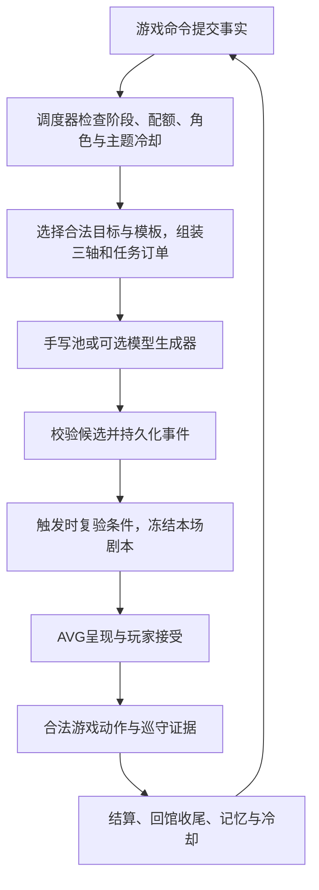

# AIRP 叙事闭环与 DEMO 部署勘探

日期：2026-09-09。性质：源码勘探与决策依据，不是AIRP功能验收报告。当前决定已改为直接应用接口；发布器路线及初勘提案只留历史，不能作为现行实施依据。

依据为用户提供的《ABYSSA · AIRP 叙事闭环核心设计文档 v0.1》，以及随后关于管线、上下文组装、静态网页和 rp-style-lab 后端的讨论。本文记录事实、差距与推荐边界；工作范围、阶段和验收统一维护在 [AIRP DEMO 实施计划](../plans/AIRP_NARRATIVE_DEMO_PLAN.md)。

## 1. 结论与适用范围

最终采用 **rp通用应用后端＋AIRP应用定义＋Abyssa游戏客户端**。用户撤销纯静态／发布后脱离rp的限制；制作与实际运行使用同一Release、Interaction、Workflow和状态规则，不再做内容发布器、导出／导入桥或浏览器内核移植。详细依据为[应用接口接入计划](../plans/AIRP_4_APPLICATION_INTEGRATION_PLAN.md)。

- rp已具备固定大纲→写作、多模型配置、受控State与执行审计基础；直接复用，不另造自主Agent循环。
- 通用机制仍归rp。AIRP配置人物、三轴、任务预设、记忆政策和输出规则；必要通用缺口在rp对应模块补齐，不藏进专用服务。
- Abyssa接入原生应用接口，保留当前玩法规则与存档；每个字段只有一个writer，不让Updater与本地reducer重复维护任务／奖励／冷却。
- 模型仅输出可见创作记录、正文与14情绪；AVG骨架、身份、选项和机械效果由作者／程序控制。
- 先以单用户本机接口接一条真实场景，再验证记忆连续性与恢复。对外运行另验认证、实例隔离与费用，不直接暴露无认证的rp管理API。
- AIRP-1至3已实现内容不重开；AIRP接口、记忆应用规则、预设与真实模型验收仍待实施。本轮只改文档，未迁移存档或修改运行代码。

服务在线不意味着世界按现实时间推进。期限仍按游戏相位；关闭网页不持续生成事件或推进一天。

### 1.1 后续能力复核与真实缺口

| 证据 | 最新判断 |
| --- | --- |
| [Workflow应用实例](../../../rp-style-lab/applications/lumen-dice/tooling/resource-bundle.ts)、[执行边界](../../../rp-style-lab/docs/architecture/model-execution-boundary.md) | 已有大纲→候选→审稿流程和Role／Task／Slot分离，不只是单次模型接口 |
| [叙事状态系统](../../../rp-style-lab/docs/architecture/narrative-state-system.md)、[Workflow与Updater集成测试](../../../rp-style-lab/server/test/narrative-state/runtime/state-updater-execution.test.ts) | 有结构化State、更新提案、校验、View和Ledger；可作为基础创作记忆容器，不等于已有AIRP记忆语义或检索库 |
| [原生关系与Thread API](../../../rp-style-lab/docs/reference/backend-api.md) | Floor是语义提交单位；Branch锚定检查点，Child有独立状态／时间线并冻结父锚点，影响父State须可信接收；应作为AIRP调试与实际运行的原生容器，不另复制分支／变量系统 |
| [Interaction入口](../../../rp-style-lab/server/src/routes/conversation-threads.ts)、[后端API](../../../rp-style-lab/docs/reference/backend-api.md) | Session、Interaction、Timeline与Result接口已有，尚需AIRP任务契约、状态／记忆配置及Abyssa接纳／确认 |
| [AIRP校验器](../../src/game-core/contracts/airp-live-validation.ts)、[共享情绪](../../src/shared/domain/presentation/emotion.ts) | 游戏表现已有14情绪，但AIRP首版仍限三情绪与短场景，需新契约／新内容适配，不能覆盖旧版 |

前次能力核对实际运行了rp的Workflow执行／发布契约／恢复完整性，以及State Updater执行／重试恢复／结算完整性共6个测试文件，53项全部通过，使用模拟Provider。首次因Node与SQLite原生模块ABI不一致未能运行，改用本机已有匹配版本后通过；没有重装依赖或调用真实模型。本轮文档整理未重跑这些测试，不将其计作本轮应用接入或文风验收。

### 1.2 决策修订

| 旧提案 | 当前决定 |
| --- | --- |
| 单次Manual Pipeline填对白 | 原生Interaction内执行大纲→写作Workflow及受控Updater |
| rp只用于制作，玩家读静态文稿 | rp同时服务开发与实际运行，版本定义一致、Session隔离 |
| 主发布器在Abyssa或rp，输出内容包 | 当前不做内容发布器，直接通过应用接口使用能力 |
| 为脱离后端提取浏览器运行内核 | 不移植，状态／执行／检查点继续由rp原生链提供 |
| 所有记忆逻辑均做成AIRP专用设施 | 通用机制归rp，AIRP只定义语义和策略，先复用已有底座 |
| 公网生成网关是联调前置 | 先本机应用联调；对外运行再验安全部署，不直接开放管理API |

楼层不机械对应每次模型调用，子区按需使用，修订分支不自动成为AVG选项。浏览器存档有契约和事实来源，不是黑盒；rp叙事State也不由浏览器缓存重建。新增接入通过来源绑定和确认衔接两类数据，不迁移全部玩法或双写同一字段。

### 1.3 变量与记忆能力复核及定稿

| 源码证据 | 已有能力与真实缺口 |
| --- | --- |
| [State架构](../../../rp-style-lab/docs/architecture/narrative-state-system.md) | State Schema V2、stable-ID collection、写权限、Candidate Engine、Updater及Checkpoint链可承载有界记忆；文档明确Memory不是当前完整能力 |
| [View实现](../../../rp-style-lab/server/src/narrative-state/domain/view.ts) | 按schema tag选择字段，collection成员应用相同投影；没有自动按逐条知情人、主题、时间和相关性筛选 |
| [状态输入接线](../../../rp-style-lab/server/src/narrative-state/execution/runtime-inputs.ts) | State View输入核对schema、授权对象、来源引用、hash和预算；应用派生记忆切片不能冒充原生View，具体接入点待4B验证 |
| [Lumen Dice应用](../../../rp-style-lab/applications/lumen-dice/tooling/resource-bundle.ts) | 已区分program写机械namespace与Updater写narrative；可复用权限设计，不等于已有AIRP记忆抽取语义 |
| [Abyssa知识条目](../../src/game-core/contracts/airp.ts)、[上下文组装](../../src/game-core/session/airp-context.ts)、[对应测试](../../src/game-core/session/airp.test.ts) | 已有玩家Fact来源、知情交集、时间／主题过滤和确定性预算；可复用语义与测试，但需要适配rp来源，不能直接以玩家存档为创作库 |

采用“原文和修订留在rp原生记录、有效记忆进入分支State、送模上下文按规则派生”的分层。硬变量不交模型；事实、人物认知、创作计划分开。小模型只提案，来源／作用域／接纳资格由应用规则与原生状态链核验。候选不等于玩家已经历，实际阅读与玩法结果须明确确认；改稿、重复抽取和容量压力不能造成串分支、重复记录或静默遗忘。

完整定稿维护在[接入计划§5](../plans/AIRP_4_APPLICATION_INTEGRATION_PLAN.md#5-变量与记忆)，并纳入4A契约、4B接线、4C连续性和4D恢复验收。不另建Memory服务、向量库或自主循环；需要的通用机制可在rp原模块补齐，不全部写死成AIRP专用功能。本次未写rp资源、调用模型或重跑功能测试。

### 1.4 应用接口与扩展边界复核

| 证据 | 当前判断 |
| --- | --- |
| [后端API](../../../rp-style-lab/docs/reference/backend-api.md)、[Interaction路由](../../../rp-style-lab/server/src/routes/conversation-threads.ts) | 已有Session／Interaction／Timeline／Run Result，直接作为接入基础；不用新增内容导出Port |
| [Server Extension](../../../rp-style-lab/packages/application-package-contracts/src/server-extension-v1.ts)、[Server SDK](../../../rp-style-lab/packages/application-server-sdk/src/index.ts) | 仅支持Program、derived、Validator及终态Materializer等窄能力；领域模块沿原生扩展接入，不能任意加路由、查库或调用Provider |
| [后端模块边界](../../../rp-style-lab/docs/reference/backend-modules.md)、[Lumen Dice应用](../../../rp-style-lab/applications/lumen-dice/README.md) | 宿主持有通用资源／执行机制，应用配置领域规则；不是为每个应用再搭一套后端 |
| [Abyssa现有事务](../../src/game-application/transaction.ts)、[叙事writer](../../src/game-application/versions/airp-pool-replay.ts) | 当前玩法有独立的提交与重放链，不能与rp Updater双写；必须明确外部请求与结果接纳边界 |

调用固定Contract／Action及精确Branch head，以稳定clientRequestId处理不明确网络结果；返回提交身份后按floorId查Timeline和Checkpoint，再定位结果，不取最后一楼或只信outputText。JSON与V9可选Presentation的SSE行为不同，后者失败不回滚前者提交；重启中断不意味着自动续跑。

当前rp是无用户认证的loopback服务。单用户本机先行，公开运行须提供访问控制／实例隔离和预算。浏览器上传的玩法快照与hash不构成服务器防作弊证明。

与旧方案相比，剩余工作是应用资源／预设／记忆策略、客户端调用与冻结场景、跨端接纳／确认／恢复；不是两套内核保持一致或内容包发布。接口与状态归属见[现行接入计划](../plans/AIRP_4_APPLICATION_INTEGRATION_PLAN.md)。

## 2. 初勘来源与证据边界（历史快照）

以下基线与§2.1记录初次勘探时点，含当时的默认内容6；当前默认内容9及AIRP-1至3接线见[现行状态](../DESIGN_DECISIONS_AND_CURRENT_STATUS.md)。§2至§8为初勘历史分析，其中后续追加的发布器建议也已失效；当前只以§1、§9及应用接口接入计划为准。

| 仓库 | 本地位置 | 本次读取基线 |
| --- | --- | --- |
| Abyssa | `/Users/liuhang/Documents/project-abyssa` | HEAD `89597fc0ea612d7be316f08e2c10203658992164`，含未提交的教程相关改动 |
| rp-style-lab | `/Users/liuhang/Documents/rp-style-lab` | HEAD `795ae91e8d0ac6cefb3ffb4b4aeb9431d013b96f`，含未提交的编辑器／提示词资源相关改动 |

以上是读取时的仓库状态，不是两个干净提交的兼容认证。外部仓库链接假设两个项目仍为相邻目录；这些链接不构成构建依赖。没有启动模型服务、调用付费模型、部署网页或重跑整套游戏测试。

### 2.1 Abyssa 已有能力

| 源码／文档 | 当前事实 | AIRP 的复用边界 |
| --- | --- | --- |
| [玩家运行时](../../src/game-runtime/player-runtime.ts) | 默认内容6／规则4；按档案完整内容引用选择服务 | 不按部分 README 中旧的“默认内容3”判断现行游戏 |
| [浏览器装配](../../src/game-runtime/browser.ts)、[加载与静态部署](../../src/shared/loading/README.md) | 静态资源、Hash 路由、本地缓存、IndexedDB 游戏存档 | `game-application` 是逻辑层，不是必须另起的服务器进程 |
| [v4 应用服务](../../src/game-application/versions/d5-service.ts)、[记录契约](../../src/game-application/versions/d5-contracts.ts) | 命令、head、回执、事实和结算有确定性提交链 | 新叙事状态必须进入合法命令与验证链，不能只加 React 状态 |
| [角色经历投影](../../src/game-application/character-history.ts) | 可依据有效事实生成角色经历，并过滤撤回事实 | 可以作为记忆来源；尚无完整私人记忆和知情传播系统 |
| [正式角色显示](../../src/game-client/character-presentation.ts)、[机制总览§8.3](../GAME_SYSTEMS_AND_CONTENT_SPEC.md#83-角色页面与好感展示) | 羁绊外观用于离散 Lv.1–3；静态档案样稿不等于真实好感数值 | AIRP 不能直接读取预览百分比作为关系轴，也不能借微量好感奖励绕过既有成长条件 |
| [洋馆角色排布](../../src/apps/mansion/data.ts)、[洋馆资产读取](../../src/apps/mansion/useMansionEstate.ts) | 有真实相位与资产；部分角色时段排布为演示，设施仍主要是场景 | 牵线委托需要可证明可达的角色位置；不能生成依赖未实现生产／修缮的目标 |
| [AVG 生成适配](../../src/game-client/avg-generation.ts)、[共享生成器](../../src/shared/presentation/avg/generation.ts) | 页面构造器限定4句、每句最多500字，具备身份、演员、情绪、超时和过期检查 | 是短回复插槽；没有可直接承载完整委托的动态剧本与存档 |
| [AVG JSON 与生成契约](../design/AVG_JSON_AND_GENERATION_CONTRACT.md) | JSON 校验、编译与原舞台可复用；`/api/avg/generate` 仅为接口约定 | 当前没有该后端路由，也没有正式生成剧情持久化 |
| [旧 AI Port](../../src/game-application/ai.ts)、[装配说明](../../src/game-runtime/README.md) | `createReactions` 仍由 legacy 服务装配 | 不代表当前 v4 已有完整模型事实投影与事件引擎 |
| [数据边界](../../src/game-core/contracts/validation.ts) | JSON 有8 MiB、深度、节点和集合上限 | 不可把全部 Prompt、模型尝试和长篇历史无界追加进存档 |

工作树另有内容7教学规则与持久契约，见 [O2-T 文档](../plans/TIDE_CAVE_RULES_AND_SAVE_CONTRACT_V0_1.md)。本次读取时内容7未注册为玩家默认包；其施工状态由教学计划维护，本报告不重复判定其测试或前端完成度。

### 2.2 rp-style-lab 已有能力

| 证据 | 当前事实 | 对接含义 |
| --- | --- | --- |
| [项目 README](../../../rp-style-lab/README.md) | 本地单用户 private prototype；Node、SQLite、多个模型 Provider | 可复用现有模型基础设施，尚非现成的公共多人游戏服务 |
| [Manual Pipeline API](../../../rp-style-lab/docs/reference/backend-api.md#57-manual-pipeline) | 精确 Release／Pipeline、显式 inputs、稳定请求 ID；保存执行结果，不创建 Thread／Floor／Message | 是单阶段工具入口，不作为当前两阶段AIRP的外层编排方案 |
| [Manual Pipeline 解析器](../../../rp-style-lab/server/src/applications/release/manual-pipeline.ts) | manual 模式只接受 `invocation.input` 端口，不接受 history projection | 历史与三轴应由 Abyssa 显式投影；不会自动从聊天记录取回游戏经历 |
| [Invocation 输入校验](../../../rp-style-lab/server/src/runtime-compile/input/invocation.ts) | 输入端口有类型、大小、Manifest 与摘要 | 可接结构化订单，但业务语义仍由 Abyssa 定义 |
| [模型执行边界](../../../rp-style-lab/docs/architecture/model-execution-boundary.md) | AI Role V2、Pipeline V5、Logical Model Slot、不可变执行证据；每条 Pipeline 恰好一次模型调用 | 多次调用由已有原生Workflow编排，不等于缺少多阶段能力 |
| 同上：输出与能力 | 通用结果返回 `outputText`；Target 的原生结构化输出能力默认 `unknown`，公共配置尚不能完整登记已验证能力 | 需解析文本 JSON 并由消费方校验；不能把任务的输出声明当作可靠 JSON 展示或领域验收 |
| [服务配置](../../../rp-style-lab/server/src/config/env.ts)、[CORS](../../../rp-style-lab/server/src/config/cors.ts) | 固定 `127.0.0.1:8787`；仅登记有限本地网页源 | 当前仅作本地开发工具，公网接入退出本轮范围 |
| [密钥存储](../../../rp-style-lab/server/src/providers/keychain-credential-store.ts) | Provider 密钥使用操作系统钥匙串 | 当前不随网页发布，也不要求云环境适配 |

现有文档明确不提供公开 Memory／向量库 API、工具执行 Agent loop、后台 Provider 队列及重启后自动续跑。AIRP 不能把这些当作已经获得的能力。Manual Invocation 的实际来源与模型绑定仍应按每次调用证据记录，不能认为“固定 Release”就固定了所有未来本机模型配置。

## 3. 从原始设计保留的产品目标

| 概念 | 原始设计范围 | 实施解释 |
| --- | --- | --- |
| 世界三轴 | Agenda 时局、Bond 关系、Locus 时空 | 为任务生成上下文投影，不强制把整个存档重写为三个大对象 |
| 事件四阶 | Canon 正典、Bond 羁绊、Echo 回响、Ripple 涟漪 | 前三类手写；模型仅参与被授权的涟漪内容 |
| 涟漪四型 | Sortie 出击、Liaison 牵线、Household 家务、Vignette 小景 | 分别映射到远征证据、已提交对话、确定性选项和纯演出完成 |
| 远征四态 | 初征、再战、回响战、巡守 | 叙事状态分类；初战／维护／回忆已有基础，再战变体仍需补内容与准入判断 |
| 核心循环 | 洋馆接受→巡守完成→归来收尾→记忆反馈 | 玩家行动与角色回应必须有实际状态和证据关联 |
| 新鲜感 | 64游戏日主题冷却、未看见惰性事件备用库、错过余波 | 不以角色为黑名单；余波不硬扣好感或锁内容 |

原稿前文提及30–50张预制卡，第六节收敛到20–30张。实施计划采用第六节的20–30张作为完整手写池目标，并从首批少量卡逐步扩充。实时事件卡生成、备用库自动改写和语义相似度模型不纳入第一版手写闭环。

## 4. 初勘运行时生成提案（历史，不直接恢复）

本节保留原在线方案的事务与知情分析，不是AIRP-4实施指令。后续曾改走制作期生成，该决定也已被直接应用接口取代；当前请求、状态权威和恢复以§1及现行接入计划为准，不原样恢复下列生成Port设计。

### 4.1 两种生成任务

**候选事件生成**解决“本轮允许发生什么”。游戏先限定角色、任务类型、合法模板、奖励与期限，生成器提供主题、情境与台词素材。初版直接使用手写池，不等待网络补充事件。

**场景对白生成**解决“同一事件在当前经历下怎么说”。接受、转达、归来等节点使用已固定的结果和分支结构，仅填充授权的对白槽。先接这种任务即可验证 AIRP，而不必同时开放事件构思。

模型不拥有事件身份、日期、奖励、数值、任务终态、主角行动和资产修改权。模型的建议最多引用订单提供的模板 ID；由游戏绑定真实目标，不能将自由文本解析成任意新机制。

### 4.2 提交与异步返回

调度由已提交的语义边界触发，例如普通归来、相位推进和正典完成；不从页面渲染次数判断是否补卡。每个触发点记录消费身份，重复打开和重试不能重复生成、抽取或发奖。

生成任务持有来源 head、事件实例、模板版本、上下文摘要与请求身份。网络等待在游戏事务外。结果回来后重新检查相关条件，通过现有 CAS 提交候选或剧本；失效结果留作诊断，不进入当前事件。

瞬时战斗短句可以沿用严格的当前场景／head 检查。预取的完整场景需要单独定义有效期和依赖字段：无关的阅读进度变化不应自动制造无限重试，但也不能忽略角色离场、委托完成或相位变化。具体依赖签名在 AIRP-1 契约阶段确定。

### 4.3 生成内容与事实分开

通过校验的剧本在首次显示前保存，随后只恢复文本、节点和已选分支。刷新、换页或模型更新不能重新生成已见内容。剧情中的“承诺”“得到物品”等效果仍由合法选项／完成命令提交，不能因为文本提到了它就成为事实。

同一场景若已经保存手写降级版本，迟到的模型结果不能替换它。模型生成了细节也不自动得到记忆写权限；可长期沉淀的事实槽需由模板预先定义，并由已发生的事件结果授予。

## 5. 上下文组装与知情边界

以下筛选原则继续适用；合法玩法快照或显式作者测试情境先导入为rp中的有来源制作输入，正式上下文从指定检查点／授权View与版本资源组装。不是每轮生成抓取浏览器缓存。玩家不提交生成请求，开发来源封套不进入公开包。

三轴只组织动态游戏事实。任务规则、请求身份和演出游标另有固定封套；这不增加新的世界状态轴。输入来源与用途建议如下：

| 内容块 | 来源与选取方式 | 不能混入的内容 |
| --- | --- | --- |
| 固定约束 | 主角契约、涟漪生成权限、演员／情绪／资产白名单、输出格式 | 模型自由改写规则的指令 |
| 静态底座 | 精简世界前提、本场角色档案、地点说明、少量作者认可的范例 | 每次全量灌入设定圣经、全部人物卡与未来剧本 |
| Agenda | 当前相关阶段、活动委托、最近有效结果、已发生的余波 | 未选择分支、未来敌群、未发生的候选事件 |
| Bond | 关系阶段、相关选择、按角色和主题筛选的记忆 | 预览好感数值、其他角色不应知晓的私事 |
| Locus | 已提交日期相位、当前地点、可达角色、已实现设施状态 | 作为真实日程使用的演示位置、虚构季节或生产结果 |
| 任务订单 | 开场／转达／收尾类型、固定目标和结果、排斥主题、长度预算 | 客户端任意模型名、任意 Pipeline 或可执行指令 |
| 演出上下文 | 已读片段、已选项、当前节点、已固定场景细节 | 自动补全主角的对白、心理和未选择行为 |
| 来源封套 | save、epoch、来源 revision、事件、上下文 hash、协议与内容版本 | Provider 密钥和把外部会话当成唯一存档的引用 |

原始人设与世界资料留在 [st/setting](../../st/setting)。另制作可版本化的运行时人物摘要，包含动机、说话习惯、关系基线、不可变设定和范例；当前 `CHARACTER_EMOTION_PROFILES.direction` 主要是表现气质，不能独自承担完整人格提示。

### 5.1 三类任务使用不同切片

| 任务 | 必需上下文 | 首版来源 |
| --- | --- | --- |
| 事件筛选／构思 | 合法任务、可用角色、地点、配额、主题冷却、相关近期结果 | 确定性手写池；模型构思后置 |
| 委托归来对白 | 接受时承诺、本趟目标证据、实际归来结果、相关关系记忆、当前在场人物 | 首个真实模型接入点 |
| 战斗短句／余波引子 | 当前已提交的小范围事实、允许的说话者及其知情内容 | 预写池；模型可选 |

输入预算按任务配置，先筛选语义块，再计算长度。权限、固定目标、当前结果和本场演员不可被静默截掉；超预算先移除低相关的旧记忆／范例，仍超限则明确降级。不能只靠最后截字符串控制 token。

### 5.2 记忆与知情

记忆至少有持有者、来源事件／Fact、时间、涉及人物、主题、可见范围和确定性摘要。先用结构化筛选，不建向量库。撤回事实、回忆战与当下远征必须区分，复制／导入时要重映射来源。

当前 v4 的 `party` 可见事实不足以表达私人记忆。首版多角色生成可仅提供全体在场者共同可知的事实；若要引入私人内容，需要独立的知情投影和验证，不能仅把秘密标注在同一大 Prompt 里就宣称已隔离。

世界事实、人物知道的事实、已播放的文学细节分别保存。模板允许的细节可在本事件后续场景引用，但不因模型自述变成公认历史、资产或关系阶段。

## 6. 初勘数据结构建议（对照用途）

事件、证据和记忆概念已由AIRP-1至3具体实现。下表保留初勘命名供对照，不是当前存档或接口契约；AIRP-4新增的请求／接纳记录应按原生应用接口设计，既不直接照搬GenerationJob／生成Port，也不恢复已废弃的内容发布器。

以下名称均为拟新增概念，不是现有导出或已发布存档字段。

| 概念 | 必要职责 | 建议归属 |
| --- | --- | --- |
| `RippleDefinition` | 类型、条件、失效政策、合法目标、奖励表、对白骨架 | gameplay 内容；core 契约与校验 |
| `RippleProposal` | 候选主题、情境、对白素材、被允许的模板引用 | 生成 Port 返回值；未经接收不属于世界 |
| `RippleInstance` | 存档内事件身份、参与者、状态、期限、已见标记、选择与证据 | Campaign 叙事域 |
| `ObjectiveSpec` / `PatrolBinding` | 合法完成谓词、证据政策、本趟远征和预制注入绑定 | core／远征状态 |
| `MemoryEntry` / `CooldownEntry` | 有来源的记忆、可见范围、主题冷却及终态去重 | Campaign 叙事域 |
| `NarrativeContextProjector` | 版本化的事实筛选、知情过滤与任务切片 | application；runtime 装配静态材料 |
| `GenerationJob` / `NarrativeGeneratorPort` | 稳定请求、来源签名、超时、取消、失败和候选接收 | application／infrastructure |
| `GeneratedScene` | 不可变文本与节点、模板引用、内容 hash、阅读进度关联 | 本地存档内容；原 AVG 渲染 |

不要把上述对象简单塞入现有 schema4 的快照。当前读档会核对内容引用、事实及旅程证据；新状态需要命令、严格 reader、内容版本、导入导出与迁移策略共同演进。具体版本号待接线时根据届时默认内容确定，本文不预占内容8或其他版本。

## 7. 原始提案需要补齐的规则

| 问题 | 本轮建议 | 后续验证 |
| --- | --- | --- |
| 候选与实例混在 `RippleCard` | 模型只产候选；游戏设置 ID、期限、目标与奖励 | 拒绝非法模板／目标／演员，候选不写事实 |
| 惰性事件被看见后是否回收 | 仅从未曝光的候选可入备用库；已见事件留下终态，新演绎用新实例 | 刷新、取消、搁置与过期组合 |
| 接受后是否超时 | 首版建议提供期有期限，接受后不按提供期自动失效；独立履约期限后置 | 已完成待交付不能因阅读耗时失效 |
| 有后果事件“销毁” | 移出活动池，保留终态、唯一余波与证据 | 重开页面不重复写余波或触发奖励 |
| 如何证明委托完成 | 绑定接受后的合法 run 和目标；配置成功带回或允许撤离带回等规则 | 旧击杀、回忆、撤回、团灭和重复交付不串证据 |
| 主题去重 | 使用规范主题键／标签；展示标题不作唯一键 | 改名不绕过冷却；不屏蔽同角色其他主题 |
| 64 日与20–30张卡是否匹配 | 保留原设计目标，配额和允许空窗必须实测 | 四相位一天时为256相位；不能靠换标题或自动清账避免耗尽 |
| 再战身份 | 从未首通及既有失败／撤离事实派生手写变体 | 首通身份、初战奖励和维护准入不变 |
| 家务选择轮次 | 首版沿用既有主角契约的1–2个关键轮 | 原稿“2–3轮”是待协调项，不自动扩大主角代言 |
| 好感微量奖励 | 首版先做记忆反馈；数值奖励需单独关系规则 | 不把小景刷成 Lv.2／Lv.3 或玛亲征前置 |

## 8. 初勘部署选项（历史对照）

表格记录讨论过的交付方式；当前采用通用应用接口，不再以静态发行约束后端能力。

| 交付形态 | 游戏规则／存档 | 模型 | 适用阶段 |
| --- | --- | --- | --- |
| 纯静态网页 | 浏览器运行，IndexedDB 保存，支持已有导入导出 | 开发期rp生成、审定后导出内容 | 曾选用，现已撤销 |
| 静态网页＋生成 API | 同上；服务端控制调用额度和结果访问 | 内部 rp-style-lab 调用云模型 | 初勘单独生成网关方案，不是当前通用应用接入 |
| 完整游戏服务 | 服务器执行命令并保存权威状态，客户端展示 | rp-style-lab 仍可作为生成服务 | 云存档、共享世界等另行提出后 |
| 桌面壳＋本地服务 | 本地应用保存状态 | 可打包或连接本地 rp 服务 | 需要安装发行时再评估；有 Node／SQLite／密钥与更新打包成本 |

以下为初勘网关方案，不是当前接入图；恢复在线调用不代表恢复这个独立生成网关设计：

公共试玩网关需固定任务／模板／管线映射，验证输入大小、演员和资产范围，限制调用预算／并发，并按试玩身份隔离请求和结果。Provider、管理接口、通用 Pipeline 选择及其他玩家的执行记录不直接开放。重试 ID 由网关按用户和任务作用域映射，不能让客户端碰撞共享的上游请求身份。

浏览器本地存档可以被玩家修改。网关的格式校验和上下文 hash 不证明玩家实际完成了战斗；该方案只保证本地游戏逻辑与生成边界，不提供服务器防作弊。如果需要付费资产、排行榜或可信云进度，应另立游戏服务的权威与迁移设计。

不把rp作为相邻源码目录由Vite导入，不安装Abyssa整个游戏为Application Package，不复制Campaign到Managed State，也不为每名角色创建长期聊天Session。曾提出另加最小后端导出支撑，该提案也已撤销；当前复用通用应用接口，见§1.4。

## 9. 当前实施入口

以[AIRP-4应用接口接入计划](../plans/AIRP_4_APPLICATION_INTEGRATION_PLAN.md)为唯一详细入口：4A固定Action／输入结果、Session绑定、状态writer与接纳／恢复契约；4B接通rp应用资源、预设、Workflow／Updater及记忆；4C用同一应用完成Abyssa真实场景与后续记忆；4D验证断线、刷新、重复、分支恢复、旧档和内容质量。

不重建Workflow、State Updater、分支或审计，不开发内容发布器、通用导出Port或浏览器内核。必要通用缺口在rp对应模块补齐，AIRP保留领域策略。AIRP-1至3不重开，不自动迁移全量玩家存档；本轮仅文档调整，真实接口、模型和公开运行均未验收。
