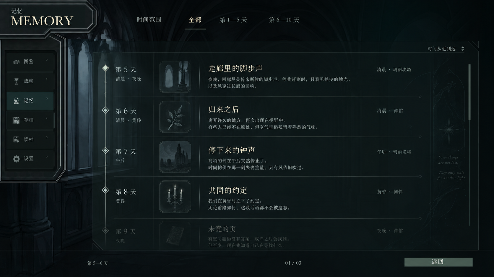
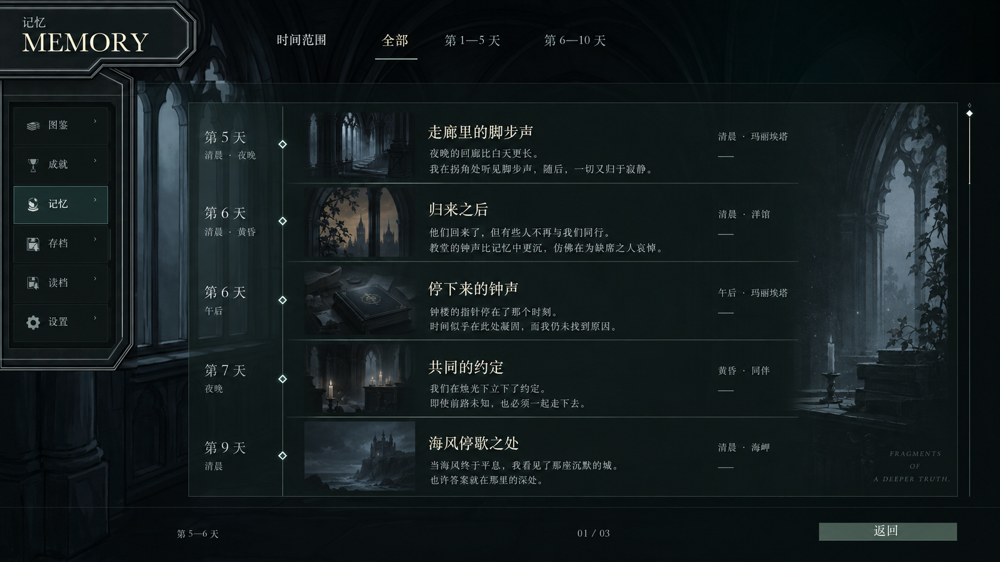
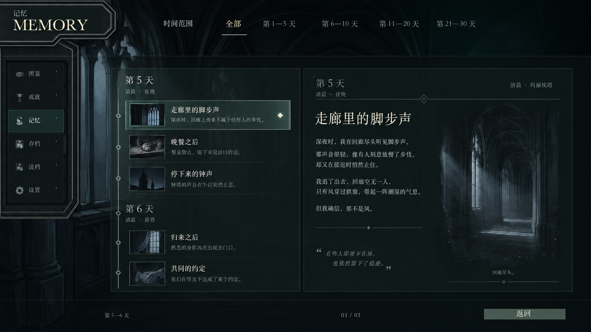

# 记忆面板：视觉与交互规范

更新：2026-10-02。目录、详情、时间范围、真实存档查询和分幕回想均已接入。本文维护现行 UI；数据、来源与回想边界见[记忆叙事合同](../architecture/MEMORY_NARRATIVE_AND_REPLAY.md)，完成度和待办见[状态页](../DESIGN_DECISIONS_AND_CURRENT_STATUS.md)。

## 1. 定位与视觉骨架

记忆是菜单中的编年手记，按发生时间寻找经历。书页感来自日期归属、共同页幅、统一边距和连续条目的节奏。角色作为事件的信息，不成为目录分类。

延续存档、设置的深色透明底、暖白文字、弱金框饰和选中反馈。纵向时间主轴与横向条目分隔建立延展感，低对比线条服务阅读秩序。标题是第一落点，概述提供内容密度；地点、时段与人物较轻。保持通透感，避免纸张、书本器物或实心金属占据主界面。

菜单外壳、左侧导航、共同页幅和右侧场景保持连续。右侧窗景向文字一侧渐隐，视觉亮点集中在页边；长正文获得足够宽度。背景、美术和图标服从同一套明暗层级。

## 2. 三张原始参考

三张用户参考图完整保留，均为 1672×941；[来源清单](memory-journal-2026-09-30/README.md)记录原附件名及 SHA-256。图片中的日期、英文题句、页码和故事文字是概念占位，不能作为正式内容。

| 参考 | 采用的部分 |
| --- | --- |
| 第一版 | 主界面骨架：时间主轴、日期列、小方形图案、标题／概述比例和统一条目节奏 |
| 第二版 | 右侧窗景、书卷与建筑空间，赋予回忆具体的场景氛围 |
| 第三版 | 左侧目录与右侧阅读区的关系，明确所选事件及内容层次 |

## 3. 目录与详情

| 内容 | 目录 | 详情 |
| --- | --- | --- |
| 时间 | 日期归组、行内天数与时段；同日后续天数弱显示 | 当前记录的日期／时段及地点 |
| 标题与概述 | 单行，超出省略，维持统一行高 | 大标题及标准事件概述为主 |
| 人物 | 超过三人显示 `X人`，不挤满姓名 | 大标题旁紧随参与者头像簇，全员可辨认 |
| 原文 | 已公开内容的短预览 | 单独“展开原文”，按所选幕展示对白、旁白、真实选择和回执 |
| 回想 | 点选事件先进入详情 | 选幕后从该幕回想；能力按幕判断 |

目录浏览采用整页连续记录。点选后目录收窄到左侧，保留相同的日期身份、轴线与条目对应关系；右侧展开详情。两态共用页幅、边距和材质，不另加一套面板外壳。

开局目录统一为「还没吃完的早饭」「赶在午餐前」两个事件，内部保留原幕、切片和选择来源。概述使用核对过剧情的总结，原文另行展开。没有专用概述的旧来源沿用已收录内容的短节选，不在浏览时生成新文案。

### 图标

- 使用现有 Game Icons SVG 图库和 `resolveItemIcon`，匹配顺序为公开主题关键词 → 标题 → 已读概述／预览 → 记录簿兜底。
- 开局提供“早餐”“毛毯”主题词，分别匹配图库茶壶、布卷，避免标题中的“午餐”误导。
- 图形呈淡灰印迹，透明度渐变，保留弱边框及内边距；悬停、选中只小幅提亮。不绘制独立 SVG，不加金属反光、立体投影或循环闪光。
- 明确配图仍可显示；关键词只消费已公开信息，不读未收录剧情，也不调用模型。

### 参与者头像

使用专用面部头像，位于大标题旁并小幅重叠，不另起一行或改用完整立绘。当前头像槽 40px、图片 36px、重叠 6px，轻压亮度与饱和度，保留完整眉眼、嘴与下巴。脸部保持清晰，通过外围轮廓协调视觉重量，不用半脸遮挡、下部模糊或金属框。全员展示，姓名在悬停和键盘聚焦时出现。

## 4. 时间范围与选幕

首次打开默认**全部经历，从现在向过去浏览**。顶部使用连续时间带，点选日期、调整两端或拨动选区改变范围；具体日期编辑沿用已有通透浮层与交互，不做第二套网页表单或居中模态窗。

范围来自实际游戏日期，跨日事件按已收录日期判断交集。缺失日期明确为“时间未记录”，入口与数量放在目录页脚中轴，再次点击可恢复全部经历。调整范围后回到目录，保持选择与当前筛选集合一致。

详情幕选择器只展示已收录幕，显示幕号、标题和当前选中状态；上一幕／下一幕与直接选择共用同一身份。阶段文字是附注，不再增设“半场”层。没有演出能力的幕保留文本阅读。

## 5. 动效与浏览连续性

- 进场延续菜单外壳、内容与侧景的淡入；减少动态效果时直接呈现最终状态。
- 目录进入详情时，日期与图案随结构收拢，详情时间／地点、标题／头像、概述依次原位模糊淡入。组件错开并自然重叠，结束后恢复清晰。
- 文本不插值字号、行宽或换行结果；旧排版固定后淡出，新排版在目标位置淡入。最右侧人物／地点原位显现，不横向飞入。
- 返回时详情先柔和淡出，目录随后展开，附注在结构到位后淡入，避免压缩文字跳闪或突然抢出。
- 时序以共享 `motionTokens.memoryJournal` 为唯一参数来源，布局适配见 [memory-layout-motion](../../src/game-client/memory/memory-layout-motion.ts)。中断切换从当前绘制状态接续，离场清理临时层。

切换记录保留目录浏览位置；首次打开正文从开头开始，同次重访可恢复阅读位置。返回目录保留范围、选择及原滚动位置。详情的 Escape 返回目录，目录的返回离开记忆页；回想的返回先结束回想。

## 6. 页脚与滚动

| 状态 | 左侧 | 中轴 | 右侧 |
| --- | --- | --- | --- |
| 目录 | 实际范围与筛选后数量 | 时间未记录入口与数量 | 返回 |
| 详情 | 当前序号／筛选总数 | 回想场景或仅文字记录 | 前一条／后一条、返回目录 |

左右区域等宽，使中轴整组居中；两态共用页脚基线与返回位置。页脚仅保留一条两端渐隐的分隔线，返回使用低对比通透切角轮廓。到达首尾禁用对应操作并保留占位。

目录与正文独立滚动，正文滚轮不切换事件。回想结束后恢复事件、所选幕、原文展开状态、阅读位置和入口焦点；存档身份变化或来源失效立即结束旧回放。

## 7. 接线与维护入口

- [MenuPage](../../src/apps/menu/MenuPage.tsx)：消费真实 `queries.memoryJournal(record)`，开发样本独立于正式查询。
- [MemoryPanel](../../src/game-client/memory/MemoryPanel.tsx)：目录／详情、范围、选择与回想入口。
- [MemoryTimeRange](../../src/game-client/memory/MemoryTimeRange.tsx)、[MemoryActPicker](../../src/game-client/memory/MemoryActPicker.tsx)：时间和幕选择。
- [MemoryReader](../../src/game-client/memory/MemoryReader.tsx)、[MemoryParticipants](../../src/game-client/memory/MemoryParticipants.tsx)、[MemoryIcon](../../src/game-client/memory/MemoryIcon.tsx)：详情及资源适配。
- [MemoryReplay](../../src/game-client/memory/MemoryReplay.tsx)：独立只读演出，不能挂载会推进剧情的主动组件。

空记录、读取失败、部分来源不可用和文本记录按查询结果区分。浏览、展开和回想不推进剧情、不执行交易或奖励；开局跳过参考必须保留来源标识。具体事实与旧版本恢复见[叙事合同](../architecture/MEMORY_NARRATIVE_AND_REPLAY.md)。

多轮被替代方案、咨询原答、施工截图和逐帧采样已归档到仓库外备份，路径与迁移摘要见[文档审计](../audits/2026-10-02-documentation-audit.md)。后续更新本规范与实际组件，不再新建 A／B／C 阶段状态副本。
