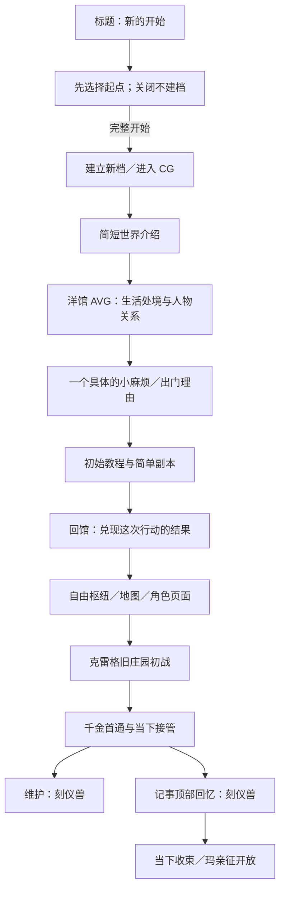

# DEMO 初章与引导：现状、范围修订与制作计划 v0.1

更新：2026-09-15。状态：**序幕CG四幕15图、34段文字与存档链路阶段收口；洋馆S1／S2合为一幕，共120节点、五组选项，默认AVG可切RP。S2-6仅有黑场章名，行军外景待制作。新版默认内容12采用六场双语定稿、诺玛E1和S4-1收束；旧档不迁移，G5真人试教待做。** [开场收口记录](../archive/audits/2026-09-09-opening-avg-closeout.md) · [09-15定稿实施](2026-09-15-chapter-one-finalization.md)。下文G3／G4阶段描述保留历史语境。

用户明确的新顺序是：新的开始进入CG介绍世界，再转洋馆介绍，随后进行基础教学和强盗／经典小怪组成的简单初始副本，并建立简单钩子。CG已按9月8日提供的四幕稿接线，见[实施记录](../design/PROLOGUE_CG_IMPLEMENTATION.md)。教学的四场结构、敌人卡、关底与素材占位已写入[退潮岩窟教学设计v0.1](TIDE_CAVE_COMBAT_TUTORIAL_DESIGN_V0_1.md)；O3-U共用画布与O2-T规则／存档后端已实施，O3-T玩家页面已接线，配平待真人试玩。本总计划只保留范围和阶段摘要。

相关入口：[当前状态](../DESIGN_DECISIONS_AND_CURRENT_STATUS.md) · [当前机制与闭环](../GAME_SYSTEMS_AND_CONTENT_SPEC.md) · [原 D0–D6 计划](../archive/plans/DEMO_CHARACTERS_AND_OLD_MANOR_IMPLEMENTATION_PLAN.md) · [内容质量审计](../audits/2026-09-07-demo-experience-quality.md)。

首晨的实际范围、五处抉择与持久契约见[实施记录](../design/FIRST_MORNING_IMPLEMENTATION.md)；本场特许保留用户稿内主角固定台词，仍用占位符。最新修稿已拆开正文与差分／动作，自动通过无文字演出节点；归还之线按普通台词带过，不做专门特效。

## 1. 本次调整的范围

### 1.1 已确认

- 标题的“新的开始”先弹起点选择；“完整开始”进入开场CG与简短世界介绍。2026-09-13新增用户要求的快捷入口：跳过序章到首晨、跳过第一章到教程、跳过教程到自由枢纽。关闭不建档，跳过不模拟通关／领奖；详见[当前机制总览](../GAME_SYSTEMS_AND_CONTENT_SPEC.md)。
- 世界介绍之后转入洋馆，先建立场所、人物关系和生活处境。
- 初章有实际可操作的教程、简单初始副本，以及让玩家愿意出门的小钩子。
- 初始敌人采用强盗和经典小怪的方向，承担基础教学。
- 本阶段新增剧情只写简短临时文本，保留明确替换槽；正式文案列为后续独立精修包，不阻塞教学玩法与接线。
- 教程前端采用共用的经典高亮画布：压暗背景、突出真实目标、浮动短说明；独立覆盖，不挤压现有布局。先完成共用画布，再接逐步教学。
- 当前优先制作初章与引导。庄园压力和现有剧本的问题继续保留返工项。

这修订了早期“庄园是 DEMO 唯一副本”的范围：**DEMO 新增庄园之前的入门内容；克雷格旧庄园仍是首个完整主题地牢。** 初章不是庄园的“初战模式”，不能共用首通身份。

庄园内部的既定顺序继续有效：初战千金；首通后并列开放刻仪兽回忆与维护；完成回忆及当下收束才开放玛丽埃塔亲征。Lv.3 上限和两件空面装备范围不变。

### 1.2 尚未定稿

破窗来者、出门理由与章节地点已由S2稿定下：诺玛报告缇比马车被十人上下、带十字弩的人类强盗劫掠；五人前往“雾滩·退潮岩窟”追回草药、书与包袱。教学设计v0.1已提出四场战斗、工作数值、失败重试、奖励及回馆分场意图；仍需设计确认、正式规则模拟与回馆正文定稿。CG已采用神话／现实／决断／日常四幕与15张gt图，阅读操作和长按跳过已落地。

当前候选为潮滩史莱姆、望风刀手、伏礁弩手、驮货打手与退潮匪首「礁钩」。这些是工作配置，正式姓名／美术未定稿。序幕、首晨与四场教学现随内容7／规则4运行，旧内容按摘要保留兼容；新增故事与规则分别由JSON和O2-T契约管理。

## 2. 实际代码现在到了哪里

O3-T的教学发布基线为 `abyssa.demo / contentVersion 7 / rulesVersion 4`，创建profile为 `profile.demo.first-run`。后续默认包继承这条流程，当前默认目录见[player-runtime](../../src/game-runtime/player-runtime.ts)。内容7承接首晨和四场教学，内容4／5／6保持可读，不改变庄园数值或现有战斗规则。

| 环节 | 当前实现 | 初章缺口／复用边界 |
| --- | --- | --- |
| 新游戏入口 | [useTitleArchive](../../src/apps/title/useTitleArchive.ts)先建档，未完序幕进入prologue；旧档按活动run继续 | CG、首晨及独立教学阶段均按真实存档恢复 |
| 初始进度 | 五名初始成员，零资金、空成长／装备；新增 `prologue: A1-01 / playing` | 不把序幕完成当作教程完成；逐步介绍队伍仍待制作 |
| CG | [正式序幕](../../src/apps/prologue/script.ts)使用新提供15图与中文定稿 | 原标题两侧竖幅轮播继续用于标题气氛；合成图的音频／独立动作待补 |
| AVG | [StoryReading](../../src/game-client/StoryReading.tsx)、[AdvStage](../../src/shared/presentation/adv/AdvStage.tsx)已有立绘差分、逐字对白与阅读操作 | 可承载洋馆介绍和途中对话；首场脚本、角色情绪与选项反应已接入；后续待制作 |
| 换场 | 战斗／AVG仍使用原SceneSequence；CG内部独立逐镜合成，跨页沿用共享交接与静帧 | 首晨结束接岩窟；战斗演出结束再切短AVG，返馆完成后领取报酬 |
| 阅读恢复 | 序幕跨镜命令正式提交，当前镜头刷新重播；完成／跳过写事实 | 仅镜头内的文字表现不持久化，避免将演出缓存当作完成证据 |
| 教学战斗 | 骰子、重掷、固定、行动、意图、道具和结算已有正式规则 | 已注册内容7岩窟四战及短AVG／自动提示，正式文案和敌图待补 |
| 出征准入 | [d5-progress](../../src/game-core/session/d5-progress.ts)区分初章与庄园路线 | 初章要求首晨完成且未通关／未豁免，固定五人和配给；未完成时恢复当前章节 |
| 成长／结算 | 庄园成长／赠物仍按原资格；初章采用独立身份及一次领奖 | 教学不触发庄园成长、接管或回忆，失败重试不产生结算或时间消耗 |
| 正式入口 | [navigation](../../src/game-client/navigation.ts)与[路由表](../../src/game-shell/routes.ts)统一为单入口、十个懒加载游戏路由；九个实验／工具入口独立保留 | 教学仍须使用独立合法路线，不借庄园首通身份；复用统一加载与换场 |

结论：**序幕、首晨、四场教学、返馆与一次领奖已接通。** 行军外景、正式敌图、O1-W文案、音频及真人试教仍待完成。

## 3. 新玩家流程

以下是目标流程；初章完成后回馆并开放自由枢纽、再承接庄园，是本稿建议的衔接方式。

“继续游戏”应返回该档真实停下的位置：尚在 CG、洋馆对白或教学战斗，就恢复对应阶段；已有庄园进度的旧档继续原流程。返回菜单和再次打开游戏不能重新触发开场。

## 4. 初章要介绍什么

### 4.1 世界介绍：只建立眼前处境

依据 [当前局势](../../st/setting/current_situation.txt)、[世界设定](../../st/setting/world_setting_bible.txt)与[玩家主角档案](../../st/setting/user/0-kael.txt)，建议开场先让玩家理解三件事：

1. 勇者的远征没有以杀死魔王结束，双方如今在守望者之崖共同生活。
2. 这份安宁有现实条件：魔王需要安眠，外面的危险与敌意没有消失。
3. 玩家一行还要出门办事、维持补给，才能把洋馆的日常过下去。

世界介绍现以用户四幕定稿为准：教廷伪史→远征真相→拥抱止住暴走→厨房与海崖洋馆。早期30–60秒建议不再作为限时；全文按中文可读节奏播放，不删改作者台词凑秒数。

初章时间建议放在**共同生活已经建立的当下**。这是新玩家的第一天，不是角色彼此认识的第一天；如需回望远征，用短 CG 交代，不自动扩成第二套前传战役。

### 4.2 洋馆介绍：通过一场事认识这个家

建议先让玩家主角、艾比希斯与玛丽埃塔承担开场焦点，其余伙伴随着整备和出门自然出现。不让全员排队报名字、解释按钮；生活洋馆与克雷格旧庄园必须明确区分。

首晨已按用户稿，以早餐、毛毯与失窃货物连接日常和出门；具体内容见[首晨实施记录](../design/FIRST_MORNING_IMPLEMENTATION.md)。本节人物表达原则继续用于后续场景，不重新替换已经定稿的首晨。

| 人物 | 档案中的表达依据 | 初章写作重点 |
| --- | --- | --- |
| 玩家主角 | 务实老兵、生活能力强，照料通过行动体现 | 察觉问题、作出安排；避免每段替所有人总结道理 |
| 艾比希斯 | 平淡、直接，懒散而有自己的观察与占有欲 | 用具体行动展示她与玩家主角的熟悉，不承担世界设定解说 |
| 玛丽埃塔 | 措辞准确、节奏沉稳，边做事边回应 | 有自身判断与边界；关心可以直接表达，不套傲娇借口 |
| 尤斯缇丝 | 骄傲、有教养、指挥习惯与细微动摇 | 对眼前事务提出要求，不靠每句“哼”制造性格 |
| 艾洛拉 | 礼貌、认真，惜物与救人之间有矛盾 | 对具体物资或行动有主张，避免泛化安慰 |
| 柯萝萝 | 懒散、歪理、熟人式讨价还价；危机时冷硬 | 偷懒也有实际办法，不能只剩撒娇和睡觉 |
| 诺玛 | 市井、利落、圆滑；重利益也护自己人 | 观察别人没注意的细节，调侃服务当前事情 |

人物语气以 [st/setting/char](../../st/setting/char) 为依据。先确定每个人在场景里想做什么，再写对白；不限定每人固定句数，不把“请点 ROLL”塞进熟练战友的交流。

### 4.3 已实现的出门钩子：追回失窃货物

**用户S2稿已覆盖此前“迟到的补给车”候选：诺玛破窗报告缇比马车在浅滩暗道遇袭，五人前往雾滩·退潮岩窟追回货物。** 草药、帝都木箱与送往工坊的包袱已经成为各角色的出门动机，不能退回泛称“重要物资”。

回馆后如何交还货物、兑现人物反应，仍待分场定稿。正文中的结界时限、涨潮与日落目前只是剧情信息，未接实时倒计时。

遭遇地点已定为浅滩及海蚀洞；具体教学路线和敌群见[教学设计](TIDE_CAVE_COMBAT_TUTORIAL_DESIGN_V0_1.md)。教学的挑战来自玩家学习操作，角色仍是熟练小队。

这一小委托可以自行收束。庄园的后续入口可由回馆后的另一件具体事务承接，连接物与触发方式待写；不提前把强盗解释成庄园幕后黑手，也不强塞红线遗物串起所有敌人。

## 5. 教程与初始副本的建议结构

### 5.1 先教会一轮，再教会一次出征

当前提案用一条单层短路线承载四场战斗，具体编成、数值与提示以[教学设计v0.1](TIDE_CAVE_COMBAT_TUTORIAL_DESIGN_V0_1.md)为准，替代此前约三场的粗估。每场只增加一个主要问题，已有操作逐步交还玩家；不在第一屏同时介绍花色、铭约、倍率、装备和七件道具。

| 段落 | 主要目的 | 玩家要亲自完成的动作 | 内容边界 |
| --- | --- | --- | --- |
| 洋馆出门前 | 知道此行目的与队伍 | 看当前目标、确认出发 | 初次编队建议沿用现有勇者五人；不假装重新招募，不改既定骰面来降低说明成本 |
| 第一场：双史莱姆 | 看懂“掷骰→固定→选面行动→结束回合” | 实际ROLL、看到骰面、选择目标并结算 | 弱敌与简单意图；清场自动收尾也算真实交接 |
| 第二场：刀手＋弩手 | 看懂意图、重掷与攻防取舍 | 留下有用面、重掷其他骰，格挡或抢先击倒威胁 | 普通攻击／蓄力；提前清场也通过，后续按实际状态承接未遇到的提示 |
| 背风石阶 | 知道状态和补给会延续 | 查看实际伤势，自主补给或继续 | 不强迫满血吃药、不凭空扣血；不自动扎营回血 |
| 第三场：搬运队 | 理解集火、减少攻击源与回合末配合 | 分配伤害，看一次真实牌型或铭约结果 | 打手＋刀手＋弩手；不要求随机出现某种牌型才能通关 |
| 上层货台 | 确认失物，并准备最后一战 | 自主整备；一处态度选择 | 具体回应草药、书和工坊包袱，不新增货物耐久或分支战斗 |
| 关底：匪首＋双弩手 | 综合运用已有规则 | 在持续攻击与双弩装填窗口之间选择集火、挡伤与恢复 | 普通人类头目，复用攻击／蓄力；不锁血、不以隐形援军拖长 |
| 回馆 | 理解“出门办事→带回结果→整备”的循环 | 看见委托兑现，知道下一次从哪里出发 | 奖励、首次商店／角色页介绍按需呈现，不一次遍历全部菜单 |

教程提示统一由独立覆盖画布绘制，定位已有骰池、意图和操作区，不在组件里插入说明、不占版面。采用经典高亮框＋短说明，统一处理窗口适配、避让、交互和转场暂停；细则见[教学设计§3.3](TIDE_CAVE_COMBAT_TUTORIAL_DESIGN_V0_1.md#33-统一教程画布经典高亮框)。整段剧情沿用全AVG，继续保留当前骰子手感、战斗布局、通用边框与换场表现。庄园红线是庄园皮肤，普通通路不套庄园专属装饰。

### 5.2 牌型和状态避免再次教错

首次遇到对应现象时，用当前真实骰子说明：**已使用不等于失去成牌资格；沉眠面不成牌；力竭队友不计入。** 固定／使用／沉眠是不同状态，提示与实际结算必须一致。

牌型先教“哪些骰子被算进去、结果在哪里看”，不灌完整倍率公式；铭约自然触发时再解释它的效果。装备成长、全部共鸣与复杂解谜后置。撤离须在真正存在的合法退出点说明，不能在教程展示一个不可执行的按钮。

战1已验证教学种子8267，从战2起使用正常随机；战1重掷仍允许真实分歧。配置与RNG游标走同一规则和持久记录，不让UI改骰面、补伤害或重算成功。完整首掷验证与种子交接见[O2-T契约](TIDE_CAVE_RULES_AND_SAVE_CONTRACT_V0_1.md)。

### 5.3 “简单”的验收标准

初章允许高通过率，但玩家仍应看懂自己的选择如何改变结果。至少一次展示忽略意图与正确处理的差异；合理小失误可恢复，失败能合法重试，不能靠资源耗尽阻断初章。

不要通过削弱角色永久规则制造教程，也不要把现有低压庄园改名为教程来宣称解决了难度。后续庄园应在已掌握基础操作的前提下提供真实的取舍和压力，另按质量审计返工。

## 6. 接线前要补齐的契约

以下为教学阶段的接线边界。O2-T已实现规则与持久化部分，字段、命令、兼容及验证以[规则与存档契约](TIDE_CAVE_RULES_AND_SAVE_CONTRACT_V0_1.md)为准；O3-T已完成页面恢复、AVG与内部素材占位。序幕已有的逐镜存档契约见[实施记录](../design/PROLOGUE_CG_IMPLEMENTATION.md)。

| 边界 | 要落实的内容 |
| --- | --- |
| 进度所有权 | Campaign 保存初章状态与唯一领取证明；活动run保存故事位置、选择、教学事件与检查点。战斗RNG、行动与结果仍由原引擎负责 |
| 恢复与导航 | 新建、继续、刷新、直接访问菜单／地图都查询同一进度；不只在标题按钮上拦截。CG／AVG／战斗恢复点与回馆交接需逐一列出 |
| 教学完成 | 由已提交的合法动作或场景推进证明，不能由动画播完、提示关闭或任意浏览器布尔值授予 |
| 共用教学画布 | 单一宿主、真实控件锚点、自动定位／避让；进入AVG、转场或其他面板时暂停。提示不参与页面布局，不复制战斗控件或阻断正常操作 |
| 文案占位 | 新增场次和分支保留稳定标识及简短临时文本；玩法不依赖台词字符串。正式中文稿、人物反应与分页演出由后置O1-W单独交付 |
| 路线与奖励 | 教学独立于庄园首通、维护和历史回忆；调整当前只允许两条庄园路线的准入。归来可发什么、是否推进时间、是否开放庄园、是否有教学专用配给，逐项定表 |
| 防止串进度 | 教学通关不得触发庄园接管、千金结局、回忆开放或玛亲征；现有Lv.2／赠物资格不能只凭层数误认教学结算。当前奖励／时间提案见教学设计§8，不授予成长与两件装备 |
| 跳过与重看 | 区分跳对白、略过操作提示、跳过整段教程、重看故事；只有已定义的规则能推进必要进度。具体开放条件待定，SKIP 不等于自动获胜或重复领奖 |
| 旧档与发布 | 现有档案不强制补做初章，不清空其资产或解锁；已发布内容不原地改写。新内容身份、必要 schema 变更、复制升级／二周目策略单独登记 |
| LLM 边界 | 初章是手写内容与确定性规则；Abyssa 独立保存事实与结果。后续 rp-style-lab 可以消费真实经历，不生成教学胜负、不成为开场运行的前置依赖 |

不为初章另造战斗引擎或通用任务平台。优先补足现有应用层的阶段控制、合法内容准入与恢复，再由既有展示组件消费结果。

## 7. 现有素材与缺项

| 资源 | 现状 | 后续处理 |
| --- | --- | --- |
| 开场 CG | [15图素材清单](../../src/assets/cg/prologue/README.md)，原PNG与2432×1664后期派生WebP已归位 | 第一幕记事定镜／柔和转场，后几幕保留运镜，全片统一轻纸纹；真16:9扩绘、音频、局部动作／视差分层尚缺，详见序幕实施记录 |
| 洋馆场景 | 已有菜单夜廊背景 `manor-night-gallery.jpg` 与洋馆页面资源 | 可复用匹配的场景；若剧本指定白天餐厅／外景，须明确相应缺图，不能用夜廊硬顶 |
| 角色表现 | 已有角色立绘／差分与 [story-actors](../../src/game-client/story-actors.ts)装配 | 先确定出场人物、站位与表情，再核对差分；需要新姿态时明确缺项 |
| 教学敌人 | 当前战斗资产登记为旧裂隙怪与庄园怪；四小怪＋匪首已有SVG轮廓占位，正式敌图待补 | 五张敌图的轮廓、透明底与比例要求见教学设计§9；不能给庄园家具换名字当强盗 |
| 教学场地 | 已有`src/assets/map/quest-backgrounds/tidecall-grotto.jpg`，1376×768，可作洞内灰盒背景 | 潮沟／洞口及货台正式背景待补；现有洞图没有车辙、匪帮或货物，不能视为最终教学场景 |
| 地图标识 | 已有洞穴图标与节点`cave`，显示名“潮声溶洞” | 与剧情“退潮岩窟”的名称／别名关系待定，优先复用而非叠加节点；素材保持本地化 |

素材命名、透明底、显示比例、源图与成品映射沿仓库现行方式；先列明确清单，再制作与归位。缺少关键图时，工程演示与内容完成应分开标记。

## 8. 制作顺序与验收

使用独立的 **O（Opening）阶段**跟踪，不改写 D0–D5 的历史完成项；D6 扩大为包含初章的整体验收。S4 仍是可选 AI 接入。

| 阶段 | 交付 | 完成口径 | 本轮状态 |
| --- | --- | --- | --- |
| O0 现状与范围 | 本稿、当前状态与旧范围修订 | 新旧流程、实现缺口、确认与建议分开 | 文档已交付 |
| O1 初章内容稿 | CG分镜／旁白、洋馆到回馆分场、钩子、教学与素材 | 当前先保证剧情接点完整；正式声音与文风另验 | CG与洋馆首晨已接入；教学设计已有，新增剧情采用短文占位，正式文案不阻塞接线 |
| O2 教学关卡与存档契约 | 逐场敌群／意图／数值、学习目标、提示触发与退出、失败重试／跳过、进度与奖励表、新旧档策略 | 每项要求有可达操作，随机不软锁，教学不串庄园奖励 | 后端已实施并发布内容7：首掷／三策略模拟、状态／命令／证据、检查点与幂等奖励；旧档升级和复制恢复已覆盖 |
| O3 实际接线 | 先做共用高亮画布，再接新档CG→洋馆→教学→回馆，复用原AVG／Battle | 原布局无位移，教程定位／交互正确；正常入口与恢复可走通 | O3-U共用画布及现有战斗手动「操作指引」已实施／实屏验证；O3-T四场、返馆、重试和领奖已接入并实屏验证，继续用短文占位 |
| O1-W 文案精修（后置预留） | 途中、分支、回馆、下一委托及教程／结果短文逐槽精修 | 人设、语感、AVG分页与差分同步通过独立验收 | 明确保留；待玩法与接点稳定后单独开展，范围见教学设计§7 |
| O4 内容与游玩验收 | 无提示复述与操作验证、策略／资源对照、完整视觉检查、兼容报告 | 玩家知道自己是谁、为何出门、如何打一轮、完成后去哪；不靠作者旁白解释才成立 | 序幕局部播放已验证；完整初章验收待实施后开展 |

O4 至少覆盖新档完整路径、CG／对白／战中恢复、合法重试、奖励去重、旧档继续，以及大小窗口的完整场景。浏览器验证必须看到实际 ROLL、行动、敌方结算和 AVG 衔接；单独加载页面截图不算走完。

**O3-T原四房已接线；G3进一步接入四战＋E1五房带做，新建默认11。下一步G4正文／双层短句，再G5／O4-T真人试教。** 旧O3-T验证保留，新版原控件与结果恢复见[G3记录](../audits/2026-09-13-tide-guided-g3.md)。正式敌图、S2-6外景、音频另补；原庄园难度和剧作问题仍保留。详见[O3-T实施记录](../audits/2026-09-09-tide-cave-o3-closeout.md)。
