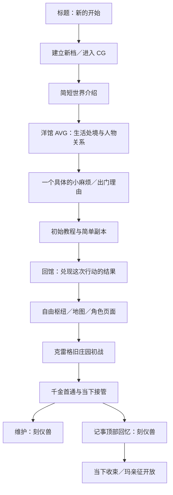

# DEMO 初章与引导：现状、范围修订与制作计划 v0.1

日期：2026-09-07。状态：**方向确认，现状审计与制作规划已整理；开场剧本、教学关卡和游戏接线尚未实施。**

本轮先更新文档。用户明确的新顺序是：新的开始进入 CG，简要介绍世界，再转入洋馆介绍，随后进行基础教学和强盗／经典小怪组成的简单初始副本，并建立一个简单的开场钩子。本文中的具体故事、场次数量、教学分配均为建议，不能视作逐项定稿。

相关入口：[当前状态](../DESIGN_DECISIONS_AND_CURRENT_STATUS.md) · [当前机制与闭环](../GAME_SYSTEMS_AND_CONTENT_SPEC.md) · [原 D0–D6 计划](../archive/plans/DEMO_CHARACTERS_AND_OLD_MANOR_IMPLEMENTATION_PLAN.md) · [内容质量审计](../audits/2026-09-07-demo-experience-quality.md)。

## 1. 本次调整的范围

### 1.1 已确认

- 标题的“新的开始”首先进入开场 CG 与简短世界介绍，不直接把玩家交给枢纽菜单。
- 世界介绍之后转入洋馆，先建立场所、人物关系和生活处境。
- 初章有实际可操作的教程、简单初始副本，以及让玩家愿意出门的小钩子。
- 初始敌人采用强盗和经典小怪的方向，承担基础教学。
- 当前优先制作初章与引导。庄园压力和现有剧本的问题继续保留返工项。

这修订了早期“庄园是 DEMO 唯一副本”的范围：**DEMO 新增庄园之前的入门内容；克雷格旧庄园仍是首个完整主题地牢。** 初章不是庄园的“初战模式”，不能共用首通身份。

庄园内部的既定顺序继续有效：初战千金；首通后并列开放刻仪兽回忆与维护；完成回忆及当下收束才开放玛丽埃塔亲征。Lv.3 上限和两件空面装备范围不变。

### 1.2 尚未定稿

章节名、具体委托与地点、CG 分镜和旁白、敌人最终名单、战斗数量、教学队伍及数值、跳过／重看／失败策略、初章奖励、庄园委托的出现方式，均需后续细化。

“经典小怪”尚未具体指定为史莱姆、哥布林或野狼；“强盗”方向已定，也不等于头目、弓手等变体已经批准。新 Catalog、schema、命令和内容 ID 在契约阶段确定，本稿不预造已发布版本。

## 2. 实际代码现在到了哪里

当前默认新档为 `abyssa.demo / contentVersion 3 / rulesVersion 4`，创建 profile 为 `profile.demo.first-run`。本轮核对源码，没有新跑战斗配平或浏览器试玩。

| 环节 | 当前实现 | 初章缺口／复用边界 |
| --- | --- | --- |
| 新游戏入口 | [useTitleArchive](../../src/apps/title/useTitleArchive.ts)先创建并打开真实档案，再按有无活动 run 进入 battle 或 menu；新档没有 run，所以直接进菜单 | 需要按已保存的初章阶段决定目的地；只改按钮链接不能解决“继续游戏”和中断恢复 |
| 初始进度 | [initialD5Projection](../../src/game-core/session/d5-progress.ts)已有五名初始成员，零资金、空成长／装备、无活动剧情／远征 | 没有开场、洋馆介绍或教学完成记录；当前也没有逐步介绍队伍的内容 |
| CG | [titleCg](../../src/apps/title/titleCg.ts)登记十一张 `cg-b-*.webp`，用于标题两侧气氛轮播 | 图是竖幅，未编成叙事分镜；不能把现有轮播称作世界观开场，也不能默认拉伸为全屏横幅 |
| AVG | [StoryReading](../../src/game-client/StoryReading.tsx)、[AdvStage](../../src/shared/presentation/adv/AdvStage.tsx)已有立绘差分、逐字对白与阅读操作 | 可承载洋馆介绍和途中对话；新的分场、表情、动作及脚本待制作 |
| 换场 | [SceneSequence](../../src/shared/presentation/adv/SceneSequence.tsx)已有战斗与 AVG 的离场、预载和入场；当前只区分 battle／adv | 复用既有时序；CG 如何进入同一演出序列需补设计，不另起一套弹窗剧情 |
| 阅读恢复 | D5 已有持久故事会话；[scene-reading-progress](../../src/game-client/scene-reading-progress.ts)另保存页签内展示游标 | 后者只是 sessionStorage 阅读缓存，不能当作初章完成证据；初章尚无持久故事会话 |
| 教学战斗 | 骰子、重掷、固定、行动、意图、道具和结算已有正式规则 | 当前 gameplay／presentation 内容中没有已注册的强盗入门路线和对应教学脚本 |
| 出征准入 | [d5-progress](../../src/game-core/session/d5-progress.ts)按接管状态只接受庄园初战／维护路线 | 必须增加初章自己的合法路线与阶段条件，不能仅向敌人表加几只怪 |
| 成长／结算 | 同文件将普通成长／赠物资格绑定第 3 层撤离或第 5 层通关，玛另有维护路线条件 | 教学归来要有明确身份；不能凑成三／五层来复用奖励，也不能让教学误触发庄园成长、接管或回忆 |
| 正式入口 | [navigation](../../src/game-client/navigation.ts)登记 title/menu/map/battle/mansion/shop/character-status | 暂无初章入口。新增页面还是由既有叙事容器承载，留契约阶段根据分场决定 |

结论：**已有可用引擎与演出组件，缺的是从新档进入作品的完整内容和进度链。** 当前“能从菜单出征庄园”不能代表初章已经存在。

## 3. 新玩家流程

以下是目标流程；初章完成后回馆并开放自由枢纽、再承接庄园，是本稿建议的衔接方式。

“继续游戏”应返回该档真实停下的位置：尚在 CG、洋馆对白或教学战斗，就恢复对应阶段；已有庄园进度的旧档继续原流程。返回菜单和再次打开游戏不能重新触发开场。

## 4. 初章要介绍什么

### 4.1 世界介绍：只建立眼前处境

依据 [当前局势](../../st/setting/current_situation.txt)、[世界设定](../../st/setting/world_setting_bible.txt)与[凯尔档案](../../st/setting/user/0-kael.txt)，建议开场先让玩家理解三件事：

1. 勇者的远征没有以杀死魔王结束，双方如今在守望者之崖共同生活。
2. 这份安宁有现实条件：魔王需要安眠，外面的危险与敌意没有消失。
3. 凯尔一行还要出门办事、维持补给，才能把洋馆的日常过下去。

大天平、两极源力、诸神史、政治派系和所有天王的姓名留到需要时再讲。CG 展示的内容与旁白相互补足，不把设定档案缩成几页名词说明。建议旁白约 30–60 秒可读完，实际长度由分镜验证，尚未定稿。

初章时间建议放在**共同生活已经建立的当下**。这是新玩家的第一天，不是角色彼此认识的第一天；如需回望远征，用短 CG 交代，不自动扩成第二套前传战役。

### 4.2 洋馆介绍：通过一场事认识这个家

建议先让凯尔、艾比希斯与玛丽埃塔承担开场焦点，其余伙伴随着整备和出门自然出现。不让全员排队报名字、解释按钮；生活洋馆与克雷格旧庄园必须明确区分。

场景应包含正在做的事、一个小阻碍和角色反应。例如补给缺口打断了原本的家务安排，决定谁去处理、谁留守，玩家由此认识她们的日常关系。具体事件见下一节候选，尚未成为正式剧情。

| 人物 | 档案中的表达依据 | 初章写作重点 |
| --- | --- | --- |
| 凯尔 | 务实老兵、生活能力强，照料通过行动体现 | 察觉问题、作出安排；避免每段替所有人总结道理 |
| 艾比希斯 | 平淡、直接，懒散而有自己的观察与占有欲 | 用具体行动展示她与凯尔的熟悉，不承担世界设定解说 |
| 玛丽埃塔 | 措辞准确、节奏沉稳，边做事边回应 | 有自身判断与边界；关心可以直接表达，不套傲娇借口 |
| 尤斯缇丝 | 骄傲、有教养、指挥习惯与细微动摇 | 对眼前事务提出要求，不靠每句“哼”制造性格 |
| 艾洛拉 | 礼貌、认真，惜物与救人之间有矛盾 | 对具体物资或行动有主张，避免泛化安慰 |
| 柯萝萝 | 懒散、歪理、熟人式讨价还价；危机时冷硬 | 偷懒也有实际办法，不能只剩撒娇和睡觉 |
| 诺玛 | 市井、利落、圆滑；重利益也护自己人 | 观察别人没注意的细节，调侃服务当前事情 |

人物语气以 [st/setting/char](../../st/setting/char) 为依据。先确定每个人在场景里想做什么，再写对白；不限定每人固定句数，不把“请点 ROLL”塞进熟练战友的交流。

### 4.3 初始钩子候选：迟到的补给车

**本稿推荐方向，待定稿：洋馆应到的补给车迟迟没有抵达交接点，凯尔一行出门接货，发现通路上有普通魔物与截留货物的强盗。**

它提供一个短而清楚的目标：找到车，清通路，把补给带回来。回馆后必须看见这次行动解决了哪件具体的事；缺的哪项物资、谁在等、谁对此有不同意见，要在分场时写实，不用“重要物资”四个字带过。

地理上建议落在外围封锁线之外的补给通路／交接区域，避免普通强盗闯进重兵与结界保护的洋馆。无需把强盗写成足以威胁勇者的强敌；教学的挑战来自玩家学习操作，角色仍是熟练小队。

这一小委托可以自行收束。庄园的后续入口可由回馆后的另一件具体事务承接，连接物与触发方式待写；不提前把强盗解释成庄园幕后黑手，也不强塞红线遗物串起所有敌人。

## 5. 教程与初始副本的建议结构

### 5.1 先教会一轮，再教会一次出征

建议先用一条短路线承载约三场短遭遇，场数在关卡稿中确认。每场只增加一个主要问题，已有操作逐步交还玩家；不在第一屏同时介绍花色、铭约、倍率、装备和七件道具。

| 段落 | 主要目的 | 玩家要亲自完成的动作 | 内容边界 |
| --- | --- | --- | --- |
| 洋馆出门前 | 知道此行目的与队伍 | 看当前目标、确认出发 | 初次编队建议沿用现有勇者五人；不假装重新招募，不改既定骰面来降低说明成本 |
| 第一场：基础小怪 | 看懂“掷骰→固定→选面行动→结束回合” | 实际 ROLL、看到骰面、选择目标并结算 | 弱敌与简单意图；不以选个人后自动赢代替战斗 |
| 第二场：强盗遭遇 | 看懂意图、重掷与攻防取舍 | 留下有用面、重掷其他骰，攻击或处理敌方攻击 | 明示的普通攻击／蓄力即可；具体敌群须验证不会在展示教学点前稳定被秒掉 |
| 间歇 | 知道状态和补给会延续 | 按实际伤势使用一种基础补给，再前进 | 不强迫满血吃药、不凭空扣血来让教学脚本成立；教程不得卡在随机未出现的状态上 |
| 末场：简短综合练习 | 独立完成一轮应对 | 根据意图自由安排已学动作，完成小目标 | 可用强盗与经典小怪的简单组合；不新增大型主题 Boss，也不靠隐藏免死延长战斗 |
| 回馆 | 理解“出门办事→带回结果→整备”的循环 | 看见委托兑现，知道下一次从哪里出发 | 奖励、首次商店／角色页介绍按需呈现，不一次遍历全部菜单 |

教程提示附着在已有骰池、意图、操作区；整段剧情沿用全 AVG。继续保留当前骰子手感、战斗布局、通用边框与换场表现。庄园红线是庄园皮肤，普通通路不套庄园专属装饰。

### 5.2 牌型和状态避免再次教错

首次遇到对应现象时，用当前真实骰子说明：**已使用不等于失去成牌资格；沉眠面不成牌；力竭队友不计入。** 固定／使用／沉眠是不同状态，提示与实际结算必须一致。

牌型先教“哪些骰子被算进去、结果在哪里看”，不灌完整倍率公式；铭约自然触发时再解释它的效果。装备成长、全部共鸣与复杂解谜后置。撤离须在真正存在的合法退出点说明，不能在教程展示一个不可执行的按钮。

若需要固定教学种子或起始局面，应作为明确的教学配置，走同一规则和持久记录；不让 UI 改骰面、补伤害或重算成功。自由练习段恢复正常随机，具体交接点待关卡稿确定。

### 5.3 “简单”的验收标准

初章允许高通过率，但玩家仍应看懂自己的选择如何改变结果。至少一次展示忽略意图与正确处理的差异；合理小失误可恢复，失败能合法重试，不能靠资源耗尽阻断初章。

不要通过削弱角色永久规则制造教程，也不要把现有低压庄园改名为教程来宣称解决了难度。后续庄园应在已掌握基础操作的前提下提供真实的取舍和压力，另按质量审计返工。

## 6. 接线前要补齐的契约

以下为实施要求与待设计边界，本轮没有创建字段或改存档。

| 边界 | 要落实的内容 |
| --- | --- |
| 进度所有权 | Campaign 保存初章阶段、已完成的必要教学、当前故事版本／恢复位置；战斗的 RNG、行动与结果仍由原引擎负责 |
| 恢复与导航 | 新建、继续、刷新、直接访问菜单／地图都查询同一进度；不只在标题按钮上拦截。CG／AVG／战斗恢复点与回馆交接需逐一列出 |
| 教学完成 | 由已提交的合法动作或场景推进证明，不能由动画播完、提示关闭或任意浏览器布尔值授予 |
| 路线与奖励 | 教学独立于庄园首通、维护和历史回忆；调整当前只允许两条庄园路线的准入。归来可发什么、是否推进时间、是否开放庄园、是否有教学专用配给，逐项定表 |
| 防止串进度 | 教学通关不得触发庄园接管、千金结局、回忆开放或玛亲征；现有 Lv.2／赠物资格不能只凭层数误认教学结算。建议初章暂不授予成长与两件装备，具体奖励留关卡稿 |
| 跳过与重看 | 区分跳对白、略过操作提示、跳过整段教程、重看故事；只有已定义的规则能推进必要进度。具体开放条件待定，SKIP 不等于自动获胜或重复领奖 |
| 旧档与发布 | 现有档案不强制补做初章，不清空其资产或解锁；已发布内容不原地改写。新内容身份、必要 schema 变更、复制升级／二周目策略单独登记 |
| LLM 边界 | 初章是手写内容与确定性规则；Abyssa 独立保存事实与结果。后续 rp-style-lab 可以消费真实经历，不生成教学胜负、不成为开场运行的前置依赖 |

不为初章另造战斗引擎或通用任务平台。优先补足现有应用层的阶段控制、合法内容准入与恢复，再由既有展示组件消费结果。

## 7. 现有素材与缺项

| 资源 | 现状 | 后续处理 |
| --- | --- | --- |
| 开场 CG | [cg 目录](../../src/assets/cg)有十一张已登记竖幅图 | 逐张看内容与构图后对应分镜；本轮未做视觉选片，不能认定已有适合世界介绍的成套图 |
| 洋馆场景 | 已有菜单夜廊背景 `manor-night-gallery.jpg` 与洋馆页面资源 | 可复用匹配的场景；若剧本指定白天餐厅／外景，须明确相应缺图，不能用夜廊硬顶 |
| 角色表现 | 已有角色立绘／差分与 [story-actors](../../src/game-client/story-actors.ts)装配 | 先确定出场人物、站位与表情，再核对差分；需要新姿态时明确缺项 |
| 教学敌人 | 当前战斗资产登记为旧裂隙怪与庄园怪；未找到已登记的强盗／经典小怪教学资产组 | 最终名册确定后补敌图；不能给庄园家具换名字当强盗 |
| 教学场地 | 现有混沌／秩序领域与庄园三舞台 | 尚无与补给通路候选匹配并已登记的教学舞台；场景数量随分场确定 |
| 地图标识 | 既有地图节点素材已本地化 | 是否新增独立教学节点待路线方案；新增素材继续入仓库，不依赖外部图床 |

素材命名、透明底、显示比例、源图与成品映射沿仓库现行方式；先列明确清单，再制作与归位。缺少关键图时，工程演示与内容完成应分开标记。

## 8. 制作顺序与验收

使用独立的 **O（Opening）阶段**跟踪，不改写 D0–D5 的历史完成项；D6 扩大为包含初章的整体验收。S4 仍是可选 AI 接入。

| 阶段 | 交付 | 完成口径 | 本轮状态 |
| --- | --- | --- | --- |
| O0 现状与范围 | 本稿、当前状态与旧范围修订 | 新旧流程、实现缺口、确认与建议分开 | 文档已交付 |
| O1 初章内容稿 | CG 分镜／简短旁白、洋馆到回馆的完整分场、人物动作和差分、具体钩子及收束、素材清单 | 能连续阅读出一场成立的事；角色声音来自档案，术语与教学不过载 | 待开始 |
| O2 教学关卡与存档契约 | 逐场敌群／意图／数值、学习目标、提示触发与退出、失败重试／跳过、进度与奖励表、新旧档策略 | 每项要求有可达操作，随机不软锁，教学不串庄园奖励 | 待开始；可随 O1 交叉核对 |
| O3 实际接线 | 新档 CG→洋馆→教学→回馆，复用原 AVG／Battle | 从正常标题入口可走通；刷新恢复、动作动画与真实结算一致 | 待 O1/O2 收口后实施 |
| O4 内容与游玩验收 | 无提示复述与操作验证、策略／资源对照、完整视觉检查、兼容报告 | 玩家知道自己是谁、为何出门、如何打一轮、完成后去哪；不靠作者旁白解释才成立 | 待开始 |

O4 至少覆盖新档完整路径、CG／对白／战中恢复、合法重试、奖励去重、旧档继续，以及大小窗口的完整场景。浏览器验证必须看到实际 ROLL、行动、敌方结算和 AVG 衔接；单独加载页面截图不算走完。

**下一份具体交付是 O1 初章内容稿，并附第一版逐场教学卡。** 先把世界介绍、洋馆场景和小委托的起承转合写成立，再将确认后的内容接入游戏。现有庄园配平、成长／回忆剧作和缺图仍在原审计中跟踪，初章完工不自动勾销这些问题。
